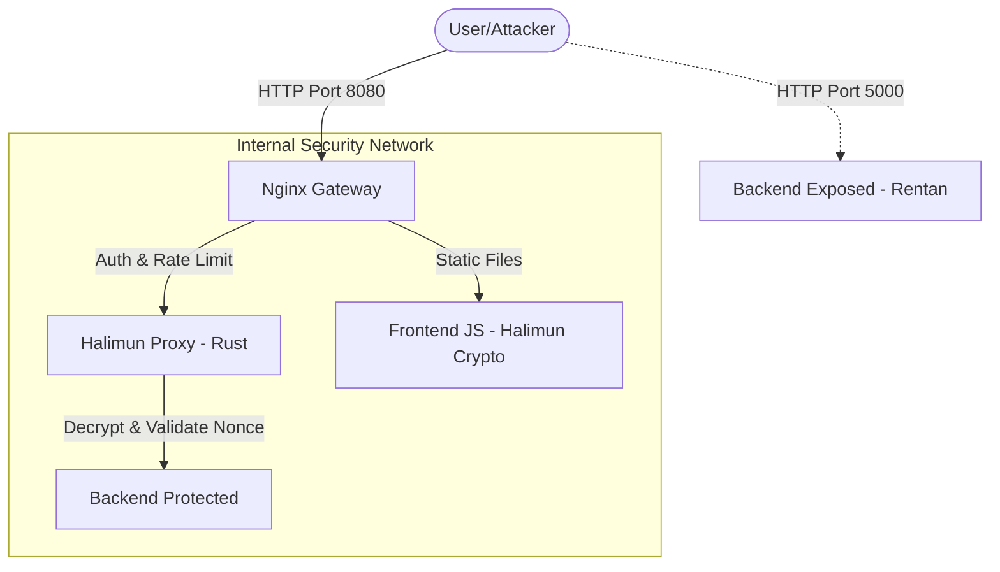

# Lab Keamanan: Halimun-Proxy (Encrypted Reverse Proxy)

Lab ini menyimulasikan penggunaan **Halimun-Proxy**, sebuah Reverse Proxy terenkripsi (Rust-based) yang bekerja di belakang Nginx untuk memberikan lapisan perlindungan ekstra terhadap serangan network-layer dan application-layer. Berbeda dengan proxy standar, Halimun-Proxy mewajibkan semua request masuk dalam bentuk terenkripsi.

## Komponen Lab

1.  **Backend Exposed (Port 5000)**: Aplikasi PHP yang terekspos langsung (Rentan).
2.  **Backend Protected**: Aplikasi PHP yang sama, namun hanya bisa diakses melalui Halimun-Proxy.
3.  **Frontend JS**: Web interface yang menggunakan `halimun-crypto.js` untuk enkripsi request.
4.  **Halimun-Proxy**: Proxy inti (Port 7878 internal) yang menangani dekripsi, validasi Replay, dan SSRF Guard.
5.  **Nginx Gateway (Port 8080)**: Gerbang utama yang menyediakan Basic Auth dan Rate Limiting sebelum diteruskan ke Halimun-Proxy.

## Fitur Keamanan yang Diuji

-   **End-to-End Encryption**: Payload dienkripsi dengan AES-256-CBC dari client hingga proxy. Request mentah (unencrypted) akan langsung ditolak.
-   **Replay Protection**: Validasi Nonce dan Timestamp untuk memastikan satu request tidak bisa dikirim ulang oleh attacker.
-   **Camouflage Routing**: URL diubah menjadi segmen random (contoh: `/proxy/1/ABCD/EFGH/...`) untuk menyembunyikan struktur backend.
-   **SSRF Protection**: Memblokir request yang mencoba memalsukan `api_url` ke alamat internal (localhost/private IP).
-   **Basic Authentication**: Akses proxy diproteksi oleh username/password di level Nginx.
-   **Information Leakage Prevention**: Menyembunyikan header asli server dan memperpendek jejak digital aplikasi.

## Daftar URL & Port

| Komponen            | URL / Port                         | Keterangan                           |
| :------------------ | :--------------------------------- | :----------------------------------- |
| **Dashboard Lab**   | `http://localhost:8080`            | Entry point utama (via Nginx)        |
| **Halimun Proxy**   | `http://localhost:8080/proxy/`     | Jalur request terenkripsi (via Auth) |
| **Direct Backend**  | `http://localhost:5000`            | Akses langsung (Sangat Rentan)       |
| **Admin Dashboard** | `http://localhost:8080/dashboard/` | Statistik traffic real-time          |

*Kredensial Basic Auth: **admin** / **admin***

## Arsitektur Lab



## Panduan Instalasi untuk Pemula (Step-by-Step)

Lab ini sedikit lebih kompleks karena menggunakan enkripsi. Ikuti langkah-langkah berikut agar tidak bingung:

### Langkah 1: Persiapan Software
1.  **Unduh & Install Docker Desktop**:
    - Pergi ke [Docker Desktop](https://www.docker.com/products/docker-desktop/).
    - Install dan jalankan hingga aplikasi Docker aktif dan siap.

### Langkah 2: Mengunduh File Lab
1.  Unduh repository ini (Klik **Code** -> **Download ZIP**) dan ekstrak file-nya di tempat yang mudah ditemukan, misalnya di `C:\Security-Lab\`.

### Langkah 3: Menjalankan Kontainer
1.  Buka terminal/CMD.
2.  Masuk ke direktori lab Halimun:
    ```bash
    cd "C:\Security-Lab\Network-Security-Course-Bank\HandsOnServerProxy\HalimunProxy"
    ```
3.  Ketik perintah berikut untuk membangun seluruh sistem:
    ```bash
    docker-compose up -d --build
    ```
    *Halimun-Proxy menggunakan bahasa Rust, jadi proses 'building' pertama kali mungkin memakan waktu 1-2 menit.*

### Langkah 4: Cara Mengakses
1.  Buka browser ke: `http://localhost:8080`
2.  Jika muncul kotak dialog login, masukkan:
    - **Username**: `admin`
    - **Password**: `admin`
3.  Anda sekarang berada di dashboard **Halimun-Proxy**.

---

## Cara Menjalankan (Instalasi Manual)

1.  Pastikan Docker sudah terinstal.
2.  Buka terminal di folder `HalimunProxy`.
3.  Jalankan perintah:
    ```bash
    docker-compose up -d --build
    ```

## Skenario Pengujian

### 1. Simulasi Serangan Otomatis (Cepat)
Jalankan script simulasi untuk melihat perbandingan proteksi secara instan di terminal:
```bash
sh ./attack-scripts/simulate_attacks.sh
```

### 2. Manual Test via Browser
Gunakan interface di `http://localhost:8080` untuk mencoba fitur:
-   **Test Replay Attack**: Klik tombol dua kali dengan cepat. Klik pertama akan berhasil (Success), klik kedua akan ditolak (Ditolak) karena Nonce sudah pernah digunakan.
-   **Akses Konfigurasi**: Bandingkan akses langsung (terbuka) vs via Proxy (diblokir karena routing tidak tersedia atau ditolak SSRF Guard).

### 3. Simulasi Serangan via Terminal (CMD / Bash)
Coba akses jalur proxy tanpa enkripsi menggunakan `curl`:

**Langkah-langkah:**
1.  **Akses Jalur Proxy (Tanpa Enkripsi)**:
    ```bash
    curl -u admin:admin -X POST http://localhost:8080/proxy/1/users
    ```
    *Analisis: Status 400/403 akan muncul karena Halimun-Proxy mendeteksi payload tidak terenkripsi atau format salah.*

2.  **Tes Proteksi Header**:
    ```bash
    curl -I http://localhost:5000/api.php/users
    curl -I http://localhost:8080/
    ```
    *Analisis: Perhatikan pada port 5000 informasi server (PHP/Apache) terekspos, sedangkan pada 8080 informasi tersebut disembunyikan.*

### 4. Panduan Simulasi Penetrasi (Kali Linux)
Gunakan Kali Linux untuk membuktikan bahwa scanner otomatis tidak berdaya melawan Reverse Proxy terenkripsi seperti Halimun.

**Langkah 1: Menjalankan Container Kali Linux**
Buka terminal baru di folder `HalimunProxy` dan jalankan:
```bash
docker run --rm -it --network halimunproxy_public-net kalilinux/kali-rolling /bin/bash
```

**Langkah 2: Menyiapkan Tools**
Di dalam terminal Kali, install tool dasar untuk pengujian:
```bash
apt update && apt install -y nmap sqlmap curl
```

**Langkah 3: Scanning Target (Nmap)**
Cek port yang terlihat dari jaringan publik:
```bash
# Scan port pada Nginx Gateway
nmap -F nginx-gateway

# Scan port pada Backend yang terekspos (Direct)
nmap -F php-backend-exposed
```
*Hasil: Nmap akan mendeteksi kedua host, namun port internal Halimun (7878) tetap tersembunyi dari jaringan luar.*

**Langkah 4: Serangan Bruteforce API (Simulasi SQLmap)**
Mari kita lihat bagaimana `sqlmap` bereaksi terhadap jalur proxy yang mewajibkan enkripsi:
```bash
# Serang backend langsung (Vulnerable)
sqlmap -u "http://php-backend-exposed/api.php/users?id=1" --batch --banner

# Serang via Halimun Proxy (Melalui Nginx)
# Perhatikan: Kita harus masukkan Basic Auth
sqlmap -u "http://nginx-gateway/proxy/1/ANY" --headers="Authorization: Basic YWRtaW46YWRtaW4=" --method=POST --data="x=test" --batch
```

**Observasi & Analisis:**
1.  **Direct Attack**: `sqlmap` dengan mudah mengeksploitasi parameter `id` pada backend langsung.
2.  **Halimun Proxy Attack**: `sqlmap` akan gagal total. Hal ini karena Halimun-Proxy menolak semua payload yang tidak terenkripsi menggunakan kunci AES-256-CBC yang valid. Scanner otomatis tidak bisa melakukan "fuzzing" karena setiap request yang ia kirim akan dianggap sampah (invalid encryption format) oleh proxy.
3.  **WAF Blocking**: Jika `sqlmap` mencoba mengirim karakter aneh ke root URL `/`, Nginx juga memiliki filter dasar yang bisa memblokirnya.

### 5. Menggunakan Postman
1.  Ambil payload terenkripsi (parameter `x`) dari console browser Dashboard Lab.
2.  Buka Postman, buat request `POST` ke `http://localhost:8080/proxy/1/[segment_random]`.
3.  Gunakan Auth: Basic Auth (`admin`/`admin`).
4.  Masukkan body: `x=[payload_tadi]`.
5.  Kirim dua kali. Request pertama OK, request berikutnya harus ERROR (Replay Protection).

## Latihan Praktikum

1.  **Tantangan 1 (Rate Limiting Analysis)**: Gunakan loop di terminal untuk memborbardir `http://localhost:8080/` dengan request. Amati kapan Nginx (sebagai gateway Halimun) memberikan status `429 Too Many Requests`.
2.  **Tantangan 2 (Deciphering Camouflage)**: Amati URL yang dikirim oleh Frontend JS ke Proxy melalui Network Tab di Browser. Apakah Anda bisa menebak endpoint backend asli hanya dengan melihat URL tersebut? Jelaskan kenapa.
3.  **Tantangan 3 (Replay Hack Attempt)**: Cobalah mengubah hanya satu karakter pada payload terenkripsi di Postman dan kirim request tersebut. Mengapa Halimun-Proxy menolaknya meskipun strukturnya terlihat benar? (Petunjuk: Integritas HMAC/Encryption).
4.  **Tantangan 4 (SSRF Defense)**: Cari file `config.yaml`, ubah `blocked_networks`. Coba masukkan IP internal Kali Linux Anda ke dalam whitelist dan amati apa yang terjadi.

## Monitoring Log

Untuk melihat proses dekripsi dan validasi secara real-time:
```bash
docker logs -f halimun-proxy
```

## Kesimpulan Lab

Halimun-Proxy membuktikan bahwa keamanan tidak cukup hanya dengan "Standard Proxy". Dengan mewajibkan enkripsi end-to-end dari client, kita menutup celah serangan tradisional seperti SQL Injection melalui scanner otomatis, serta mencegah kebocoran data melalui manipulasi request mentah.
