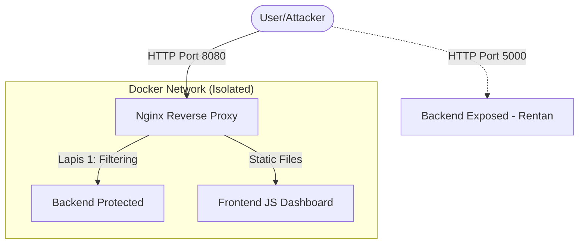

# Lab Keamanan: Nginx Reverse Proxy & WAF Dasar

Lab ini menyimulasikan penggunaan Nginx sebagai Reverse Proxy untuk memperkuat keamanan aplikasi backend (PHP). Lab ini menunjukkan perbandingan antara server yang terekspos langsung ke publik vs server yang berada di belakang proxy yang dikonfigurasi dengan benar.

## Komponen Lab

1.  **Backend Exposed (Port 5000)**: Aplikasi PHP yang terekspos langsung (Rentan).
2.  **Backend Protected**: Aplikasi PHP yang sama, namun hanya bisa diakses via Nginx Proxy.
3.  **Frontend JS**: Web interface untuk mencoba serangan secara visual.
4.  **Nginx Proxy (Port 8080)**: Gerbang utama dengan aturan keamanan (WAF Dasar).

## Fitur Keamanan yang Diuji

-   **Path Restriction**: Memblokir akses ke file konfigurasi (`/config`) dan file sensitif (`/sensitive.php`).
-   **WAF (Web Application Firewall)**: Memblokir query string yang mencurigakan (SQL Injection: `union`, `select`, dsb; XSS: `<script>`).
-   **Rate Limiting**: Membatasi jumlah request per detik untuk mencegah DDoS.
-   **Security Headers**: Menyembunyikan identitas backend server (`X-Powered-By`, `Server`).

## Daftar URL & Port

| Komponen           | URL / Port                   | Keterangan                               |
| :----------------- | :--------------------------- | :--------------------------------------- |
| **Dashboard Lab**  | `http://localhost:8080`      | Entry point utama (via Proxy)            |
| **Protected API**  | `http://localhost:8080/api/` | Jalur API yang dilindungi WAF            |
| **Direct Backend** | `http://localhost:5000`      | Akses langsung ke backend (Rentan)       |
| **Nginx Status**   | `Internal Only`              | Digunakan untuk monitoring (Stub Status) |


## Arsitektur Lab



## Panduan Instalasi untuk Pemula (Step-by-Step)

Jika Anda baru pertama kali menggunakan Docker, ikuti langkah-langkah di bawah ini:

### Langkah 1: Persiapan Software
1.  **Unduh & Install Docker Desktop**:
    - Pergi ke [Docker Desktop](https://www.docker.com/products/docker-desktop/).
    - Pilih versi sesuai OS Anda (Windows/Mac/Linux).
    - Install dan **jalankan** Docker Desktop hingga ikon paus di pojok bawah berwarna hijau.

### Langkah 2: Mengunduh File Lab
1.  Klik tombol **Code** (hijau) di bagian atas repository ini dan pilih **Download ZIP**.
2.  Ekstrak file ZIP tersebut ke folder di komputer Anda (misal: `C:\Security-Lab\`).

### Langkah 3: Membuat Server Berjalan
1.  Buka terminal/command prompt:
    - **Windows**: Tekan tombol `Win + R`, ketik `cmd`, lalu Enter.
    - **Mac/Linux**: Buka aplikasi `Terminal`.
2.  Masuk ke folder lab menggunakan perintah `cd` (Ganti path sesuai lokasi Anda):
    ```bash
    cd "C:\Security-Lab\Network-Security-Course-Bank\HandsOnServerProxy\NginxProxy"
    ```
3.  Jalankan perintah ajaib ini:
    ```bash
    docker-compose up -d --build
    ```
    *Artinya: Mempersiapkan semua kontainer dan menjalankannya di latar belakang.*

### Langkah 4: Verifikasi
1.  Tunggu hingga proses download selesai dan muncul tulisan `Started`.
2.  Buka browser Anda dan ketik: `http://localhost:8080`
3.  Jika muncul dashboard simulasi, selamat! Lab Anda sudah siap digunakan.

---

## Cara Menjalankan (Instruksi Manual)
1.  Buka terminal di folder `NginxProxy`.
2.  Jalankan:
    ```bash
    docker-compose up -d --build
    ```
4.  Setelah semua container statusnya `Started`, buka browser dan akses Dashboard Lab di:
    `http://localhost:8080`

## Skenario Pengujian

### 1. Simulasi Serangan Otomatis (Cepat)
Anda dapat menjalankan script simulasi untuk melihat hasil proteksi secara cepat di terminal:
```bash
sh ./attack-scripts/simulate_attacks.sh
```

### 2. Manual Test via Browser
Gunakan antarmuka web di `http://localhost:8080` untuk mencoba tombol:
- **Direct Backend**: Melihat kerentanan langsung (SQLi berhasil, Config terekspos).
- **Nginx Proxy**: Melihat proteksi aktif (SQLi diblokir, Config forbidden).

### 1. Simulasi Serangan via Terminal (CMD / Bash)
Gunakan `curl` untuk melihat bagaimana Nginx memproses request di level HTTP.

**Langkah-langkah:**
1.  Buka Command Prompt (CMD) atau Terminal.
2.  **Tes Proteksi Path**:
    Coba akses file konfigurasi melalui proxy:
    ```bash
    curl -I http://localhost:8080/api/config
    ```
    *Analisis: Perhatikan status `HTTP/1.1 403 Forbidden`.*
3.  **Tes Proteksi SQL Injection**:
    Kirim payload SQLi sederhana:
    ```bash
    curl -I "http://localhost:8080/api/users?id=' OR 1=1"
    ```
    *Analisis: Perhatikan status `HTTP/1.1 400 Bad Request`. Nginx mendeteksi kata kunci `OR` dan `'`.*
4.  **Tes Perbandingan Header**:
    ```bash
    curl -I http://localhost:5000/api.php/users
    curl -I http://localhost:8080/api/users
    ```
    *Analisis: Bandingkan header `Server`. Versi asli (Apache/PHP) disembunyikan oleh Nginx.*

### 2. Panduan Simulasi Penetrasi (Kali Linux)
Gunakan tools penetrasi standar industri untuk menguji ketahanan Nginx terhadap serangan otomatis. Skenario ini akan menunjukkan mengapa "security by obscurity" saja tidak cukup.

**Langkah 1: Menjalankan Container Kali Linux**
Buka terminal baru (pastikan berada di folder `NginxProxy`) dan jalankan container Kali yang akan bergabung ke jaringan Docker lab:
```bash
docker run --rm -it --network nginxproxy_public-net kalilinux/kali-rolling /bin/bash
```

**Langkah 2: Menyiapkan Tools (Reconnaissance)**
Di dalam terminal Kali, perbarui repositori dan install tools yang diperlukan:
```bash
apt update && apt install -y nmap sqlmap curl
```

**Langkah 3: Scanning Target (Nmap)**
Mari cari tahu port apa saja yang terbuka pada gateway kita:
```bash
# Scan port pada Nginx Gateway
nmap -F nginx-gateway

# Scan port pada Backend yang terekspos (Direct)
nmap -F php-backend-exposed
```
*Analisis: Bandingkan hasilnya. Meskipun keduanya memiliki port terbuka, Nginx akan menyaring trafik yang masuk ke port tersebut.*

**Langkah 4: Pengujian Header (Vulnerability Research)**
Cek informasi teknis server yang bocor:
```bash
# Cek backend langsung
curl -I http://php-backend-exposed

# Cek via Nginx Proxy
curl -I http://nginx-gateway/api/users
```
*Analisis: Lihat header `Server` dan `X-Powered-By`. Nginx menyembunyikan versi asli backend untuk mempersulit attacker.*

**Langkah 5: Serangan SQL Injection (Exploitation)**
Gunakan `sqlmap` untuk mencoba mengambil data dari database:
```bash
# Serang backend langsung (Pasti Berhasil/Vulnerable)
sqlmap -u "http://php-backend-exposed/api.php/users?id=1" --batch --banner

# Serang via Nginx Gateway (Akan Gagal/Forbidden)
sqlmap -u "http://nginx-gateway/api/users?id=1" --batch --banner
```

**Observasi Hasil:**
1.  **Direct Attack**: `sqlmap` akan mendeteksi celah dan berhasil menampilkan informasi database.
2.  **Proxy Attack**: Nginx akan merespons dengan `400 Bad Request` atau `403 Forbidden` saat mendeteksi pola serangan, sehingga `sqlmap` tidak bisa menemukan celah.

### 3. Menggunakan Postman
1.  Buat request `GET` ke `http://localhost:8080/api/config`.
2.  Perhatikan tab **Headers** dan **Status** di Postman (Status harus `403 Forbidden`).
3.  Coba masukkan script XSS di parameter: `http://localhost:8080/api/users?name=<script>alert(1)</script>`.
4.  Interpretasikan hasilnya.


## Latihan Praktikum

Selesaikan tantangan berikut untuk memperdalam pemahaman Anda:

1.  **Tantangan 1 (Rate Limiting)**: Gunakan Postman Runner atau loop sederhana di terminal untuk mengirim 50 request dalam waktu singkat ke `http://localhost:8080/api/users`. Amati kapan Nginx mulai mengirimkan status `429 Too Many Requests`.
2.  **Tantangan 2 (WAF Custom Rule)**: Buka file `nginx-proxy/default.conf`. Tambahkan aturan untuk memblokir kata kunci `xss` atau `<script>`. Restart container (`docker-compose restart nginx-proxy`) dan uji apakah blokir berhasil.
3.  **Tantangan 3 (Leakage Investigation)**: Bandingkan header response antara `http://localhost:5000/api.php/users` dan `http://localhost:8080/api/users`. Identifikasi informasi apa saja yang berhasil disembunyikan oleh Nginx.
4.  **Tantangan 4 (Bypass Attempt)**: Cobalah mencari celah untuk mengakses file `sensitive.php` melalui proxy dengan berbagai variasi URL (misal: `/API/Sensitive.php`). Apakah Nginx tetap bisa memblokirnya? Kenapa?

## Monitoring Log

Untuk melihat bukti blokir oleh Nginx secara real-time, jalankan perintah berikut:
```bash
docker logs -f nginx-gateway
```


## Kesimpulan Lab

Nginx bukan hanya berfungsi sebagai pengimbang beban (load balancer), tetapi juga sebagai lapisan pertahanan pertama yang sangat efektif untuk memblokir serangan sebelum mencapai aplikasi backend yang berharga.

