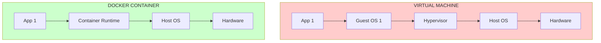
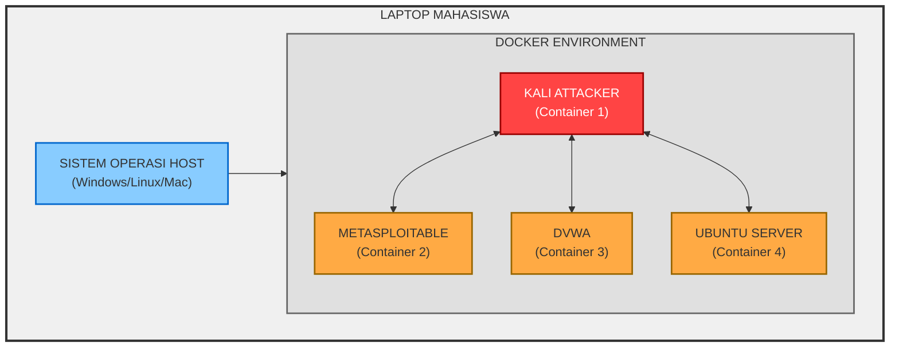
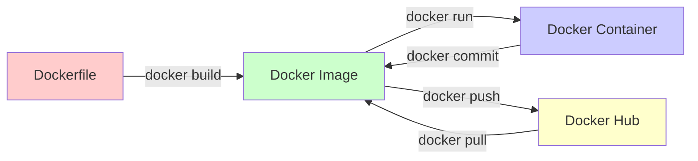
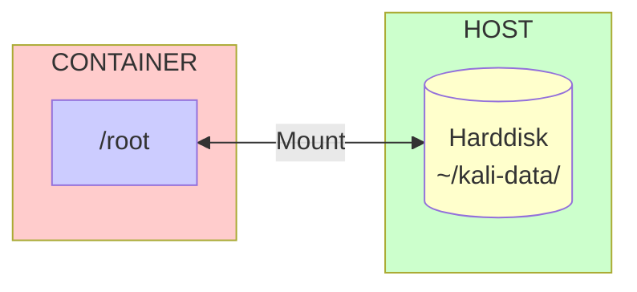
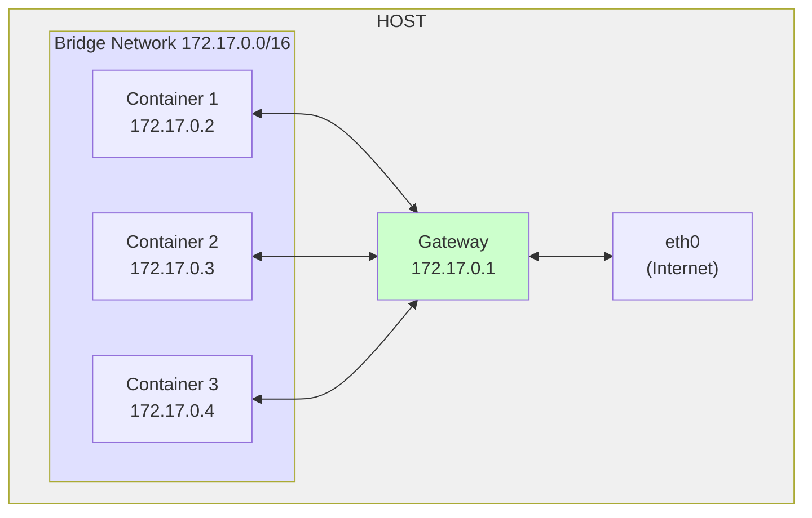

# 🐳 Pertemuan 0: Pengenalan Docker & Kali Linux untuk Keamanan Jaringan

---

## Daftar Isi
1. [Apa itu Docker?](#1-apa-itu-docker)
2. [Apa itu Kali Linux?](#2-apa-itu-kali-linux)
3. [Mengapa Docker + Kali untuk Belajar Network Security?](#3-mengapa-docker--kali-untuk-belajar-network-security)
4. [Instalasi Docker](#4-instalasi-docker)
5. [Dasar-Dasar Docker](#5-dasar-dasar-docker)
6. [Menjalankan Kali Linux dengan Docker](#6-menjalankan-kali-linux-dengan-docker)
7. [Memahami Volume untuk Penyimpanan Data](#7-memahami-volume-untuk-penyimpanan-data)
8. [Memahami Jaringan Docker](#8-memahami-jaringan-docker)
9. [Docker Compose untuk Lab Multi-Container](#9-docker-compose-untuk-lab-multi-container)
10. [Troubleshooting & Tips](#10-troubleshooting--tips)
11. [Latihan Mandiri](#11-latihan-mandiri)
12. [Sumber Belajar](#12-sumber-belajar)

---

## 1. Apa itu Docker?

### Definisi

**Docker** adalah platform open-source yang memungkinkan Anda untuk mengemas, mendistribusikan, dan menjalankan aplikasi dalam **container**. Container adalah lingkungan yang terisolasi dan ringan yang berisi semua yang dibutuhkan untuk menjalankan aplikasi (kode, runtime, library, dependensi).

### Analogi Sederhana

Bayangkan Anda ingin mengirimkan aplikasi ke teman:

- **Tanpa Docker**: Anda kirim source code + instruksi instalasi 10 halaman. Teman Anda harus install semua dependensi, setting path, dll. Sering gagal karena beda OS/versi.

- **Dengan Docker**: Anda masukkan aplikasi + semua kebutuhannya ke dalam "kontainer pengiriman" standar. Teman Anda tinggal jalankan, pasti berhasil di mana saja.

### Container vs Virtual Machine



### Tabel Perbandingan

| Aspek | Virtual Machine | Docker Container |
|-------|----------------|------------------|
| **Waktu Boot** | Menit (boot OS penuh) | Detik (start proses) |
| **Ukuran** | GB (ISO OS + aplikasi) | MB (hanya aplikasi + lib) |
| **Resource** | Heavy (butuh RAM/CPU untuk OS) | Lightweight (share kernel host) |
| **Isolasi** | Level hardware (sangat kuat) | Level proses (cukup kuat) |
| **Portabilitas** | Bisa berat (format OVA, VHD) | Sangat ringan (Docker image) |

---

## 2. Apa itu Kali Linux?

### Definisi

**Kali Linux** adalah distribusi Linux berbasis Debian yang dirancang khusus untuk **digital forensik** dan **penetration testing**. Dikembangkan dan dikelola oleh Offensive Security.

### Sejarah Singkat

- **2006**: BackTrack Linux (pendahulu Kali)
- **2013**: Kali Linux 1.0 dirilis
- **2015**: Kali Linux 2.0
- **2019**: Kali Linux Rolling (update terus-menerus)

### Fitur Utama Kali Linux

1. **600+ Tools Pre-installed**: Nmap, Wireshark, Metasploit, Aircrack-ng, John the Ripper, Burp Suite, dan ratusan tools lainnya.

2. **Rolling Release**: Selalu mendapatkan update tools terbaru.

3. **Single User Root**: Dirancang untuk akses root penuh (hati-hati!).

4. **Customizable**: Bisa dimodifikasi untuk kebutuhan spesifik.

### Tools Penting untuk Network Security

| Kategori | Tools |
|----------|-------|
| **Scanning** | Nmap, Masscan, Zenmap |
| **Sniffing** | Wireshark, Tcpdump, Bettercap |
| **Wireless** | Aircrack-ng, Kismet, Reaver |
| **Web App** | Burp Suite, SQLmap, Nikto |
| **Password** | John the Ripper, Hydra, Crunch |
| **Exploitation** | Metasploit, BeEF, Social Engineering Toolkit |
| **Forensik** | Autopsy, Sleuth Kit, Volatility |

---

## 3. Mengapa Docker + Kali untuk Belajar Network Security?

### Keuntungan Utama

| Keuntungan | Penjelasan |
|------------|------------|
| **Isolasi Aman** | Eksperimen serangan tidak merusak sistem utama |
| **Portabel** | Bawa lab ke mana saja dalam satu folder |
| **Reproducible** | Setup lab yang sama berulang-ulang |
| **Resource Efisien** | Bisa jalankan banyak container di laptop biasa |
| **Clean State** | Rusak? Hapus container, buat baru dalam detik |
| **Realistis** | Mirip environment server sungguhan |

### Arsitektur Belajar dengan Docker + Kali



### Perbandingan Metode Belajar

| Metode | Kelebihan | Kekurangan |
|--------|-----------|------------|
| **VM Tradisional** | Isolasi kuat | Berat, butuh resource besar |
| **Install Langsung** | Performa maksimal | Berisiko merusak OS utama |
| **Dual Boot** | Performa native | Ribet ganti-ganti OS |
| **Cloud VM** | Akses di mana saja | Berbayar, butuh internet |
| **DOCKER + KALI** | Ringan, cepat, aman | Perlu belajar Docker dulu |

---

## 4. Instalasi Docker

### A. Instalasi di Windows

**Persyaratan**:
- Windows 10/11 Pro, Enterprise, atau Education
- Virtualisasi diaktifkan di BIOS (VT-x/AMD-V)

**Langkah-langkah**:

1. **Download Docker Desktop** dari [docker.com](https://www.docker.com/products/docker-desktop/)

2. **Jalankan installer** (Docker Desktop Installer.exe)

3. **Pilih konfigurasi**:
   - Centang "Install required Windows components for WSL 2"
   - Centang "Add shortcut to desktop"

4. **Restart komputer** saat diminta

5. **Setelah restart**, Docker akan otomatis jalan. Verifikasi:
   ```powershell
   docker --version
   ```

### B. Instalasi di Linux (Ubuntu/Debian)

**Langkah-langkah**:

1. **Update package**:
   ```bash
   sudo apt update
   ```

2. **Install dependensi**:
   ```bash
   sudo apt install -y apt-transport-https ca-certificates curl software-properties-common
   ```

3. **Tambah GPG key Docker**:
   ```bash
   curl -fsSL https://download.docker.com/linux/ubuntu/gpg | sudo gpg --dearmor -o /usr/share/keyrings/docker-archive-keyring.gpg
   ```

4. **Tambah repository Docker**:
   ```bash
   echo "deb [arch=amd64 signed-by=/usr/share/keyrings/docker-archive-keyring.gpg] https://download.docker.com/linux/ubuntu $(lsb_release -cs) stable" | sudo tee /etc/apt/sources.list.d/docker.list > /dev/null
   ```

5. **Install Docker**:
   ```bash
   sudo apt update
   sudo apt install -y docker-ce docker-ce-cli containerd.io docker-compose
   ```

6. **Verifikasi instalasi**:
   ```bash
   sudo docker --version
   ```

7. **(Opsional) Agar bisa run tanpa sudo**:
   ```bash
   sudo usermod -aG docker $USER
   ```
   **Logout lalu login kembali**

### C. Instalasi di macOS

1. **Download Docker Desktop** untuk Mac dari [docker.com](https://www.docker.com/products/docker-desktop/)

2. **Drag & drop** Docker.app ke folder Applications

3. **Jalankan Docker.app** dari Applications

4. **Verifikasi**:
   ```bash
   docker --version
   ```

---

## 5. Dasar-Dasar Docker

### Konsep Fundamental



### 5.1 Docker Image

**Image** adalah template read-only yang berisi instruksi untuk membuat container. Bisa diibaratkan seperti ISO installer.

**Perintah penting**:
```bash
# Melihat image yang ada di lokal
docker images

# Mendownload image dari Docker Hub
docker pull ubuntu:20.04
docker pull kalilinux/kali-rolling
docker pull nginx:latest

# Menghapus image
docker rmi nama-image:tag

# Melihat detail image
docker inspect nama-image
```

### 5.2 Docker Container

**Container** adalah instance dari image yang berjalan. Bisa diibaratkan seperti hasil instalasi dari ISO.

**Perintah penting**:
```bash
# Menjalankan container baru
docker run hello-world
docker run -it ubuntu bash

# Melihat container yang berjalan
docker ps

# Melihat semua container (termasuk yang berhenti)
docker ps -a

# Menghentikan container
docker stop nama-container

# Menghapus container
docker rm nama-container

# Masuk ke container yang sedang berjalan
docker exec -it nama-container bash

# Melihat log container
docker logs nama-container
```

### 5.3 Docker Hub

**Docker Hub** adalah registry online tempat menyimpan dan membagikan image.

**Perintah penting**:
```bash
# Mencari image di Docker Hub
docker search kali

# Mendownload image
docker pull kalilinux/kali-rolling

# Mengupload image (perlu login)
docker login
docker push username/nama-image:tag
```

### 5.4 Parameter Penting docker run

```bash
# Format dasar
docker run [OPTIONS] IMAGE [COMMAND]

# Contoh-contoh penggunaan
docker run -it ubuntu bash
# -i: interactive, -t: pseudo-TTY

docker run -d nginx
# -d: detached (background)

docker run --name webserver -p 8080:80 nginx
# --name: beri nama, -p: port forwarding

docker run -v /host/folder:/container/folder ubuntu
# -v: volume (mount folder)

docker run --privileged kalilinux/kali-rolling
# --privileged: akses penuh ke host
```

---

## 6. Menjalankan Kali Linux dengan Docker

### 6.1 Mendownload Image Kali

```bash
# Download image resmi Kali Linux Rolling
docker pull kalilinux/kali-rolling

# Verifikasi
docker images | grep kali
```

### 6.2 Menjalankan Kali Container Sederhana

```bash
# Jalankan Kali dengan akses terminal interaktif
docker run -it --name kali-basic kalilinux/kali-rolling bash
```

**Di dalam container**:
```bash
# Update repository
apt update

# Install tools sederhana
apt install -y nmap net-tools iputils-ping

# Cek IP
ip addr

# Keluar (container tetap jalan di background)
# Tekan Ctrl+P, Ctrl+Q
# Atau ketik 'exit' (container akan stop)
```

### 6.3 Menjalankan Kali dengan Konfigurasi Lengkap

Untuk keperluan network security, kita butuh akses lebih:

```bash
docker run -it \
  --name kali-attacker \
  --privileged \
  --network host \
  -v ~/kali-data:/root \
  kalilinux/kali-rolling \
  bash
```

**Penjelasan parameter**:
- `--privileged`: Memberi akses ke semua device host (untuk packet capture)
- `--network host`: Container menggunakan network stack host (untuk serangan jaringan)
- `-v ~/kali-data:/root`: Mount folder lokal ke /root di container

### 6.4 Mengelola Kali Container

```bash
# Melihat container yang berjalan
docker ps

# Masuk ke container yang sudah jalan
docker exec -it kali-attacker bash

# Menghentikan container
docker stop kali-attacker

# Memulai container yang berhenti
docker start kali-attacker

# Menghapus container
docker rm kali-attacker

# Menghapus paksa
docker rm -f kali-attacker
```

### 6.5 Menginstall Tools di Kali Container

```bash
# Masuk ke container
docker exec -it kali-attacker bash

# Update dan install tools
apt update
apt install -y \
  nmap \
  wireshark \
  tcpdump \
  aircrack-ng \
  hydra \
  john \
  sqlmap \
  metasploit-framework \
  burpsuite \
  gobuster \
  dirb \
  nikto

# Verifikasi
nmap --version
msfconsole --version
```

---

## 7. Memahami Volume untuk Penyimpanan Data

### 7.1 Masalah: Data Hilang Saat Container Dihapus

Container bersifat **ephemeral** (sementara). Semua data akan hilang saat container dihapus.

**Demonstrasi**:
```bash
# Buat container dengan file
docker run -it --name test ubuntu bash
echo "Data penting" > /data.txt
exit

# Hapus container
docker rm test

# Coba buat container baru dari image sama
docker run -it --name test2 ubuntu bash
cat /data.txt  # ERROR! File tidak ada
```

### 7.2 Solusi: Volume

**Volume** adalah mekanisme menyimpan data di host agar persist meski container dihapus.



### 7.3 Tiga Jenis Volume

**1. Bind Mount** (yang akan kita gunakan):
```bash
docker run -v /home/user/folder:/container/folder ubuntu
```

**2. Named Volume**:
```bash
docker volume create mydata
docker run -v mydata:/data ubuntu
```

**3. Anonymous Volume**:
```bash
docker run -v /data ubuntu
```

### 7.4 Praktik Bind Mount dengan Kali

```bash
# Buat folder di host
mkdir -p ~/kali-home

# Jalankan Kali dengan bind mount
docker run -it \
  --name kali-persisten \
  -v ~/kali-home:/root \
  kalilinux/kali-rolling \
  bash

# Di dalam container, buat file
echo "Data akan tersimpan" > /root/test.txt
exit

# Lihat di host
ls -la ~/kali-home/
cat ~/kali-home/test.txt  # File masih ada!
```

### 7.5 Verifikasi Persistensi

```bash
# Hapus container
docker rm kali-persisten

# Buat container baru dengan mount sama
docker run -it \
  --name kali-baru \
  -v ~/kali-home:/root \
  kalilinux/kali-rolling \
  bash

# Cek file
cat /root/test.txt  # MASIH ADA!
```

---

## 8. Memahami Jaringan Docker

### 8.1 Network Driver di Docker

Docker menyediakan beberapa jenis network driver:

| Driver | Fungsi | Use Case |
|--------|--------|----------|
| **bridge** | Jaringan internal antar container | Default, untuk lab terisolasi |
| **host** | Container pakai network host | Butuh performa tinggi, akses langsung |
| **none** | Tanpa jaringan | Container terisolasi total |
| **overlay** | Menghubungkan multi-host | Swarm/cluster |

### 8.2 Bridge Network (yang akan kita gunakan)



### 8.3 Membuat Custom Bridge Network

```bash
# List network yang ada
docker network ls

# Buat network baru dengan subnet tertentu
docker network create \
  --driver bridge \
  --subnet 172.20.0.0/24 \
  lab-network

# Lihat detail network
docker network inspect lab-network
```

### 8.4 Menjalankan Container di Network Tertentu

```bash
# Container 1 dengan IP tetap
docker run -it \
  --name kali-1 \
  --network lab-network \
  --ip 172.20.0.5 \
  kalilinux/kali-rolling \
  bash

# Container 2 dengan IP tetap
docker run -it \
  --name kali-2 \
  --network lab-network \
  --ip 172.20.0.6 \
  kalilinux/kali-rolling \
  bash
```

### 8.5 Uji Konektivitas Antar Container

**Dari container 1**:
```bash
# Install ping
apt update && apt install -y iputils-ping

# Ping container 2
ping 172.20.0.6

# Ping berdasarkan nama container (DNS internal)
ping kali-2
```

**Penjelasan**: Docker memiliki DNS internal yang menerjemahkan nama container ke IP.

### 8.6 Host Network (Akses Langsung)

Untuk serangan jaringan (ARP spoofing, packet capture), container perlu akses langsung ke interface host:

```bash
docker run -it \
  --name kali-host \
  --network host \
  --privileged \
  kalilinux/kali-rolling \
  bash
```

**Di dalam container**:
```bash
# Lihat interface jaringan (sama dengan host!)
ip addr

# Bisa capture packet dari host
tcpdump -i any
```

### 8.7 Port Mapping (Akses dari Host ke Container)

Untuk mengakses service di container dari browser host:

```bash
# Jalankan web server di container
docker run -d \
  --name webserver \
  -p 8080:80 \
  nginx

# Akses dari browser: http://localhost:8080
```

**Penjelasan**: `-p 8080:80` artinya port 8080 host dipetakan ke port 80 container.

---

## 9. Docker Compose untuk Lab Multi-Container

### 9.1 Apa itu Docker Compose?

**Docker Compose** adalah tool untuk mendefinisikan dan menjalankan aplikasi multi-container dengan satu file konfigurasi (YAML).

### 9.2 Install Docker Compose

**Di Windows/Mac**: Sudah termasuk dalam Docker Desktop

**Di Linux**:
```bash
sudo apt update
sudo apt install -y docker-compose

# Verifikasi
docker-compose --version
```

### 9.3 Format File docker-compose.yml

```yaml
version: '3.8'  # Versi format file

services:       # Daftar container
  web:
    image: nginx:latest
    ports:
      - "8080:80"
    networks:
      - my-network

  database:
    image: mysql:5.7
    environment:
      MYSQL_ROOT_PASSWORD: secret
    networks:
      - my-network

networks:       # Definisi network
  my-network:
    driver: bridge
    ipam:
      config:
        - subnet: 172.20.0.0/24
```

### 9.4 Contoh Lab Network Security Sederhana

Buat file `docker-compose.yml`:

```yaml
version: '3.8'

services:
  # Penyerang: Kali Linux
  kali:
    image: kalilinux/kali-rolling
    container_name: kali-attacker
    privileged: true
    tty: true
    stdin_open: true
    volumes:
      - ./kali-home:/root
    networks:
      lab-net:
        ipv4_address: 172.20.0.5

  # Target: Web Server Rentan
  dvwa:
    image: vulnerables/web-dvwa
    container_name: target-web
    ports:
      - "8080:80"
    networks:
      lab-net:
        ipv4_address: 172.20.0.10

networks:
  lab-net:
    driver: bridge
    ipam:
      config:
        - subnet: 172.20.0.0/24
```

### 9.5 Perintah Docker Compose Penting

```bash
# Buat folder proyek
mkdir ~/lab-network && cd ~/lab-network

# Buat file docker-compose.yml (copy dari atas)
nano docker-compose.yml

# Jalankan semua container
docker-compose up -d

# Lihat status
docker-compose ps

# Lihat log
docker-compose logs -f

# Masuk ke container tertentu
docker-compose exec kali bash

# Hentikan container
docker-compose stop

# Hentikan dan hapus container + network
docker-compose down

# Hapus juga volume
docker-compose down -v
```

### 9.6 Verifikasi Lab

```bash
# Cek container jalan
docker-compose ps

# Masuk ke Kali
docker-compose exec kali bash

# Di dalam Kali, test koneksi
apt update && apt install -y iputils-ping
ping target-web
ping 172.20.0.10

# Akses DVWA dari browser host
# Buka http://localhost:8080
```

---

## 10. Troubleshooting & Tips

### 10.1 Container Tidak Jalan

```bash
# Cek log
docker logs nama-container

# Cek apakah ada container bentrok
docker ps -a | grep nama

# Hapus container lama
docker rm -f nama-container
```

### 10.2 Tidak Bisa Ping ke Internet

```bash
# Cek DNS
cat /etc/resolv.conf

# Set DNS manual
echo "nameserver 8.8.8.8" > /etc/resolv.conf
```

### 10.3 Permission Denied (Linux)

```bash
# Tambah user ke group docker
sudo usermod -aG docker $USER

# Logout lalu login lagi
# Atau jalankan dengan sudo
sudo docker ...
```

### 10.4 Port Already in Use

```bash
# Cari proses yang menggunakan port
sudo lsof -i :8080

# Ganti port di mapping (misal 8081:80)
```

### 10.5 Disk Penuh karena Docker

```bash
# Hapus container yang tidak dipakai
docker container prune

# Hapus image yang tidak dipakai
docker image prune

# Hapus semua yang tidak dipakai
docker system prune -a
```

### 10.6 Tips Penting

1. **Selalu gunakan volume** untuk menyimpan data penting
2. **Beri nama container** dengan `--name` agar mudah diingat
3. **Gunakan docker-compose** untuk lab kompleks
4. **Hapus container tidak terpakai** untuk hemat disk
5. **Simpan docker-compose.yml** di version control (git)

---

## 11. Latihan Mandiri

### Latihan 1: Eksplorasi Docker Dasar

```bash
# 1. Pull image Ubuntu
docker pull ubuntu:20.04

# 2. Jalankan container Ubuntu
docker run -it --name ubuntu-test ubuntu:20.04 bash

# 3. Di dalam container, buat file
echo "Hello Docker" > /hello.txt
exit

# 4. Cek container berhenti
docker ps -a | grep ubuntu-test

# 5. Start ulang container
docker start ubuntu-test
docker exec -it ubuntu-test bash

# 6. Cek file masih ada?
cat /hello.txt
exit

# 7. Hapus container
docker rm ubuntu-test
```

### Latihan 2: Kali Linux dengan Tools

```bash
# 1. Pull Kali
docker pull kalilinux/kali-rolling

# 2. Jalankan Kali dengan volume
mkdir ~/kali-data
docker run -it --name kali-latihan -v ~/kali-data:/root kalilinux/kali-rolling bash

# 3. Install tools
apt update
apt install -y nmap net-tools curl

# 4. Buat script sederhana
echo "nmap -sV \$1" > /root/scan.sh
chmod +x /root/scan.sh

# 5. Keluar dan hapus container
exit
docker rm kali-latihan

# 6. Jalankan container baru dengan volume sama
docker run -it --name kali-baru -v ~/kali-data:/root kalilinux/kali-rolling bash

# 7. Cek script masih ada?
ls -la /root/
cat /root/scan.sh  # Harusnya masih ada!
```

### Latihan 3: Jaringan dengan Dua Container

```bash
# 1. Buat network
docker network create --subnet 172.30.0.0/24 latihan-net

# 2. Jalankan container A
docker run -itd --name server-a --network latihan-net --ip 172.30.0.10 kalilinux/kali-rolling

# 3. Jalankan container B
docker run -itd --name server-b --network latihan-net --ip 172.30.0.11 kalilinux/kali-rolling

# 4. Masuk ke server-a
docker exec -it server-a bash
apt update && apt install -y iputils-ping
ping server-b
ping 172.30.0.11
exit

# 5. Bersihkan
docker stop server-a server-b
docker rm server-a server-b
docker network rm latihan-net
```

### Latihan 4: Web Server dengan Port Mapping

```bash
# 1. Jalankan nginx
docker run -d --name web-server -p 8888:80 nginx

# 2. Akses dari browser: http://localhost:8888

# 3. Lihat log
docker logs web-server

# 4. Masuk ke container
docker exec -it web-server bash

# 5. Ubah halaman default
echo "<h1>Selamat Belajar Docker!</h1>" > /usr/share/nginx/html/index.html
exit

# 6. Refresh browser, lihat perubahannya

# 7. Bersihkan
docker stop web-server
docker rm web-server
```

---

## 12. Sumber Belajar

### Dokumentasi Resmi
- [Docker Documentation](https://docs.docker.com/)
- [Kali Linux Documentation](https://www.kali.org/docs/)
- [Docker Compose Documentation](https://docs.docker.com/compose/)

### Video Tutorial
- [Docker Tutorial for Beginners (freeCodeCamp)](https://www.youtube.com/watch?v=fqMOX6JJhGo)
- [Kali Linux Tutorial (NetworkChuck)](https://www.youtube.com/playlist?list=PLIhvC56v63IJIujbMvUZUtp6G-fWzlklu)

### Buku Referensi
- "Docker Deep Dive" by Nigel Poulton
- "Kali Linux Revealed" by Offensive Security

### Cheat Sheet
- [Docker Cheat Sheet](https://dockerlabs.collabnix.com/docker/cheatsheet/)
- [Kali Linux Cheat Sheet](https://www.kali.org/tools/)

### Tools Online
- [Mermaid Live Editor](https://mermaid.live/) - Untuk bikin diagram
- [Play with Docker](https://labs.play-with-docker.com/) - Coba Docker online gratis
---

**Selamat!** Anda sekarang sudah siap untuk memulai petualangan di dunia Network Security dengan Docker dan Kali Linux. Lanjut ke **Pertemuan 1** untuk mempelajari keamanan jaringan dan setup lab persisten yang sebenarnya.
