# 🛡️ Pertemuan 1: Pengantar Keamanan Jaringan & Setup Lab Persisten

---

## Daftar Isi
1. [Landasan Teori](#1-landasan-teori-pilar-keamanan-informasi-cia-triad)
2. [Mengenal Arsitektur Lab Docker](#2-mengenal-arsitektur-lab-docker)
3. [Hands-On: Setup Lab](#3-hands-on-step-by-step-setup-lab)
4. [Hands-On: Konfigurasi Jaringan](#4-hands-on-konfigurasi--eksperimen-jaringan)
5. [Hands-On: Eksperimen Persistensi](#5-hands-on-eksperimen-persistensi-volume)
6. [Sumber Belajar](#6-sumber-belajar--referensi)

---

## 1. Landasan Teori: Pilar Keamanan Informasi (CIA Triad)

Sebelum melakukan penetrasi, seorang praktisi keamanan harus memahami apa yang mereka lindungi. Model **CIA Triad** adalah standar industri untuk mengevaluasi keamanan data.

### A. Confidentiality (Kerahasiaan)
- **Definisi**: Memastikan data hanya dapat diakses oleh pihak yang berwenang
- **Contoh Implementasi**: Enkripsi data, kontrol akses
- **Serangan Umum**: 
  - Eavesdropping (penyadapan jaringan)
  - Man-in-the-Middle (MITM)
  - Packet sniffing

### B. Integrity (Integritas)
- **Definisi**: Menjamin data tetap akurat dan tidak dimodifikasi selama pengiriman atau penyimpanan
- **Contoh Implementasi**: Hashing (SHA-256), checksum, tanda tangan digital
- **Serangan Umum**:
  - Data tampering
  - SQL Injection
  - Man-in-the-Middle (modifikasi data)

### C. Availability (Ketersediaan)
- **Definisi**: Memastikan sistem, aplikasi, dan data selalu siap digunakan saat dibutuhkan
- **Contoh Implementasi**: Redundansi server, backup, load balancing
- **Serangan Umum**:
  - DoS/DDoS (Denial of Service)
  - SYN Flood
  - Ransomware

---

## 2. Mengenal Arsitektur Lab Docker

Docker menggunakan teknologi **Containerization**, yang memungkinkan isolasi aplikasi tanpa beban berat dari Virtual Machine tradisional.

### Perbedaan VM vs Container

| Aspek      | Virtual Machine          | Docker Container                |
| ---------- | ------------------------ | ------------------------------- |
| Waktu Boot | Menit                    | Detik                           |
| Ukuran     | GB                       | MB                              |
| Resource   | Heavy (butuh OS sendiri) | Lightweight (share kernel host) |
| Isolasi    | Level hardware           | Level proses                    |

### Bagan Arsitektur Jaringan Lab

Berikut adalah visualisasi bagaimana mesin penyerang dan korban terhubung dalam satu jaringan virtual:

```mermaid
graph TB
    subgraph Host["HOST MACHINE (PC ANDA)"]
        
        Docker["DOCKER ENGINE
        Menjalankan & Mengelola Container"]
        
        subgraph Network["DOCKER BRIDGE NETWORK 172.20.0.0/24"]
            
            Kali["KALI ATTACKER
            ┌────────────────────┐
            │ IP: 172.20.0.5     │
            │ Container: Attacker │
            │ Role: Penyerang     │
            └────────────────────┘"]
            
            Target["TARGET VICTIM
            ┌────────────────────┐
            │ IP: 172.20.0.10    │
            │ Container: DVWA     │
            │ Role: Korban        │
            │ Service: Web Server │
            └────────────────────┘"]
            
            Gateway["GATEWAY
            ┌────────────────────┐
            │ IP: 172.20.0.1     │
            │ Koneksi ke Internet │
            └────────────────────┘"]
            
        end
        
        Volume["FOLDER LOKAL HOST
        ┌────────────────────┐
        │ ~/netsec-lab/      │
        │   ├─ docker-compose │
        │   └─ kali-home/     │
        │      └─ data persist│
        └────────────────────┘"]
        
        Docker --> Kali
        Docker --> Target
        Docker --> Gateway
    end
    
    Kali <--> |"Lalu Lintas Jaringan"| Target
    Kali --> Gateway
    Target --> Gateway
    
    Kali --- |"Sinkronisasi Data"| Volume
    
    style Kali fill:#ff4444,stroke:#990000,stroke-width:3px,color:white
    style Target fill:#ffaa44,stroke:#996600,stroke-width:3px,color:black
    style Gateway fill:#3333ff,stroke:#000066,stroke-width:3px,color:white
    style Host fill:#f0f0f0,stroke:#000000,stroke-width:3px
    style Network stroke:#666666,stroke-width:2px,stroke-dasharray:5 5
    style Docker fill:#666666,stroke:#333333,stroke-width:2px,color:white
    style Volume fill:#88ccff,stroke:#0066cc,stroke-width:2px
```



---

## 3. Hands-On: Step-by-Step Setup Lab

### Langkah 1: Persiapan Ruang Kerja (Host Machine)

**Tujuan**: Membuat folder di komputer asli (Host) yang akan disinkronisasikan ke dalam Kali Linux agar data tidak hilang.

**Prosedur**:

1. **Buka Terminal** (Command Prompt di Windows, Terminal di Linux/Mac)

2. **Buat folder proyek utama**:
```bash
mkdir -p ~/netsec-lab/kali-home
```

3. **Masuk ke folder tersebut**:
```bash
cd ~/netsec-lab
```

4. **Verifikasi folder telah dibuat**:
```bash
ls -la
```
Anda akan melihat folder `kali-home` dan nantinya file `docker-compose.yml`

.png)

---

### Langkah 2: Membuat Blueprint Lab (Docker Compose)

**Tujuan**: Membuat file konfigurasi yang mengatur topologi jaringan dan penyimpanan.

**Prosedur**:

1. **Buat file bernama `docker-compose.yml`** di folder `~/netsec-lab`:
```bash
nano docker-compose.yml
```
*(Gunakan `nano`, `vim`, atau text editor lainnya)*

2. **Salin kode berikut** ke dalam file:

```yaml
version: '3.8'

services:
  # Penyerang: Kali Linux (Rolling Edition)
  kali-attacker:
    image: kalilinux/kali-rolling
    container_name: kali-attacker
    tty: true
    stdin_open: true
    privileged: true  # Mengizinkan akses hardware/network tingkat rendah
    volumes:
      # SINKRONISASI: Folder host : Folder container
      - ./kali-home:/root
    networks:
      lab_network:
        ipv4_address: 172.20.0.5

  # Korban: Damn Vulnerable Web App (DVWA)
  victim-server:
    image: vulnerables/web-dvwa
    container_name: target-web
    networks:
      lab_network:
        ipv4_address: 172.20.0.10

networks:
  lab_network:
    driver: bridge
    ipam:
      config:
        - subnet: 172.20.0.0/24
```

.png)

3. **Simpan file** (di nano: `Ctrl+X`, lalu `Y`, lalu `Enter`)

.png)

.png)

.png)

4. **Verifikasi file telah dibuat**:
```bash
ls -la
```
.png)

Anda akan melihat file `docker-compose.yml` bersama folder `kali-home`


---

### Langkah 3: Menjalankan Infrastruktur Lab

**Tujuan**: Mengaktifkan container berdasarkan blueprint yang telah dibuat.

**Prosedur**:

1. **Membangun dan menjalankan lab**:
```bash
docker-compose up -d
```
.png)

*Parameter `-d` berarti "detached mode" (berjalan di latar belakang)*

2. **Tunggu proses download selesai** (tergantung kecepatan internet):
   - Kali Linux image (~100-200MB)
   - DVWA image (~300-400MB)

3. **Verifikasi status container**:
```bash
docker ps
```

**Output yang diharapkan**:
```
CONTAINER ID   IMAGE                      STATUS         NAMES
abc123def456   kalilinux/kali-rolling     Up 2 minutes   kali-attacker
xyz789uvw123   vulnerables/web-dvwa       Up 2 minutes   target-web
```

.png)

4. **Jika ada error**, cek log:
```bash
docker logs kali-attacker
docker logs target-web
```

---

## 4. Hands-On: Konfigurasi & Eksperimen Jaringan

### Tahap A: Persiapan Alat di Kali Linux

**Tujuan**: Menginstal tools jaringan dasar di dalam container Kali.

**Prosedur**:

1. **Masuk ke terminal Kali Linux**:
```bash
docker exec -it kali-attacker bash
```
.png)

2. **Setelah masuk, prompt akan berubah menjadi**:
```bash
root@kali-attacker:/#
```

3. **Update repository dan install tools**:
```bash
apt update
apt install -y nmap iputils-ping net-tools curl
```
.png)

**Penjelasan tools**:
- `nmap`: Network scanner untuk menemukan host dan layanan
- `iputils-ping`: Utilitas ping untuk uji konektivitas
- `net-tools`: Berisi `ifconfig`, `netstat`, dll
- `curl`: Transfer data dari/ke server

4. **Verifikasi instalasi**:
```bash
nmap --version
ping --version
```
---

### Tahap B: Verifikasi Koneksi & CIA Analysis

**Tujuan**: Memastikan komunikasi antara attacker dan target berjalan.

**Prosedur**:

1. **Uji koneksi ke target** (dari dalam container Kali):
```bash
ping -c 4 172.20.0.10
```
.png)

**Output yang diharapkan**:
```
PING 172.20.0.10 (172.20.0.10) 56(84) bytes of data.
64 bytes from 172.20.0.10: icmp_seq=1 ttl=64 time=0.123 ms
64 bytes from 172.20.0.10: icmp_seq=2 ttl=64 time=0.089 ms
...
--- 172.20.0.10 ping statistics ---
4 packets transmitted, 4 received, 0% packet loss
```

**Analisis Keamanan**:
- ✅ **Availability Terpenuhi**: Target merespon ping (tersedia)
- ❌ **Jika ping gagal**: Ada masalah jaringan atau target down

2. **Cek koneksi ke internet**:
```bash
ping -c 2 google.com
```
.png)

3. **Keluar dari container Kali** (tanpa menghentikannya):
```bash
exit
```

---

### Tahap C: Reconnaissance (Pemindaian Jaringan)

**Tujuan**: Mengidentifikasi layanan yang berjalan pada target.

**Prosedur**:

1. **Masuk kembali ke container Kali** (jika sudah keluar):
```bash
docker exec -it kali-attacker bash
```
.png)


2. **Lakukan port scanning dengan Nmap**:
```bash
nmap -sV 172.20.0.10 > /root/hasil-scan.txt
```
**Penjelasan parameter**:
- `-sV`: Mendeteksi versi layanan yang berjalan
- `> /root/hasil-scan.txt`: Menyimpan hasil ke file

3. **Lihat hasil scan**:
```bash
cat /root/hasil-scan.txt
```

.png)

**Output yang diharapkan** (DVWA biasanya):
```
PORT   STATE SERVICE VERSION
80/tcp open  http    Apache httpd 2.4.25
3306/tcp open  mysql  MySQL 5.5.62
```

4. **Verifikasi file tersimpan**:
```bash
ls -la /root/
```

---

## 5. Hands-On: Eksperimen Persistensi Volume

### Memahami Alur Sinkronisasi Data

**Tujuan**: Membuktikan bahwa data di folder `/root` dalam container tersimpan permanen di host.

**Diagram Alur**:


### Prosedur Pembuktian

**Langkah 1: Verifikasi dari Host**

1. **Buka File Explorer/Terminal di HOST** (bukan di container)
2. **Navigasi ke folder**:
   - Linux/Mac: `~/netsec-lab/kali-home/`
   - Windows: `C:\Users\username\netsec-lab\kali-home\`

3. **Cari file `hasil-scan.txt`** - file harus ada di sana!

**Langkah 2: Modifikasi dari Host**

1. **Buka file `hasil-scan.txt`** dengan text editor (Notepad, VS Code, dll)
2. **Tambahkan teks di baris baru**:
```
--- REVIEW SELESAI: File ini dimodifikasi dari HOST ---
```
3. **Simpan file**

**Langkah 3: Verifikasi dari Container**

1. **Masuk ke container Kali**:
```bash
docker exec -it kali-attacker bash
```

2. **Cek isi file**:
```bash
cat /root/hasil-scan.txt
```

3. **Hasilnya**: Teks tambahan akan muncul! Ini membuktikan sinkronisasi dua arah.

**Langkah 4: Uji Persistensi (Data Tidak Hilang)**

1. **Hentikan dan hapus container** (dari host):
```bash
cd ~/netsec-lab
docker-compose down
```

2. **Verifikasi container hilang**:
```bash
docker ps -a | grep kali-attacker
```
*(Seharusnya tidak muncul)*

3. **Cek file di host** (masih ada):
```bash
ls -la ~/netsec-lab/kali-home/
```
File `hasil-scan.txt` HARUS masih ada!

4. **Jalankan ulang container**:
```bash
docker-compose up -d
```

5. **Masuk ke container baru dan cek file**:
```bash
docker exec -it kali-attacker bash
cat /root/hasil-scan.txt
```
**Hasil**: File masih ada! Data selamat meski container dihapus.

---

## 6. Sumber Belajar & Referensi

### Dokumentasi Resmi
- [Docker Documentation: Networking Overview](https://docs.docker.com/network/)
- [Kali Linux Official Docker Images](https://www.kali.org/docs/containers/official-kalilinux-docker-images/)
- [DVWA Official Documentation](https://github.com/digininja/DVWA)

### Standar Keamanan
- [NIST SP 800-115: Technical Guide to Information Security Testing](https://csrc.nist.gov/publications/detail/sp/800-115/final)
- [CIA Triad Explained (NIST)](https://www.nist.gov/cybersecurity)

### Tools & Visualisasi
- [Mermaid Live Editor](https://mermaid.live/) - Untuk membuat diagram arsitektur
- [Nmap Reference Guide](https://nmap.org/docs.html)

### Bacaan Lanjutan
- "Network Security Essentials" by William Stallings
- "The Web Application Hacker's Handbook" by Stuttard & Pinto
