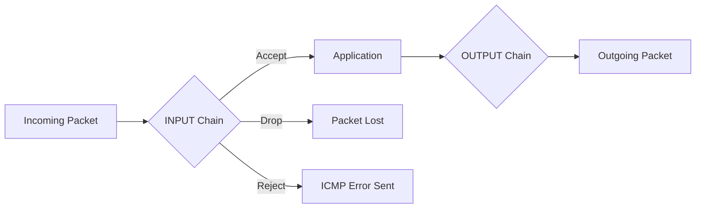

# 🧱 Pertemuan 11: Firewalling with iptables

## Daftar Isi
1. [Apa itu Firewall?](#1-apa-itu-firewall)
2. [Mengenal iptables: Tables & Chains](#2-mengenal-iptables-tables--chains)
3. [Arsitektur Paket dalam iptables](#3-arsitektur-paket-dalam-iptables)
4. [Hands-On: Konfigurasi Dasar (Drop & Accept)](#4-hands-on-konfigurasi-dasar-drop--accept)
5. [Hands-On: Membatasi Akses Port Spesifik](#5-hands-on-membatasi-akses-port-spesifik)
6. [Hands-On: Rate Limiting & Proteksi DoS](#6-hands-on-rate-limiting--proteksi-dos)
7. [Persistence: Menyimpan Aturan iptables](#7-persistence-menyimpan-aturan-iptables)
8. [Latihan Mandiri](#8-latihan-mandiri)

---

## 1. Apa itu Firewall?

Firewall adalah pengawal keamanan jaringan yang memantau dan mengontrol lalu lintas jaringan masuk dan keluar berdasarkan aturan keamanan yang ditentukan.

**Fungsi Utama:**
- Membatasi akses ke layanan yang tidak perlu.
- Mencegah serangan malware/Scanning.
- Mengatur segmentasi jaringan.

---

## 2. Mengenal iptables: Tables & Chains

Linux menggunakan framework **Netfilter** melalui utility `iptables`.

### 2.1 Tables
1. **Filter**: Tabel default untuk filtering paket.
2. **NAT**: Untuk Network Address Translation (routing).
3. **Mangle**: Untuk modifikasi header paket.

### 2.2 Chains (Alur)
- **INPUT**: Paket yang ditujukan ke server sendiri.
- **FORWARD**: Paket yang hanya lewat server (routing).
- **OUTPUT**: Paket yang keluar dari server sendiri.

---

## 3. Arsitektur Paket dalam iptables



---

## 4. Hands-On: Konfigurasi Dasar (Drop & Accept)

### 4.1 Cek Aturan Saat Ini
```bash
# Di container Ubuntu-target
iptables -L -n -v
```

### 4.2 Blokir Ping (ICMP)
```bash
# Attacker (Kali) coba ping
ping 172.20.0.10

# Di container target (Ubuntu), blokir ICMP
iptables -A INPUT -p icmp -j DROP

# Cek kembali dari Attacker -> Seharusnya Request Timeout
```

### 4.3 Menghapus Aturan
```bash
# Hapus aturan di chain INPUT urutan ke-1
iptables -D INPUT 1
```

---

## 5. Hands-On: Membatasi Akses Port Spesifik

Kita ingin server hanya bisa diakses via HTTP (Port 80), sedangkan port lain ditutup.

```bash
# 1. Izinkan koneksi loopback (Localhost)
iptables -A INPUT -i lo -j ACCEPT

# 2. Izinkan koneksi establish (yang sudah berjalan)
iptables -A INPUT -m state --state ESTABLISHED,RELATED -j ACCEPT

# 3. Izinkan port 80 (HTTP)
iptables -A INPUT -p tcp --dport 80 -j ACCEPT

# 4. Blokir SEMUA yang lain (Default Policy)
iptables -P INPUT DROP
```

**Peringatan:** Hati-hati jangan sampai memblokir port SSH jika Anda menggunakan server remote!

---

## 6. Hands-On: Rate Limiting & Proteksi DoS

Mencegah serangan Brute Force atau Flooding.

### 6.1 Membatasi Paket ICMP
```bash
# Izinkan ping maksimal 1 paket per detik
iptables -A INPUT -p icmp -m limit --limit 1/s -j ACCEPT
iptables -A INPUT -p icmp -j DROP
```

### 6.2 Proteksi Port Scanning
```bash
# Deteksi port scan dan log ke syslog
iptables -A INPUT -p tcp --tcp-flags ALL NONE -j LOG --log-prefix "NULL_SCAN: "
iptables -A INPUT -p tcp --tcp-flags ALL NONE -j DROP
```

---

## 7. Persistence: Menyimpan Aturan iptables

Aturan `iptables` akan hilang saat reboot. Untuk menyimpannya:

```bash
# Install tool persistence
apt update && apt install iptables-persistent

# Simpan manual
iptables-save > /etc/iptables/rules.v4
```

---

## 8. Latihan Mandiri

### Latihan 1: SSH Hardening dengan iptables
Buatlah aturan `iptables` yang hanya memperbolehkan akses SSH (Port 22) dari IP spesifik (IP container Kali Anda). Cobalah akses dari container lain, seharusnya gagal.

### Latihan 2: Sinkronisasi Default Policy
Diskusikan perbedaan antara menggunakan `DROP` dan `REJECT`. Kapan sebaiknya kita menggunakan salah satunya dari sudut pandang keamanan?
