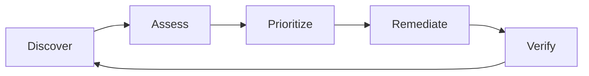

# 🔍 Pertemuan 13: Vulnerability Assessment

## Daftar Isi
1. [Apa itu Vulnerability Assessment (VA)?](#1-apa-itu-vulnerability-assessment-va)
2. [Siklus Hidup Vulnerability Management](#2-siklus-hidup-vulnerability-management)
3. [Nmap NSE (Nmap Scripting Engine)](#3-nmap-nse-nmap-scripting-engine)
4. [Hands-On: Web Scanning dengan Nikto](#4-hands-on-web-scanning-dengan-nikto)
5. [Mengenal OpenVAS / GVM](#5-mengenal-openvas--gvm)
6. [Analisis Hasil: CVSS Score](#6-analisis-hasil-cvss-score)
7. [Reporting & Mitigasi](#7-reporting--mitigasi)
8. [Latihan Mandiri](#8-latihan-mandiri)

---

## 1. Apa itu Vulnerability Assessment (VA)?

**Vulnerability Assessment** adalah proses mendefinisikan, mengidentifikasi, mengklasifikasi, dan memprioritaskan kerentanan keamanan dalam sistem komputer, jaringan, dan infrastruktur aplikasi.

**VA vs PT (Penetration Testing):**
- **VA**: Mencari celah keamanan sebanyak mungkin (Surface scanning).
- **PT**: Mencoba mengeksploitasi celah tertentu untuk mencapai target (Deep dive).

---

## 2. Siklus Hidup Vulnerability Management



---

## 3. Nmap NSE (Nmap Scripting Engine)

NSE memungkinkan pengguna untuk menulis (dan menggunakan) script untuk mengotomatisasi tugas-tugas jaringan.

### 3.1 Script Kategorisasi
- **safe**: Jarang mengganggu layanan.
- **vuln**: Mencari kerentanan spesifik.
- **exploit**: Mencoba mengeksploitasi.
- **brute**: Melakukan serangan brute force.

### 3.2 Contoh Penggunaan
```bash
# Mencari celah SMB (ms17-010 / EternalBlue)
nmap -p 445 --script smb-vuln-ms17-010 172.20.0.10

# Scan umum kerentanan
nmap -sV --script vuln 172.20.0.10
```

---

## 4. Hands-On: Web Scanning dengan Nikto

Nikto adalah web server scanner open-source yang mencari file berbahaya, outdated server software, dan masalah konfigurasi.

```bash
# Jalankan Nikto terhadap target web
nikto -h http://172.20.0.10
```

**Hasil Nikto biasanya mencakup:**
- Versi server yang sudah tua.
- Header keamanan yang hilang (X-Frame-Options, etc).
- File/direktori sensitif yang bocor (misal: `/phpinfo.php`).

---

## 5. Mengenal OpenVAS / GVM

**OpenVAS (Open Vulnerability Assessment System)** adalah framework scanner yang sangat komprehensif dengan ribuan Network Vulnerability Tests (NVTs).

---

## 6. Analisis Hasil: CVSS Score

**CVSS (Common Vulnerability Scoring System)** memberikan skor numerik untuk menunjukkan tingkat keparahan sebuah kerentanan.

| Skor       | Tingkat Keparahan |
| ---------- | ----------------- |
| 0.1 - 3.9  | Low (Rendah)      |
| 4.0 - 6.9  | Medium (Sedang)   |
| 7.0 - 8.9  | High (Tinggi)     |
| 9.0 - 10.0 | Critical (Kritis) |

---

## 7. Reporting & Mitigasi

Setelah scanning selesai, analis harus membuat laporan yang berisi:
1. **Daftar Temuan**: Apa kerentanannya?
2. **Impact**: Apa risikonya jika dieksploitasi?
3. **Remediation**: Bagaimana cara memperbaikinya? (Patching, Update, Configuration change).

---

## 8. Latihan Mandiri

### Latihan 1: Scan Port dan Service Outdated
Gunakan `nmap -sV` pada container target. Cari versi software yang digunakan dan cek di Google apakah ada CVE (Common Vulnerabilities and Exposures) untuk versi tersebut.

### Latihan 2: Nikto Tuning
Pelajari flag `-Tuning` pada Nikto untuk menghemat waktu scan dengan hanya memfokuskan pada kategori kerentanan tertentu (misal: SQL Injection atau XSS).
