# 🔐 Pertemuan 2: Cryptography 101 - Dasar-Dasar Kriptografi untuk Keamanan Jaringan

---

## Daftar Isi
1. [Apa itu Kriptografi?](#1-apa-itu-kriptografi)
2. [Tiga Pilar Kriptografi](#2-tiga-pilar-kriptografi)
3. [Hands-On: Setup Lab](#3-hands-on-setup-lab-untuk-pertemuan-2)
4. [Hands-On: Hashing](#4-hands-on-hashing-dengan-md5sum-dan-sha256sum)
5. [Hands-On: Enkripsi Simetris (AES)](#5-hands-on-enkripsi-simetris-aes)
6. [Hands-On: Enkripsi Asimetris (RSA)](#6-hands-on-enkripsi-asimetris-rsa)
7. [Hands-On: Sertifikat SSL/TLS](#7-hands-on-sertifikat-ssltls)
8. [Latihan Mandiri](#8-latihan-mandiri)

---

## 1. Apa itu Kriptografi?

### Definisi Sederhana

**Kriptografi** adalah teknik untuk mengubah pesan yang bisa dibaca menjadi kode rahasia, dan mengembalikannya lagi menjadi pesan asli. Tujuannya agar hanya orang yang berhak yang bisa membaca pesan tersebut.

### Analogi Sehari-hari

Bayangkan Anda ingin mengirim surat cinta:
- **Tanpa kriptografi**: Surat dikirim terbuka, semua orang bisa baca
- **Dengan kriptografi**: Surat dimasukkan ke brankas terkunci, hanya penerima yang punya kunci bisa membuka

### Peran Kriptografi dalam Keamanan Jaringan


**Tanpa Kriptografi**: Penyerang bisa membaca password Anda


**Dengan Kriptografi**: Penyerang dapat data acak yang tidak berguna

---

## 2. Tiga Pilar Kriptografi

### 2.1 Hashing

**Apa itu Hashing?**
Hashing mengubah data menjadi "sidik jari digital" dengan panjang tetap.

**Ciri-ciri Hashing**:
- Satu arah (tidak bisa dikembalikan)
- Input sama → output selalu sama
- Perubahan sedikit → output sangat berbeda

```bash
Contoh:
Input: "Password123"  → Hash: a4f5d2e8...
Input: "Password124"  → Hash: 8b3e7c1... (sangat berbeda)
```

**Kegunaan**:
- Menyimpan password
- Memverifikasi file tidak berubah
- Tanda tangan digital

### 2.2 Enkripsi Simetris

**Apa itu Enkripsi Simetris?**
Satu kunci digunakan untuk mengunci DAN membuka.

```mermaid
graph LR
    A[Pesan: Halo] --> B[🔐 Kunci: rahasia]
    B --> C[Pesan Terenkripsi: XyZ@123]
    C --> D[🔑 Kunci: rahasia]
    D --> E[Pesan: Halo]
```



**Contoh Sehari-hari**: Lemari dengan satu kunci. Orang yang punya kunci bisa membuka dan mengunci.

**Algoritma Populer**: AES (Advanced Encryption Standard)

### 2.3 Enkripsi Asimetris

**Apa itu Enkripsi Asimetris?**
Dua kunci berbeda: satu untuk mengunci (publik), satu untuk membuka (privat).

**Contoh Sehari-hari**: Kotak surat dengan celah untuk memasukkan surat (kunci publik), tapi hanya pemilik yang punya kunci untuk membukanya (kunci privat).

**Algoritma Populer**: RSA

---

## 3. Hands-On: Setup Lab untuk Pertemuan 2

### 3.1 Masuk ke Container Kali

```bash
# Masuk ke folder lab (dari Pertemuan 1)
cd ~/netsec-lab

# Masuk ke container Kali
docker-compose exec kali-attacker bash
```

### 3.2 Install Tools

```bash
# Update dan install OpenSSL
apt update
apt install -y openssl coreutils

# Buat folder kerja
mkdir -p /root/crypto-lab
cd /root/crypto-lab

# Buat file contoh
echo "Ini adalah pesan rahasia" > pesan.txt
echo "Password: admin123" > password.txt
```

---

## 4. Hands-On: Hashing dengan md5sum dan sha256sum

### 4.1 Mencoba Hashing Sederhana

```bash
cd /root/crypto-lab

# Buat file
echo "Halo Dunia" > file.txt

# Hash dengan MD5 (16 karakter)
md5sum file.txt
# Output: 5f4dcc3b5aa765d61d8327deb882cf99  file.txt

# Hash dengan SHA-256 (64 karakter - lebih aman)
sha256sum file.txt
# Output: 7f83b1657ff1fc53b92dc18148a1d65dfc2d4b1fa3d677284addd200126d9069  file.txt
```

**Catatan**: SHA-256 lebih panjang dan lebih aman dari MD5.

### 4.2 Membuktikan Avalanche Effect

```bash
# Buat dua file dengan perbedaan 1 huruf
echo "Halo Dunia" > file1.txt
echo "Halo dunia" > file2.txt  # huruf 'd' kecil

# Bandingkan hash SHA-256
echo "File1:"
sha256sum file1.txt
echo "File2:"
sha256sum file2.txt

# Hash akan sangat berbeda meski hanya beda kapitalisasi!
```

### 4.3 Verifikasi File Tidak Berubah

```bash
# Buat file penting
echo "Data Ujian: 90" > nilai.txt

# Buat hash-nya
sha256sum nilai.txt > nilai.txt.sha256

# Cek apakah file masih asli
sha256sum -c nilai.txt.sha256
# Output: nilai.txt: OK

# Ubah file
echo "Data Ujian: 100" > nilai.txt

# Cek lagi
sha256sum -c nilai.txt.sha256
# Output: nilai.txt: FAILED
```

### 4.4 Menyimpan Password dengan Hash

```bash
# JANGAN PERNAH simpan password asli!
# Simpan hash-nya

# Simulasi database user
echo "alice" > users.txt
echo "bob" >> users.txt

# Hash password mereka
echo -n "alice123" | sha256sum > alice.hash
echo -n "bob456" | sha256sum > bob.hash

# Saat login, hash password input, bandingkan dengan hash di database
echo -n "Cek login untuk alice..."
input_hash=$(echo -n "alice123" | sha256sum)
stored_hash=$(cat alice.hash)

if [ "$input_hash" = "$stored_hash" ]; then
    echo "BERHASIL"
else
    echo "GAGAL"
fi
```

---

## 5. Hands-On: Enkripsi Simetris (AES)

### 5.1 Enkripsi File dengan Password

```bash
cd /root/crypto-lab

# Buat pesan rahasia
cat > surat-cinta.txt << EOF
Untuk kekasihku,
Aku akan menjemputmu jam 7 malam di kafe biasa.
Bawa payung, sepertinya akan hujan.
EOF

# Enkripsi dengan AES-256 (gunakan password: sayang123)
openssl enc -aes-256-cbc -salt -in surat-cinta.txt -out surat-cinta.enc

# Anda akan diminta memasukkan password 2 kali
# Masukkan: sayang123

# Lihat hasilnya (sudah tidak terbaca)
cat surat-cinta.enc
# Output: �Z�x��l�ɮ� ...
```

### 5.2 Dekripsi File

```bash
# Dekripsi file
openssl enc -aes-256-cbc -d -in surat-cinta.enc -out surat-cinta-dekripsi.txt

# Masukkan password yang sama: sayang123

# Lihat hasilnya
cat surat-cinta-dekripsi.txt
```

### 5.3 Enkripsi dengan Base64 (Agar Bisa Dikirim via Email)

```bash
# Enkripsi dan encode base64
openssl enc -aes-256-cbc -salt -in surat-cinta.txt -out surat-cinta.b64 -base64

# Lihat hasilnya (masih aman, tapi bentuknya teks)
cat surat-cinta.b64
# Output: U2FsdGVkX18pL0Y1c2VydGVzdCBtZXNzYWdl...

# Dekripsi dari base64
openssl enc -aes-256-cbc -d -in surat-cinta.b64 -out surat-cinta-hasil.txt -base64
cat surat-cinta-hasil.txt
```

### 5.4 Eksperimen: Password Salah

```bash
# Coba dekripsi dengan password berbeda
openssl enc -aes-256-cbc -d -in surat-cinta.enc -out coba.txt -pass pass:salah123

# Akan muncul error: bad decrypt
# File coba.txt akan kosong/rusak
```

---

## 6. Hands-On: Enkripsi Asimetris (RSA)

### 6.1 Membuat Pasangan Kunci

```bash
cd /root/crypto-lab

# Buat kunci privat (simpan rahasia!)
openssl genrsa -out private.pem 2048

# Lihat kunci privat
cat private.pem
# Ini adalah file teks yang berisi kunci dalam format base64

# Ekstrak kunci publik (bisa disebar ke siapa saja)
openssl rsa -in private.pem -pubout -out public.pem

# Lihat kunci publik
cat public.pem
```

### 6.2 Enkripsi dengan Kunci Publik

```bash
# Buat pesan untuk bos
echo "Transfer Rp 10.000.000 ke rekening 123-456-789" > perintah.txt

# Enkripsi dengan kunci publik bos
openssl rsautl -encrypt -inkey public.pem -pubin -in perintah.txt -out perintah.enc

# Lihat hasilnya (tidak terbaca)
hexdump -C perintah.enc | head
```

### 6.3 Dekripsi dengan Kunci Privat

```bash
# Dekripsi dengan kunci privat (hanya bos yang punya)
openssl rsautl -decrypt -inkey private.pem -in perintah.enc -out perintah-dekripsi.txt

# Lihat hasilnya
cat perintah-dekripsi.txt
```

### 6.4 Keterbatasan RSA

```bash
# RSA hanya bisa enkripsi data kecil (< 256 byte)
# Buat file besar
for i in {1..50}; do echo "Baris ke-$i dengan data panjang..." >> data-besar.txt; done

# Coba enkripsi dengan RSA (akan gagal)
openssl rsautl -encrypt -inkey public.pem -pubin -in data-besar.txt -out data-besar.enc
# ERROR: data too large for key size
```

**Solusi**: Gunakan hybrid encryption (RSA untuk kunci, AES untuk data)

---

## 7. Hands-On: Sertifikat SSL/TLS

### 7.1 Membuat Sertifikat Self-Signed

```bash
cd /root/crypto-lab

# Buat kunci privat untuk server
openssl genrsa -out server.key 2048

# Buat sertifikat self-signed (berlaku 365 hari)
openssl req -new -x509 -days 365 -key server.key -out server.crt -subj "/C=ID/ST=Jakarta/L=Jakarta/O=Lab Security/CN=localhost"
```

### 7.2 Membaca Isi Sertifikat

```bash
# Lihat detail sertifikat
openssl x509 -in server.crt -text -noout

# Informasi penting yang bisa dilihat:
# - Subject: Pemilik sertifikat (CN=localhost)
# - Issuer: Penerbit (karena self-signed, sama dengan Subject)
# - Validity: Masa berlaku
# - Public Key: Kunci publik server
```

### 7.3 Informasi Spesifik dari Sertifikat

```bash
# Lihat subject
openssl x509 -in server.crt -noout -subject
# Output: subject=C = ID, ST = Jakarta, L = Jakarta, O = Lab Security, CN = localhost

# Lihat masa berlaku
openssl x509 -in server.crt -noout -dates
# Output: notBefore=... notAfter=...

# Lihat fingerprint (hash sertifikat)
openssl x509 -in server.crt -noout -fingerprint -sha256
```

### 7.4 Analisis Sertifikat Website Real

```bash
# Download sertifikat Google
echo -n | openssl s_client -connect google.com:443 2>/dev/null | \
    sed -ne '/-BEGIN CERTIFICATE-/,/-END CERTIFICATE-/p' > google.crt

# Analisis
echo "=== SERTIFIKAT GOOGLE ==="
echo "Penerbit:"
openssl x509 -in google.crt -noout -issuer
echo ""
echo "Pemilik:"
openssl x509 -in google.crt -noout -subject
echo ""
echo "Masa berlaku:"
openssl x509 -in google.crt -noout -dates
```

---

## 8. Latihan Mandiri

### Latihan 1: Verifikasi File Penting

```bash
# Buat file berisi password penting
cat > passwords.txt << EOF
Email: user@example.com / pass: email123
Bank: 12345678 / pin: 9876
WiFi: SSID: rumah / pass: wifi456
EOF

# Buat hash-nya
sha256sum passwords.txt > passwords.txt.sha256

# Simpan di tempat aman
# Nanti untuk cek apakah file masih asli:
sha256sum -c passwords.txt.sha256
```

### Latihan 2: Kirim Pesan Rahasia ke Teman

**Di sisi pengirim**:
```bash
# Enkripsi pesan
echo "Temui saya di perpustakaan jam 2 siang" > pesan.txt
openssl enc -aes-256-cbc -salt -in pesan.txt -out pesan.enc -base64

# Kirim file pesan.enc ke teman
cat pesan.enc
# Copy paste outputnya
```

**Di sisi penerima**:
```bash
# Paste output ke file
nano pesan.enc  # paste di sini

# Dekripsi (pakai password yang sama)
openssl enc -aes-256-cbc -d -in pesan.enc -out pesan-dekripsi.txt -base64
cat pesan-dekripsi.txt
```

### Latihan 3: Buat Sertifikat untuk Website Palsu

```bash
# Buat sertifikat untuk website latihan
openssl req -new -x509 -days 30 -newkey rsa:2048 -keyout website.key -out website.crt -nodes -subj "/CN=belajar-keamanan.local"

# Jalankan web server sederhana dengan sertifikat ini (simulasi)
echo "Selesai! Sertifikat untuk belajar-keamanan.local telah dibuat."
```

### Latihan 4: Script Enkripsi Sederhana

```bash
cat > myencrypt.sh << 'EOF'
#!/bin/bash
# Script enkripsi sederhana

echo "=== TOOLS ENKRIPSI SEDERHANA ==="
echo "1. Enkripsi file"
echo "2. Dekripsi file"
read -p "Pilih (1/2): " pilih

if [ "$pilih" = "1" ]; then
    read -p "Nama file: " file
    read -sp "Password: " pass
    echo
    openssl enc -aes-256-cbc -salt -in "$file" -out "$file.enc" -pass pass:$pass
    echo "File terenkripsi: $file.enc"
elif [ "$pilih" = "2" ]; then
    read -p "Nama file (.enc): " file
    read -sp "Password: " pass
    echo
    openssl enc -aes-256-cbc -d -in "$file" -out "${file%.enc}" -pass pass:$pass
    echo "File terdekripsi: ${file%.enc}"
fi
EOF

chmod +x myencrypt.sh
./myencrypt.sh
```

### Latihan 5: Verifikasi Tanda Tangan Digital

```bash
# Buat dokumen
echo "Saya setuju dengan kontrak ini." > kontrak.txt

# Buat tanda tangan digital (hash + enkripsi dengan kunci privat)
openssl dgst -sha256 -sign private.pem -out kontrak.sig kontrak.txt

# Verifikasi dengan kunci publik
openssl dgst -sha256 -verify public.pem -signature kontrak.sig kontrak.txt
# Output: Verified OK

# Ubah dokumen
echo "Saya TIDAK setuju dengan kontrak ini." > kontrak.txt

# Verifikasi ulang
openssl dgst -sha256 -verify public.pem -signature kontrak.sig kontrak.txt
# Output: Verification Failure
```

---

## Ringkasan Perintah Penting

| Fungsi | Perintah |
|--------|----------|
| Hash MD5 | `md5sum file.txt` |
| Hash SHA-256 | `sha256sum file.txt` |
| Enkripsi AES | `openssl enc -aes-256-cbc -in file.txt -out file.enc` |
| Dekripsi AES | `openssl enc -aes-256-cbc -d -in file.enc -out file.txt` |
| Buat kunci RSA | `openssl genrsa -out private.pem 2048` |
| Ekstrak kunci publik | `openssl rsa -in private.pem -pubout -out public.pem` |
| Enkripsi RSA | `openssl rsautl -encrypt -inkey public.pem -pubin -in file.txt -out file.enc` |
| Dekripsi RSA | `openssl rsautl -decrypt -inkey private.pem -in file.enc -out file.txt` |
| Buat sertifikat | `openssl req -new -x509 -days 365 -key server.key -out server.crt` |
| Lihat sertifikat | `openssl x509 -in server.crt -text -noout` |
