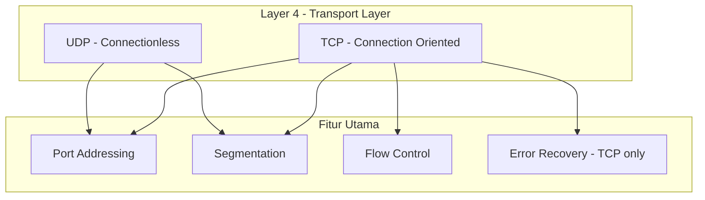
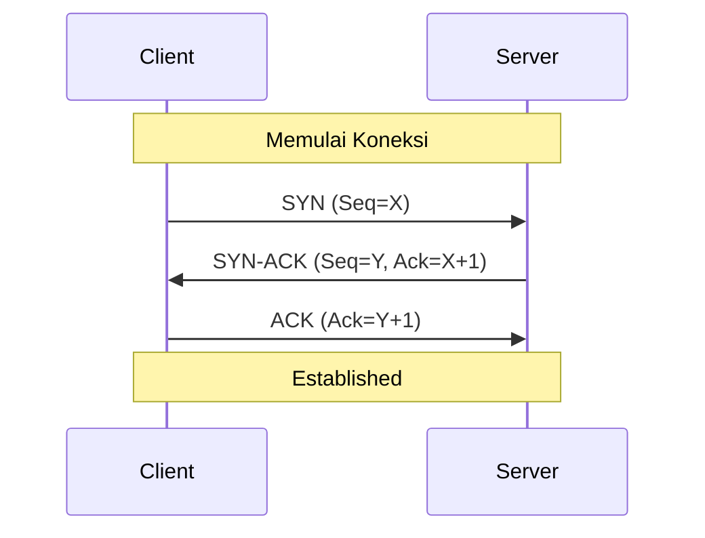
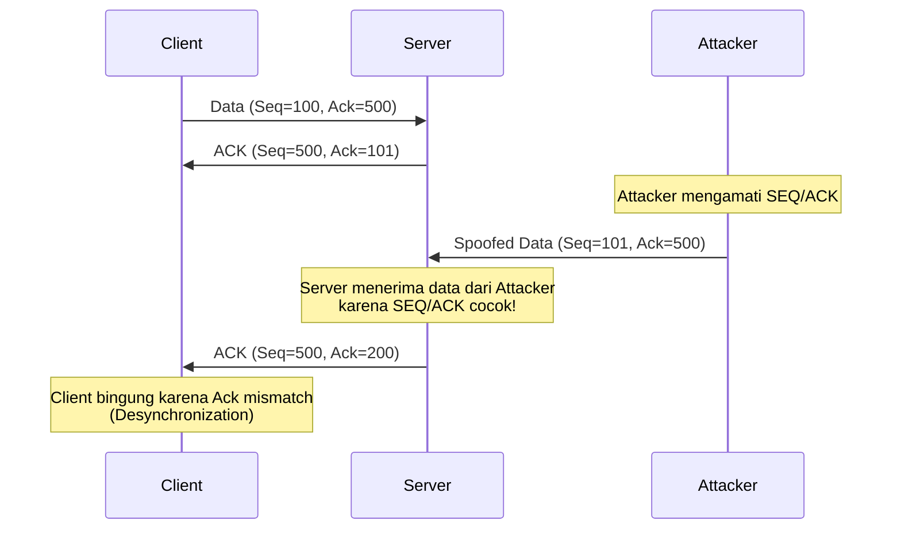
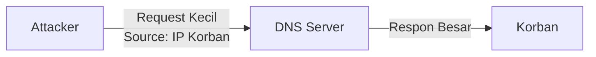

# 🔄 Pertemuan 6: L4 Security - TCP/UDP Attacks

## Daftar Isi
1. [Pengantar Layer 4 Security](#1-pengantar-layer-4-security)
2. [TCP Three-Way Handshake Deep Dive](#2-tcp-three-way-handshake-deep-dive)
3. [TCP Flags & Kerentanannya](#3-tcp-flags--kerentanannya)
4. [Hands-On: SYN Flood Attack dengan hping3](#4-hands-on-syn-flood-attack-dengan-hping3)
5. [Hands-On: TCP Session Hijacking Concepts](#5-hands-on-tcp-session-hijacking-concepts)
6. [UDP Security & Amplification](#6-udp-security--amplification)
7. [Deteksi dan Pencegahan](#7-deteksi-dan-pencegahan)
8. [Latihan Mandiri](#8-latihan-mandiri)

---

## 1. Pengantar Layer 4 Security

### Model OSI Layer 4 (Transport Layer)



### Fungsi Utama Layer 4
1. **Port Addressing** - Memastikan data sampai ke aplikasi yang benar (misal: 80 untuk HTTP).
2. **Segmentation** - Membagi data besar menjadi segmen-segmen kecil.
3. **Session Management** - Membangun dan memutuskan koneksi (TCP).

---

## 2. TCP Three-Way Handshake Deep Dive

TCP memastikan pengiriman data yang handal melalui proses jabat tangan (handshake).



### Kelemahan Handshake
Proses ini memakan resource di sisi server (state table). Server harus menyimpan informasi tentang koneksi yang "setengah terbuka" (half-open connection).

---

## 3. TCP Flags & Kerentanannya

| Flag    | Deskripsi                      | Potensi Abuse           |
| ------- | ------------------------------ | ----------------------- |
| **SYN** | Sinkronisasi nomor urut        | SYN Flood (DoS)         |
| **ACK** | Konfirmasi penerimaan paket    | Blind ACK Injection     |
| **FIN** | Mengakhiri koneksi normal      | FIN Scan (Stealth)      |
| **RST** | Memutuskan koneksi paksa       | Connection Reset Attack |
| **PSH** | Push data langsung ke aplikasi | Buffer pressure         |
| **URG** | Data mendesak                  | Segment evasion         |

---

## 4. Hands-On: SYN Flood Attack dengan hping3

### 4.1 Apa itu SYN Flood?
Penyerang mengirimkan ribuan paket SYN tanpa pernah membalas SYN-ACK dari server. Akibatnya, antrean koneksi server penuh dan tidak bisa menerima client baru.

### 4.2 Setup Lab
Pastikan container target (Ubuntu/Web) dan penyerang (Kali) berjalan.

```bash
# Di container Kali
hping3 --version
```

### 4.3 Menjalankan Serangan

```bash
# Kirim SYN flood ke target dengan source IP acak (spoofing)
hping3 -S --flood --rand-source -p 80 192.168.1.10
```

Parameter:
- `-S`: Set SYN flag.
- `--flood`: Kirim paket secepat mungkin.
- `--rand-source`: Gunakan IP pengirim acak agar sulit diblokir.
- `-p 80`: Target port web server.

### 4.4 Monitoring di Target
Monitor status koneksi di server target:

```bash
# Lihat koneksi SYN_RECV (half-open)
netstat -atn | grep SYN_RECV | wc -l

# Gunakan htop untuk melihat CPU/RAM usage
htop
```

---

## 5. Hands-On: TCP Session Hijacking Concepts

### 5.1 Mekanisme Serangan
Session Hijacking terjadi ketika penyerang mengambil alih sesi aktif antara client dan server dengan memprediksi **Next Sequence Number**.



### 5.2 Teknik Prediksi SEQ
Dahulu Sequence Number bersifat linear, namun OS modern menggunakan **ISN (Initial Sequence Number)** yang acak. Namun, jika penyerang berada dalam jalur jaringan (MITM), mereka tetap bisa melihat nomor tersebut.

---

## 6. UDP Security & Amplification

UDP tidak memiliki handshake (connectionless), sehingga sangat mudah dipalsukan (spoofing).

### UDP Amplification Attack
Memanfaatkan service UDP (DNS, NTP, SNMP) untuk mengirim respon besar ke korban dari request kecil yang dipalsukan.



---

## 7. Deteksi dan Pencegahan

### 7.1 TCP SYN Cookies
Teknik untuk menangani SYN Flood tanpa menghabiskan memory state table.

```bash
# Cek apakah SYN cookies aktif di Linux
sysctl net.ipv4.tcp_syncookies

# Aktifkan jika belum
sysctl -w net.ipv4.tcp_syncookies=1
```

### 7.2 Rate Limiting
Membatasi jumlah koneksi per IP menggunakan `iptables`.

```bash
# Batasi 10 koneksi baru per detik dari satu IP
iptables -A INPUT -p tcp --syn -m limit --limit 1/s --limit-burst 10 -j ACCEPT
```

---

## 8. Latihan Mandiri

### Latihan 1: Analisis Paket SYN Flood
1. Jalankan `tcpdump` di target.
2. Jalankan `hping3` dari attacker selama 10 detik.
3. Simpan file `.pcap` dan buka di Wireshark.
4. Hitung berapa banyak paket SYN yang masuk tanpa ACK.

### Latihan 2: Penutupan Port
Gunakan `nmap` untuk menscan port yang terbuka di target dan tutup port yang tidak digunakan untuk mengurangi attack surface Layer 4.
